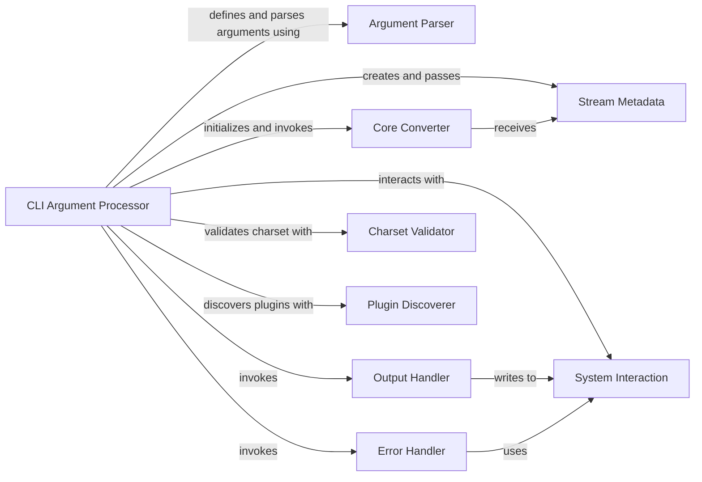

## Component Details

This analysis focuses on the `CLI Argument Processor` subsystem, which is fundamental to how the `markitdown` application receives and interprets user commands. The core of this subsystem resides within the `markitdown.__main__.py` file, specifically the `main` function, which acts as the central orchestrator for command-line interactions.

### CLI Argument Processor
The `main` function in `markitdown.__main__.py` serves as the primary entry point and orchestrator for the command-line interface. It defines, parses, and validates all command-line arguments using `argparse`, initializes the `Core Converter` (`MarkItDown`), executes the document conversion, and manages the output. It also handles listing available plugins and error conditions related to argument validation.

**Related Classes/Methods**:

- <a href="https://github.com/microsoft/markitdown/blob/master/packages/markitdown/src/markitdown/__main__.py#L12-L199" target="_blank" rel="noopener noreferrer">`markitdown.__main__.main` (12:199)</a>

### Argument Parser
This standard library component (`argparse.ArgumentParser`) is instantiated and used by the `CLI Argument Processor` to define the expected command-line arguments (e.g., `--output`, `--extension`, `--use-docintel`) and to parse the raw input provided by the user into a structured `Namespace` object. It handles argument validation based on defined types and choices.

**Related Classes/Methods**:

- `argparse.ArgumentParser` (0:0)

### Core Converter
The `MarkItDown` class is the central engine responsible for performing the actual document conversion. It is instantiated by the `CLI Argument Processor` and receives configuration (e.g., `enable_plugins`, `docintel_endpoint`) and input stream metadata (`StreamInfo`) from it. It then executes the conversion logic, returning the result to the `CLI Argument Processor`.

**Related Classes/Methods**:

- <a href="https://github.com/microsoft/markitdown/blob/master/packages/markitdown/src/markitdown/_markitdown.py#L92-L770" target="_blank" rel="noopener noreferrer">`markitdown._markitdown.MarkItDown` (92:770)</a>

### Stream Metadata
The `StreamInfo` class is a data structure created by the `CLI Argument Processor` to encapsulate hints about the input stream, such as file extension, MIME type, and character encoding. This object is then passed to the `Core Converter` to provide necessary context for the conversion process, especially when reading from standard input.

**Related Classes/Methods**:

- <a href="https://github.com/microsoft/markitdown/blob/master/packages/markitdown/src/markitdown/_stream_info.py#L5-L31" target="_blank" rel="noopener noreferrer">`markitdown._stream_info.StreamInfo` (5:31)</a>

### Error Handler
The `_exit_with_error` function is an internal utility within `__main__.py` that prints an error message to `stderr` and terminates the program with a non-zero exit status. It is invoked by the `CLI Argument Processor` when critical argument validation failures or other unrecoverable errors occur during the initial setup phase.

**Related Classes/Methods**:

- <a href="https://github.com/microsoft/markitdown/blob/master/packages/markitdown/src/markitdown/__main__.py#L216-L218" target="_blank" rel="noopener noreferrer">`markitdown.__main__._exit_with_error` (216:218)</a>

### Output Handler
The `_handle_output` function is an internal utility within `__main__.py` responsible for writing the conversion result (the markdown string) to the specified output destination. This destination can be a file (if `--output` is provided) or standard output (`stdout`). It is invoked by the `CLI Argument Processor` after the conversion is complete.

**Related Classes/Methods**:

- <a href="https://github.com/microsoft/markitdown/blob/master/packages/markitdown/src/markitdown/__main__.py#L202-L213" target="_blank" rel="noopener noreferrer">`markitdown.__main__._handle_output` (202:213)</a>

### System Interaction
This component represents the interaction with the underlying operating system, primarily through the `sys` module. The `CLI Argument Processor` uses it for reading from `stdin`, writing to `stdout`, and exiting the program. The `Error Handler` and `Output Handler` also leverage `sys` for their respective operations.

**Related Classes/Methods**:

- `sys` (0:0)

### Charset Validator
This component, represented by the `codecs` module, is used by the `CLI Argument Processor` to validate the character set hint provided by the user via the `--charset` argument. It ensures that the specified encoding is a recognized and valid one, preventing errors during stream processing.

**Related Classes/Methods**:

- `codecs` (0:0)

### Plugin Discoverer
This component, specifically `importlib.metadata.entry_points`, is used by the `CLI Argument Processor` to discover and list available `markitdown` plugins. When the `--list-plugins` option is used, this component provides the mechanism to enumerate installed third-party extensions.

**Related Classes/Methods**:

- `importlib.metadata.entry_points` (0:0)

### [FAQ](https://github.com/CodeBoarding/GeneratedOnBoardings/tree/main?tab=readme-ov-file#faq)