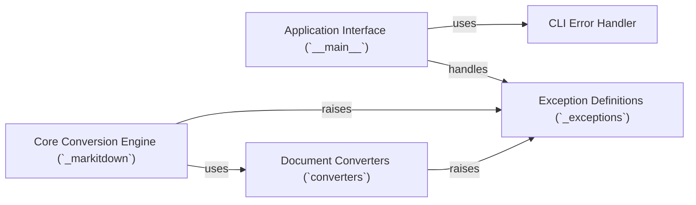

## Component Details

This analysis focuses on the `CLI Error Handler` component within the `markitdown` project, examining its structure, flow, and purpose in the context of the overall application. The `CLI Error Handler` is crucial for providing user-friendly error messages and ensuring graceful application termination.

### CLI Error Handler
This component is responsible for displaying user-friendly error messages to the console and ensuring a graceful exit from the application with a non-zero status code when critical issues occur. It centralizes the application's termination logic upon error.

**Related Classes/Methods**:

- <a href="https://github.com/microsoft/markitdown/blob/master/packages/markitdown/src/markitdown/__main__.py#L216-L218" target="_blank" rel="noopener noreferrer">`markitdown.__main__._exit_with_error` (216:218)</a>

### Application Interface (`__main__`)
This component serves as the command-line interface's primary entry point. It parses arguments, orchestrates the conversion process, and, critically, catches and handles exceptions raised by other components. It translates these internal exceptions into user-friendly messages before invoking the `CLI Error Handler` for display and termination.

**Related Classes/Methods**:

- <a href="https://github.com/microsoft/markitdown/blob/master/packages/markitdown/src/markitdown/__main__.py#L0-L0" target="_blank" rel="noopener noreferrer">`markitdown.__main__` (0:0)</a>

### Exception Definitions (`_exceptions`)
This component defines a hierarchy of custom exception classes used throughout the `markitdown` library. These exceptions provide specific context about various error conditions, such as missing dependencies, general file conversion issues, or unsupported formats, enabling more granular error handling and reporting.

**Related Classes/Methods**:

- <a href="https://github.com/microsoft/markitdown/blob/master/packages/markitdown/src/markitdown/_exceptions.py#L0-L0" target="_blank" rel="noopener noreferrer">`markitdown._exceptions` (0:0)</a>

### Core Conversion Engine (`_markitdown`)
This is the central component responsible for orchestrating the document conversion process. It manages a collection of individual converters, attempts to convert a given file stream, and handles various conversion outcomes, including raising specific exceptions (defined in `_exceptions`) upon failure.

**Related Classes/Methods**:

- <a href="https://github.com/microsoft/markitdown/blob/master/packages/markitdown/src/markitdown/_markitdown.py#L0-L0" target="_blank" rel="noopener noreferrer">`markitdown._markitdown` (0:0)</a>

### Document Converters (`converters`)
This is a collection of specialized modules, each designed to convert a specific document format (e.g., PPTX, XLSX, DOCX, PDF) into markdown. Each converter implements methods to determine if it can handle a file and to perform the conversion, raising specific exceptions (defined in `_exceptions`) if issues arise (e.g., missing external dependencies, conversion failures).

**Related Classes/Methods**:

- `markitdown.converters` (0:0)

### [FAQ](https://github.com/CodeBoarding/GeneratedOnBoardings/tree/main?tab=readme-ov-file#faq)