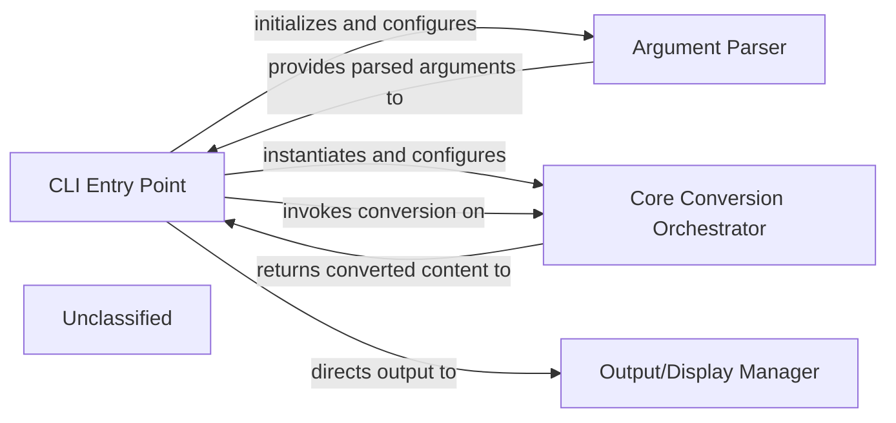

## Details

The markitdown application's architecture is centered around a command-line interface (CLI) that facilitates document conversion. The CLI Entry Point (markitdown.__main__.main) acts as the primary orchestrator, responsible for parsing user commands via the Argument Parser and then configuring and invoking the Core Conversion Orchestrator (markitdown.MarkItDown) to perform the actual document transformation. Once the conversion is complete, the CLI Entry Point utilizes the Output/Display Manager to present the results to the user, either by writing to standard output or a specified file. This clear separation of concerns ensures a modular and maintainable system for converting various file formats to Markdown.

### CLI Entry Point
The `markitdown.__main__.main` function serves as the primary entry point for the command-line interface. It orchestrates the application's flow by parsing arguments, configuring the conversion process, and managing input/output operations.

**Related Classes/Methods**:

- <a href="https://github.com/microsoft/markitdown/blob/main/packages/markitdown/src/markitdown/__main__.py" target="_blank" rel="noopener noreferrer">`markitdown.__main__.main`</a>

### Argument Parser
This component, primarily handled by `argparse.ArgumentParser` within the `main` function, defines and parses command-line arguments and options, validating user input and providing structured parameters for the `CLI Entry Point`.

**Related Classes/Methods**:

- <a href="https://github.com/microsoft/markitdown/blob/main/packages/markitdown/src/markitdown/__main__.py" target="_blank" rel="noopener noreferrer">`argparse.ArgumentParser`</a>

### Output/Display Manager
Responsible for directing the converted output to the appropriate destination (stdout or a specified file) and handling basic informational messages. This is managed by `sys.stdout` or file write operations within the `main` function.

**Related Classes/Methods**:

- <a href="https://github.com/microsoft/markitdown/blob/main/packages/markitdown/src/markitdown/__main__.py" target="_blank" rel="noopener noreferrer">`sys.stdout`</a>

### Core Conversion Orchestrator [[Expand]](./Core_Conversion_Orchestrator.md)
This central component, represented by the `MarkItDown` class, manages the document conversion pipeline. It is responsible for applying plugins and transforming input documents into Markdown format.

**Related Classes/Methods**:

- <a href="https://github.com/microsoft/markitdown/blob/main/packages/markitdown/src/markitdown/_markitdown.py#L93-L776" target="_blank" rel="noopener noreferrer">`markitdown.MarkItDown`:93-776</a>

### Unclassified
Component for all unclassified files and utility functions (Utility functions/External Libraries/Dependencies)

**Related Classes/Methods**: _None_

### [FAQ](https://github.com/CodeBoarding/GeneratedOnBoardings/tree/main?tab=readme-ov-file#faq)