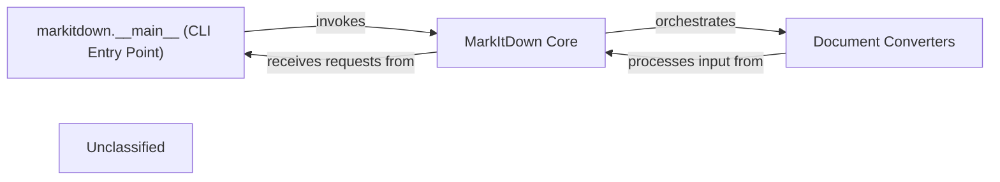

## Details

The MarkItDown application follows a clear architectural pattern, with the markitdown.__main__ (CLI Entry Point) acting as the initial interface for user interaction and command parsing. This entry point then delegates the core responsibility of document conversion to the MarkItDown Core. The MarkItDown Core serves as the central orchestrator, intelligently selecting and managing various Document Converters to transform diverse input formats into Markdown. This modular design ensures that the application can easily extend its capabilities to support new document types by simply adding new converters, without altering the fundamental core logic.

### markitdown.__main__ (CLI Entry Point)
The initial interface for user interaction and command parsing.

**Related Classes/Methods**:

- `markitdown.__main__`:13-200

### MarkItDown Core [[Expand]](./MarkItDown_Core.md)
Serves as the central orchestrator, intelligently selecting and managing various Document Converters to transform diverse input formats into Markdown.

**Related Classes/Methods**:

- `markitdown._markitdown`

### Document Converters [[Expand]](./Document_Converters.md)
Perform the actual transformation of the document content into Markdown.

**Related Classes/Methods**:

### Unclassified
Component for all unclassified files and utility functions (Utility functions/External Libraries/Dependencies)

**Related Classes/Methods**: _None_

### [FAQ](https://github.com/CodeBoarding/GeneratedOnBoardings/tree/main?tab=readme-ov-file#faq)