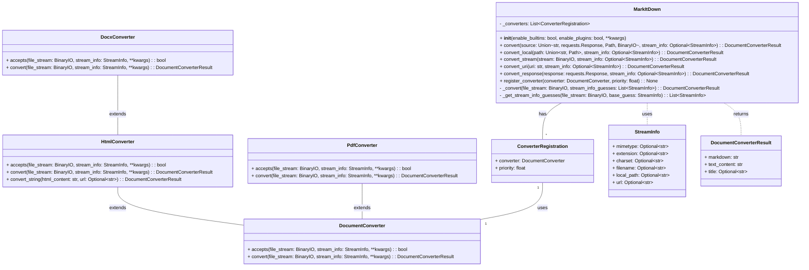

Okay, I have examined the source code of the core components. Here's a summary of the `markitdown` component:

**Description:**

The `markitdown` component is a versatile tool designed to convert various document formats and web content into Markdown. It provides both a command-line interface (CLI) and a Python API for seamless integration into different workflows. The core functionality revolves around the `MarkItDown` class, which orchestrates the conversion process by utilizing a collection of `DocumentConverter` instances. These converters are responsible for handling specific file types or content sources, such as HTML, DOCX, PDF, and more. The component also supports plugins, allowing for extending its capabilities with custom converters.

**Main Classes and Their Purposes:**

*   **`markitdown.__main__.main`**: This is the entry point for the command-line interface. It parses command-line arguments, initializes the `MarkItDown` class, and performs the conversion based on the provided input.
*   **`markitdown._markitdown.MarkItDown`**: This is the central class that manages the conversion process. It maintains a list of registered `DocumentConverter` instances, determines the appropriate converter for a given input, and invokes the converter to produce the Markdown output. It also handles enabling built-in converters and loading plugin converters.
*   **`markitdown._base_converter.DocumentConverter`**: This is an abstract base class that defines the interface for all document converters. Subclasses must implement the `accepts` method to determine if they can handle a given input and the `convert` method to perform the actual conversion.
*   **`markitdown.cli`**: This module contains the logic for the command-line interface, including argument parsing and handling output.
*   **`markitdown.converters._html_converter.HtmlConverter`**: A concrete `DocumentConverter` subclass that converts HTML content to Markdown using `BeautifulSoup`.
*   **`markitdown.converters._docx_converter.DocxConverter`**: A concrete `DocumentConverter` subclass that converts DOCX files to Markdown by first converting them to HTML using the `mammoth` library and then using the `HtmlConverter`.
*   **`markitdown.converters._pdf_converter.PdfConverter`**: A concrete `DocumentConverter` subclass that converts PDF files to Markdown using the `pdfminer.high_level.extract_text` function.

**Visualization:**

I believe a class diagram best represents the structure of the `markitdown` component, highlighting the relationships between the core classes.

