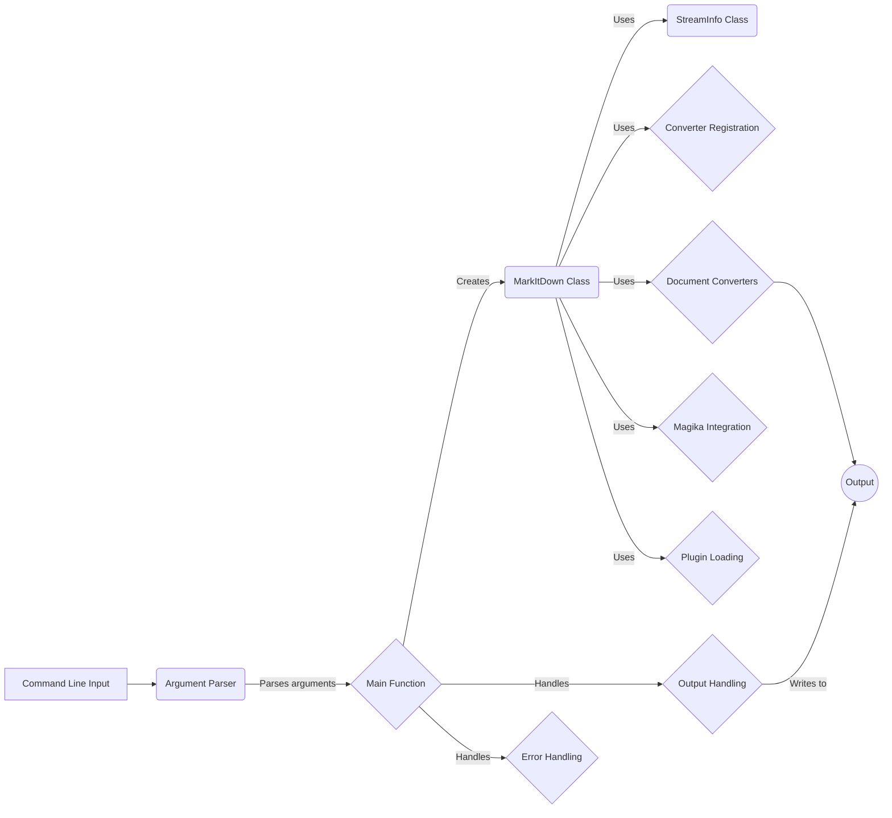

## Command Line Interface Overview

The Command Line Interface (CLI) serves as the entry point for the `markitdown` application. It's responsible for parsing command-line arguments, invoking the core conversion logic, and handling output. The CLI utilizes the `argparse` module for argument parsing and interacts with the `MarkItDown` class to perform the actual conversion.

### Component Descriptions:

*   **Command Line Input:** Represents the user's input to the application via the command line.
    *   Interaction: Initiates the application flow by providing arguments to the Argument Parser.
    *   Relevant source files: N/A

*   **Argument Parser:** Parses command-line arguments using `argparse`. It defines the expected arguments, such as input filename, output filename, and various hints.
    *   Interaction: Receives command-line input and passes the parsed arguments to the Main Function.
    *   Relevant source files: `repos.markitdown.packages.markitdown.src.markitdown.__main__:argparse.ArgumentParser`

*   **Main Function:** The entry point of the `markitdown` application. It orchestrates the conversion process by creating a `MarkItDown` instance, handling input/output streams, and managing errors.
    *   Interaction: Receives parsed arguments from the Argument Parser, creates the MarkItDown class, and calls the Output Handling or Error Handling components.
    *   Relevant source files: [click A href "https://github.com/CodeBoarding/GeneratedOnBoardings/blob/main/markitdown//main.py"](https://github.com/CodeBoarding/GeneratedOnBoardings/blob/main/markitdown//main.py)

*   **MarkItDown Class:** The core class responsible for converting content to markdown. It handles different input types and uses appropriate converters.
    *   Interaction: Receives the conversion request from the Main Function and uses StreamInfo, Converter Registration, Document Converters, Magika Integration, and Plugin Loading to perform the conversion.
    *   Relevant source files: [click A href "https://github.com/CodeBoarding/GeneratedOnBoardings/blob/main/markitdown//MarkItDown Core.md"](https://github.com/CodeBoarding/GeneratedOnBoardings/blob/main/markitdown//MarkItDown Core.md)

*   **StreamInfo Class:** Manages information about input and output streams, such as encoding and MIME type.
    *   Interaction: Used by the MarkItDown class to provide hints to the conversion process.
    *   Relevant source files: [click A href "https://github.com/CodeBoarding/GeneratedOnBoardings/blob/main/markitdown//Stream Information Handler.md"](https://github.com/CodeBoarding/GeneratedOnBoardings/blob/main/markitdown//Stream Information Handler.md)

*   **Converter Registration:** Associates a `DocumentConverter` with a priority.
    *   Interaction: Used by the MarkItDown class to determine the order in which converters are attempted.
    *   Relevant source files: `repos.markitdown.packages.markitdown.src.markitdown._markitdown.ConverterRegistration`

*   **Document Converters:** A collection of classes responsible for converting specific document types to markdown.
    *   Interaction: Used by the MarkItDown class to convert the input document to markdown.
    *   Relevant source files: [click A href "https://github.com/CodeBoarding/GeneratedOnBoardings/blob/main/markitdown//Document Converters.md"](https://github.com/CodeBoarding/GeneratedOnBoardings/blob/main/markitdown//Document Converters.md)

*   **Magika Integration:** Uses the `magika` library to identify the file type based on its content.
    *   Interaction: Used by the MarkItDown class to select the appropriate converter.
    *   Relevant source files: `repos.markitdown.packages.markitdown.src.markitdown._markitdown.MarkItDown._magika`

*   **Plugin Loading:** Dynamically loads 3rd-party plugins to extend the application's conversion capabilities.
    *   Interaction: Used by the MarkItDown class to register additional document converters.
    *   Relevant source files: `repos.markitdown.packages.markitdown.src.markitdown._markitdown._load_plugins`

*   **Output Handling:** Handles the output of the converted markdown, writing to the specified output file or to standard output.
    *   Interaction: Called by the Main Function to write the converted markdown to the output.
    *   Relevant source files: `repos.markitdown.packages.markitdown.src.markitdown.__main__._handle_output`

*   **Error Handling:** Handles and exits upon encountering an error, printing an error message to the console.
    *   Interaction: Called by the Main Function to handle errors and exit the application.
    *   Relevant source files: `repos.markitdown.packages.markitdown.src.markitdown.__main__._exit_with_error`