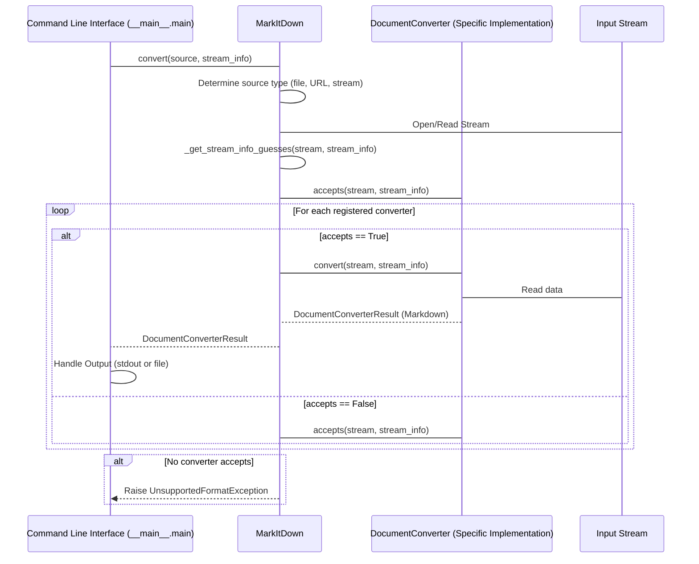
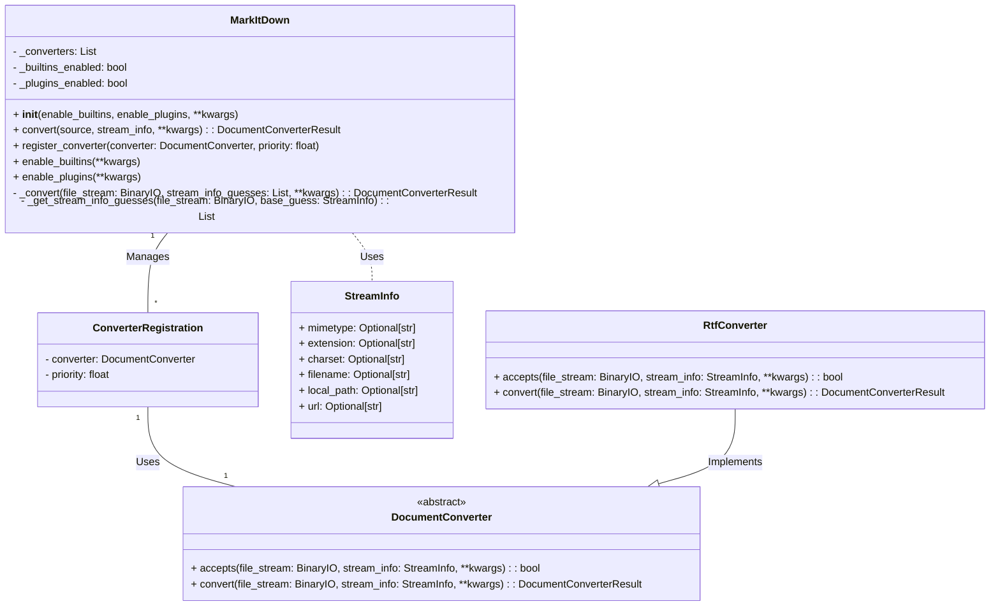

Okay, I have examined the source code of the core components. Here's a refined overview of the `MarkItDown` component:

**Component Description:**

The `MarkItDown` component is a versatile document conversion tool that transforms various file formats and web resources into Markdown. It features a central orchestrator (`MarkItDown` class) that manages the conversion process by registering and utilizing specialized converters. The component supports built-in converters for common file types (e.g., HTML, PDF, DOCX) and allows for extending its functionality through plugins. The `DocumentConverter` abstract class defines the interface for all converters, ensuring a consistent conversion process. The component also includes a command-line interface (`__main__.main`) for easy execution and integration.

**Main Classes and Their Purposes:**

1.  **`MarkItDown`**: The central orchestrator class.
    *   Purpose: Manages converter registration, enables built-in and plugin converters, and orchestrates the conversion process based on the input source.
    *   Key Methods:
        *   `__init__`: Initializes the `MarkItDown` instance, registers built-in and plugin converters.
        *   `convert`: Determines the input type (local file, URL, stream) and calls the appropriate conversion method.
        *   `register_converter`: Registers a `DocumentConverter` instance with a specified priority.
        *   `enable_builtins`: Enables and registers the built-in converters.
        *   `enable_plugins`: Enables and registers converters from external plugins.
2.  **`DocumentConverter`**: An abstract base class for all document converters.
    *   Purpose: Defines the interface that all converters must implement.
    *   Key Methods:
        *   `accepts`: Determines whether the converter can handle a given file based on its stream information (e.g., MIME type, file extension).
        *   `convert`: Converts the document stream to Markdown.
3.  **`StreamInfo`**: A data class that holds metadata about the input stream.
    *   Purpose: Encapsulates information about the input source, such as MIME type, file extension, and URL, to aid in converter selection.
4.  **`RtfConverter`**: A concrete implementation of `DocumentConverter` for RTF files (example from plugin).
    *   Purpose: Converts RTF files to Markdown using the `striprtf` library.
    *   Key Methods:
        *   `accepts`: Checks if the input stream is an RTF file based on MIME type or extension.
        *   `convert`: Reads the RTF content, converts it to plain text using `striprtf`, and returns the result.
5.  **`__main__.main`**: The entry point for the command-line interface.
    *   Purpose: Parses command-line arguments, initializes the `MarkItDown` instance, performs the conversion, and handles the output.

**Main Flow (Sequence Diagram):**

**Class Diagram:**

