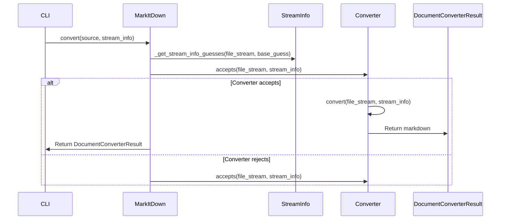
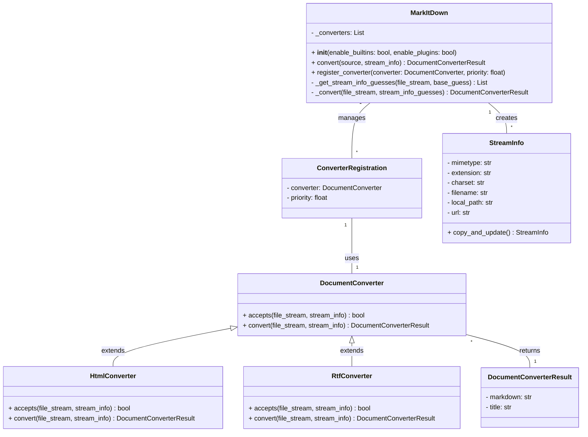

Okay, I have analyzed the source code and have a better understanding of the `markitdown` component. Here's a summary:

**Component Description:**

The `markitdown` component is a document conversion tool that converts various file formats (e.g., PDF, DOCX, HTML, RTF) and web resources (e.g., URLs, YouTube videos) into Markdown. It uses a chain-of-responsibility pattern with `DocumentConverter` classes to handle different file types. The central class is `MarkItDown`, which manages the registration and selection of appropriate converters. It also handles stream information to help converters determine if they can handle the conversion. The component can be used as a command-line tool or as a library within other Python applications.

**Main Classes and Their Purposes:**

*   **`MarkItDown`**: The orchestrator. It manages converter registration, stream information handling, and the overall conversion process. It initializes the built-in converters and enables plugins.
*   **`DocumentConverter`**: An abstract base class for all document converters. It defines the `accepts` and `convert` methods, which subclasses must implement.
*   **`StreamInfo`**: A data class that encapsulates information about the input stream, such as MIME type, file extension, charset, filename, and URL. It helps converters determine if they can handle the input.
*   **`HtmlConverter`**: A concrete `DocumentConverter` that handles HTML files. It uses `BeautifulSoup` to parse the HTML and converts it to Markdown.
*   **`RtfConverter`**: A concrete `DocumentConverter` (provided as a sample plugin) that handles RTF files. It uses `striprtf` to extract the text from the RTF file.
*   **`__main__.main`**: The entry point for the command-line interface. It parses command-line arguments, creates a `MarkItDown` instance, and performs the conversion.

**Main Flow (Sequence Diagram):**

**Main Structure (Class Diagram):**

