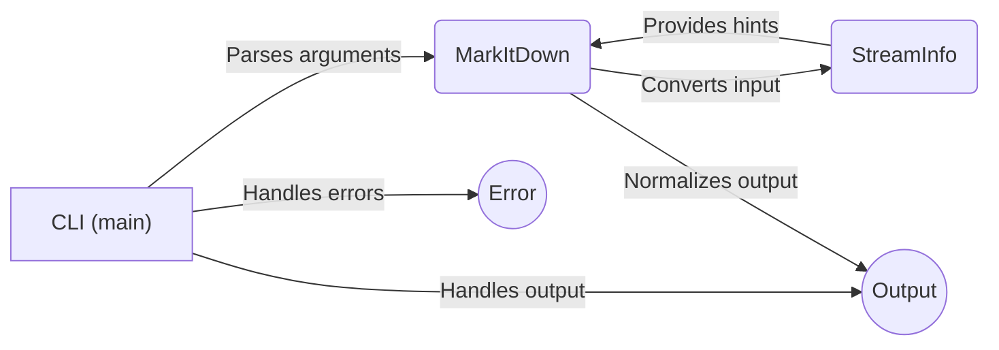

```markdown
## Component: Command-Line Interface

The Command-Line Interface (CLI) is the entry point for the `markitdown` application. It's responsible for parsing command-line arguments, invoking the core conversion engine (`MarkItDown`), and managing the output.



### Component Descriptions:

*   **CLI (main)**
    *   **Description:** Parses command-line arguments using `argparse`, determines the input source (file or stdin), instantiates the `MarkItDown` converter, calls the appropriate conversion method, and handles the output by either writing to a file or printing to stdout. It also handles errors and provides version information.
    *   **Interaction:** Parses arguments to configure `MarkItDown`, calls `MarkItDown` to perform the conversion, and then handles the output.
    *   **Relevant source files:** `repos.markitdown.packages.markitdown.src.markitdown.__main__.main`

*   **MarkItDown**
    *   **Description:** The core conversion engine. It receives the input (either a file path or a stream) and converts it to Markdown. It uses `StreamInfo` to get hints about the input type.
    *   **Interaction:** Receives input from the CLI, uses `StreamInfo` for hints, and produces the converted Markdown output.
    *   **Relevant source files:** `repos.markitdown.packages.markitdown.src.markitdown._markitdown.MarkItDown`

*   **StreamInfo**
    *   **Description:** A helper class that stores information about the input stream, such as the file extension, MIME type, and charset. This information is used to provide hints to the conversion process.
    *   **Interaction:** Provides hints to the `MarkItDown` converter based on the input file or stream.
    *   **Relevant source files:** `repos.markitdown.packages.markitdown.src.markitdown._stream_info.StreamInfo`

*   **Output**
    *   **Description:** Represents the final output of the conversion process. The CLI writes the converted markdown to the specified output (either a file or stdout).
    *   **Interaction:** Receives the converted markdown from `MarkItDown` and writes it to the destination specified by the user.
    *   **Relevant source files:** `repos.markitdown.packages.markitdown.src.markitdown.__main__._handle_output`

*   **Error**
    *   **Description:** Represents the error handling mechanism. The CLI reports any errors encountered during argument parsing or conversion.
    *   **Interaction:** Handles and reports errors that occur during the execution of the application.
    *   **Relevant source files:** `repos.markitdown.packages.markitdown.src.markitdown.__main__._exit_with_error`

```mermaid
graph LR
    A["CLI (main)"] -- Parses arguments --> B(MarkItDown)
    A -- Handles output --> C((Output))
    B -- Converts input --> D(StreamInfo)
    D -- Provides hints --> B
    B -- Normalizes output --> C
    A -- Handles errors --> E((Error))
    classDef linkStyle fill:#f9f,stroke:#333,stroke-width:2px
    A:::linkStyle --> A "CLI (main)"
    click A href "https://github.com/CodeBoarding/GeneratedOnBoardings/blob/main/markitdown/Command-Line Interface.md" "CLI (main)"
    B:::linkStyle --> B "MarkItDown"
    click B href "https://github.com/CodeBoarding/GeneratedOnBoardings/blob/main/markitdown/Core Conversion Engine.md" "MarkItDown"
    C:::linkStyle --> C "Output"
    click C href "https://github.com/CodeBoarding/GeneratedOnBoardings/blob/main/markitdown/Command-Line Interface.md" "Output"
    D:::linkStyle --> D "StreamInfo"
    click D href "https://github.com/CodeBoarding/GeneratedOnBoardings/blob/main/markitdown/Stream Information Handling.md" "StreamInfo"
    E:::linkStyle --> E "Error"
    click E href "https://github.com/CodeBoarding/GeneratedOnBoardings/blob/main/markitdown/Command-Line Interface.md" "Error"
```