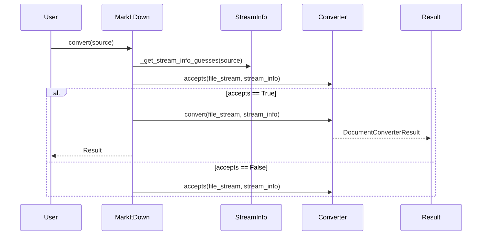
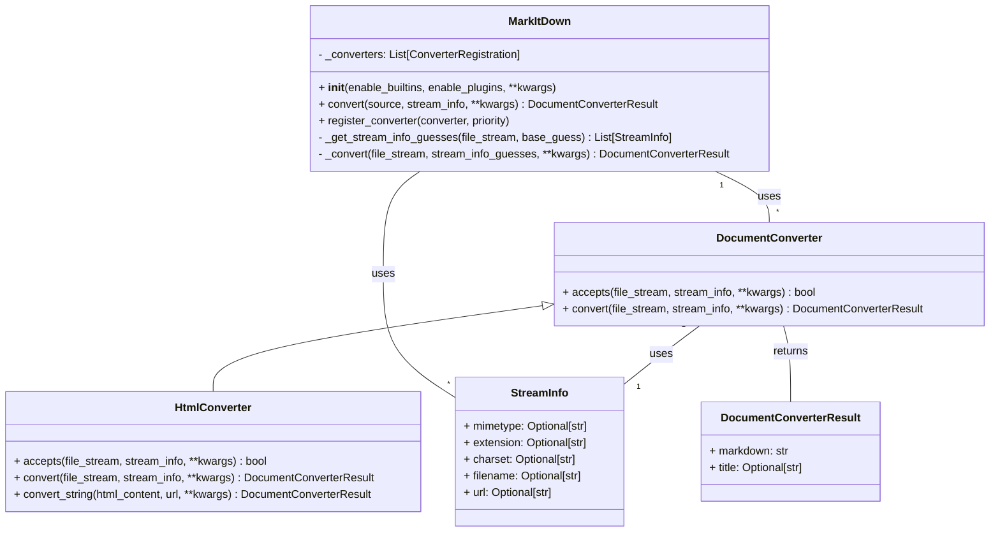

Based on the information gathered, here's an overview of the `markitdown` component:

**Description:**

The `markitdown` component is designed to convert various document types and web resources into Markdown format. It provides a flexible and extensible architecture that supports built-in converters and plugins. The core of the component is the `MarkItDown` class, which orchestrates the conversion process. It identifies the input type, selects the appropriate converter, and returns the Markdown output. The component also includes abstract base classes and concrete implementations for different document converters.

**Main Classes and Their Purposes:**

*   **`MarkItDown`**: The central class responsible for managing the conversion process. It handles input from various sources (local files, URLs, streams, responses), determines the file type, selects the appropriate converter, and returns the converted Markdown.
*   **`DocumentConverter`**: An abstract base class for all document converters. It defines the `accepts` and `convert` methods, which are responsible for determining if a converter can handle a given file type and performing the conversion, respectively.
*   **`HtmlConverter`**: A concrete implementation of `DocumentConverter` that converts HTML documents to Markdown. It uses `BeautifulSoup` for parsing HTML and `markdownify` for converting HTML elements to Markdown.
*   **`StreamInfo`**: A data class that holds metadata about the input stream, such as mimetype, extension, charset, filename, and URL. This information is used to determine the appropriate converter and to pass relevant context to the converter.

**Main Flow (Sequence Diagram):**

**Main Structure (Class Diagram):**

