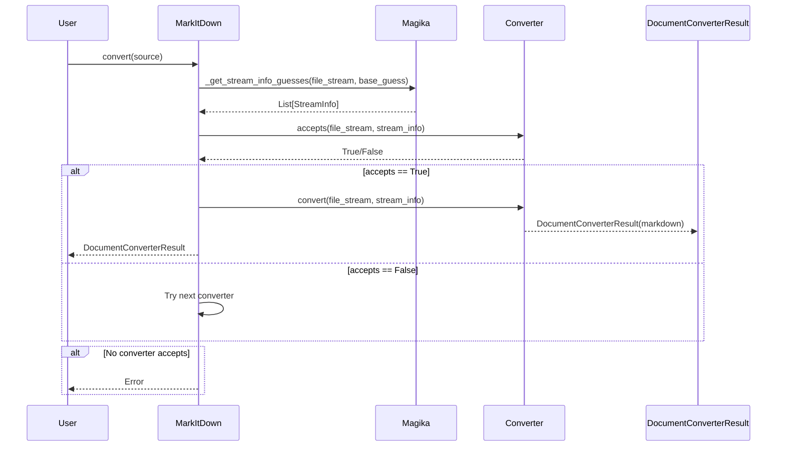
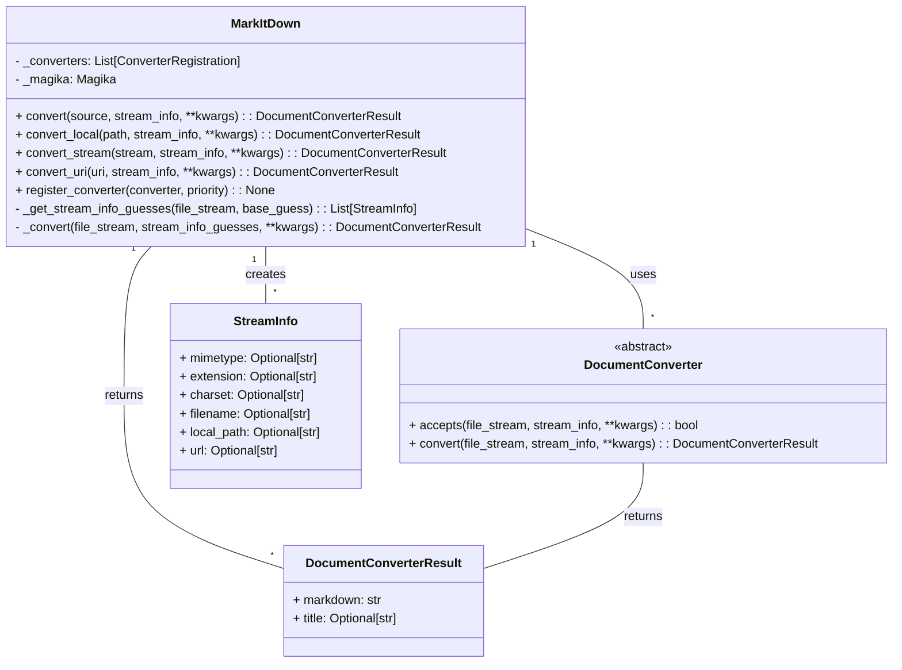

It seems I'm having trouble accessing some of the modules directly. I will adjust my approach and focus on the core `MarkItDown` class and the `DocumentConverter` interface, as these seem to be the central elements.

Here's an overview of the `Markdown Conversion Orchestration` component:

**Description:**

This component orchestrates the conversion of various document types to Markdown. It handles tasks such as:

*   Reading the input document from various sources (local file, URL, stream, etc.).
*   Detecting the file type.
*   Selecting an appropriate converter.
*   Converting the document to Markdown.
*   Normalizing the output.

**Main Classes and their Purposes:**

*   **`MarkItDown`**: This is the main class that orchestrates the conversion process. It handles input from various sources, manages converter registration, and performs the conversion.
    *   `convert(source, stream_info, **kwargs)`: This method is the entry point for converting a document. It accepts the document source, stream information, and optional keyword arguments. It determines the source type and calls the appropriate conversion method.
    *   `convert_local(path, stream_info, **kwargs)`: Converts a local file to Markdown.
    *   `convert_stream(stream, stream_info, **kwargs)`: Converts a file stream to Markdown.
    *   `convert_uri(uri, stream_info, **kwargs)`: Converts a document from a URI (URL, file, data) to Markdown.
    *   `convert_response(response, stream_info, **kwargs)`: Converts a `requests.Response` object to Markdown.
    *   `register_converter(converter, priority)`: Registers a `DocumentConverter` with a given priority.
*   **`DocumentConverter`**: This is an abstract base class for all document converters. Concrete converters (e.g., `DocxConverter`, `PdfConverter`, `HtmlConverter`) inherit from this class and implement the `accepts()` and `convert()` methods.
    *   `accepts(file_stream, stream_info, **kwargs)`: Determines whether the converter can handle the given document based on its stream information (mimetype, extension, etc.).
    *   `convert(file_stream, stream_info, **kwargs)`: Converts the document to Markdown.
*   **`DocumentConverterResult`**: A data class that represents the result of a document conversion. It contains the converted Markdown text and an optional title.

**Main Flow (Sequence Diagram):**

**Component Structure (Class Diagram):**

**Brief Description:**

The `Markdown Conversion Orchestration` component is responsible for converting documents of various types into Markdown format. The central class, `MarkItDown`, manages the conversion process by utilizing a collection of `DocumentConverter` implementations. The `MarkItDown` class first tries to determine the file type using `Magika` and `StreamInfo`. Then, it iterates through registered converters, calling the `accepts` method of each converter to determine if it can handle the file. If a converter accepts the file, its `convert` method is called to perform the conversion. The result is encapsulated in a `DocumentConverterResult` object, which contains the Markdown output. The component supports various input sources, including local files, URLs, and streams.