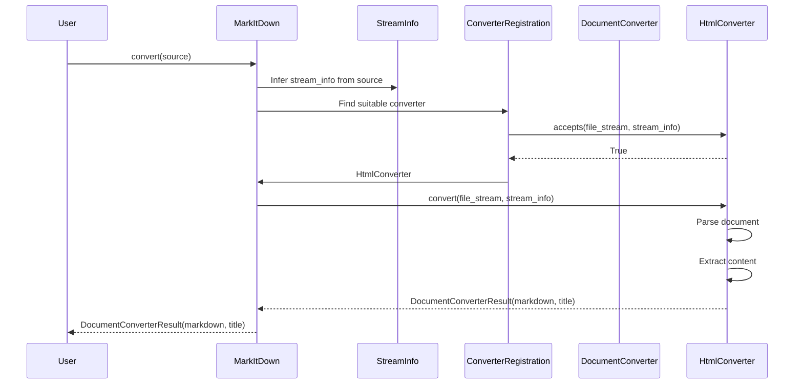
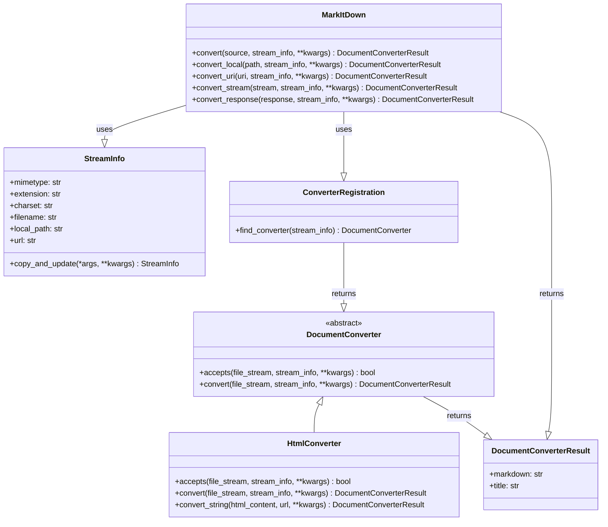

Okay, I have examined the source code of the core components. Here's a breakdown of the `markitdown` library:

**Component Description:**

The `markitdown` library provides a way to convert various document formats into Markdown. It offers a flexible and extensible architecture, allowing users to convert documents from local files, URLs, or even in-memory streams. The core components are:

*   **`MarkItDown`**: This class acts as the central orchestrator. It receives the input document (path, URL, stream, etc.) and determines the appropriate `DocumentConverter` to use.
*   **`DocumentConverter`**: This is an abstract base class that defines the interface for all document converters. Subclasses are responsible for handling specific document types (e.g., HTML, PDF, DOCX). The key methods are `accepts()` (to determine if the converter can handle the input) and `convert()` (to perform the actual conversion).
*   **`StreamInfo`**: A data class that encapsulates metadata about the input stream, such as MIME type, file extension, charset, filename, and URL. This information is crucial for selecting the correct converter and handling the conversion process.
*   **Concrete `DocumentConverter` implementations (e.g., `HtmlConverter`)**: These classes inherit from `DocumentConverter` and provide the logic for converting specific document types to Markdown. They use libraries like `BeautifulSoup` (in the case of `HtmlConverter`) to parse the document and extract the relevant content.

**Main Flow:**

The main flow involves the `MarkItDown` class receiving a document, determining the appropriate converter, and then using that converter to generate Markdown.

**Main Structure:**

The structure is centered around the `MarkItDown` class and the `DocumentConverter` hierarchy.

