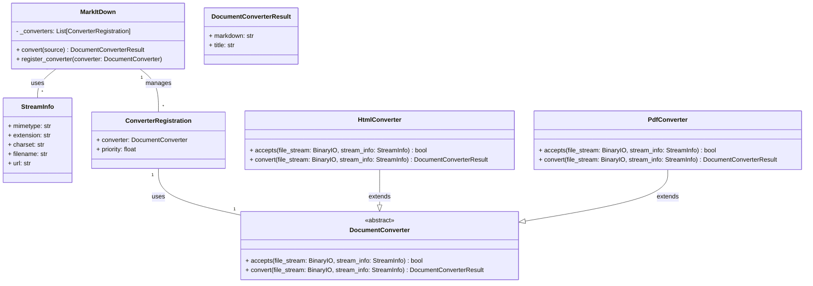

Okay, I have analyzed the source code of the core components. Here's a breakdown of the `markitdown` library:

**Component Description:**

The `markitdown` library provides a way to convert various document formats (HTML, PDF, DOCX, etc.) and web resources (URLs) into Markdown. It uses a modular design with a central `MarkItDown` class that orchestrates the conversion process by delegating to specialized `DocumentConverter` classes. The library handles stream information, converter registration, and fallback mechanisms when a specific converter fails.

**Main Classes and Their Purposes:**

*   **`MarkItDown`**: The main class responsible for managing the conversion process. It handles:
    *   Converter registration and selection.
    *   Input source handling (local files, URLs, streams, responses).
    *   Stream information detection using `magika`.
    *   Error handling and fallback mechanisms.
*   **`DocumentConverter` (Abstract Base Class)**: Defines the interface for all document converters. Subclasses must implement `accepts()` to determine if the converter can handle a given input and `convert()` to perform the actual conversion.
*   **`DocumentConverterResult`**: A simple data class that encapsulates the result of a conversion, containing the converted Markdown text and an optional title.
*   **`StreamInfo`**: A data class that stores metadata about the input stream, such as MIME type, file extension, charset, filename, and URL. This information is used by converters to determine if they can handle the input and how to convert it.
*   **`HtmlConverter`**: A concrete `DocumentConverter` that converts HTML content to Markdown using `BeautifulSoup` for parsing and a custom `Markdownify` class for the conversion.
*   **`PdfConverter`**: A concrete `DocumentConverter` that converts PDF content to Markdown using `pdfminer.six`.

**Main Flow (Sequence Diagram):**

The main flow involves the `MarkItDown` class receiving a conversion request and delegating it to the appropriate `DocumentConverter`.

```mermaid
sequenceDiagram
    participant User
    participant MarkItDown
    participant StreamInfo
    participant Converter (e.g., HtmlConverter)
    participant DocumentConverterResult

    User->>MarkItDown: convert(source)
    MarkItDown->>StreamInfo: _get_stream_info_guesses(source)
    MarkItDown->>Converter: accepts(file_stream, stream_info)
    alt Converter accepts the stream
        Converter->>Converter: convert(file_stream, stream_info)
        Converter-->>MarkItDown: DocumentConverterResult
    else Converter rejects the stream
        Converter-->>MarkItDown: (rejection)
    end
    MarkItDown-->>User: DocumentConverterResult
```

**Main Structure (Class Diagram):**

The class diagram shows the relationships between the main classes involved in the conversion process.

