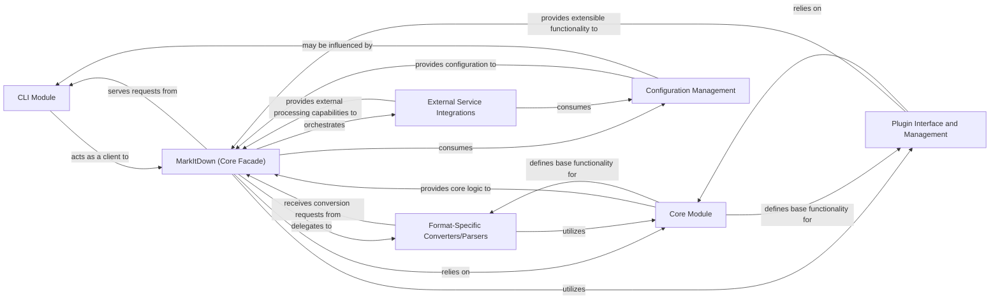

## Details

The `markitdown` project is structured around a central `MarkItDown` facade that orchestrates document conversion. The process begins with the `CLI Module` parsing user input and configuring the `MarkItDown` facade. This facade then dynamically selects and utilizes appropriate `Format-Specific Converters/Parsers` to transform various document types into Markdown. The system is highly extensible, allowing for `Plugin Interface and Management` to integrate third-party converters and `External Service Integrations` to leverage advanced capabilities like AI-powered content extraction. All these operations are underpinned by a `Core Module` providing essential data structures and interfaces, with `Configuration Management` ensuring flexible operation through command-line arguments and environment variables.

### CLI Module
Serves as the primary user-facing interface, handling command-line argument parsing, input validation, and orchestrating document conversion tasks. It delegates core processing to the `MarkItDown` facade and manages output presentation to the user.

**Related Classes/Methods**: _None_

### MarkItDown (Core Facade)
The central facade for the `markitdown` library, abstracting complex document processing workflows, including parsing, conversion, and integration with external services and plugins.

**Related Classes/Methods**: _None_

### Core Module
Provides fundamental utilities, common data structures, and base interfaces that underpin the entire `markitdown` library, ensuring consistency and reusability across different components.

**Related Classes/Methods**: _None_

### Format-Specific Converters/Parsers
Responsible for handling the parsing of various input document formats (e.g., Markdown, HTML, PDF) into an internal representation and converting this representation into target output formats.

**Related Classes/Methods**: _None_

### Plugin Interface and Management
Defines the architectural contract and mechanisms for extending `markitdown`'s capabilities through a plugin system, including plugin discovery, loading, and execution.

**Related Classes/Methods**: _None_

### External Service Integrations
Manages secure and efficient communication with external AI/LLM services (e.g., Azure Document Intelligence, OpenAI) to leverage advanced capabilities like content extraction or summarization.

**Related Classes/Methods**: _None_

### Configuration Management
Handles the loading, parsing, and provision of application-wide and user-specific configurations, including API keys, default paths, and processing options.

**Related Classes/Methods**: _None_

### [FAQ](https://github.com/CodeBoarding/GeneratedOnBoardings/tree/main?tab=readme-ov-file#faq)