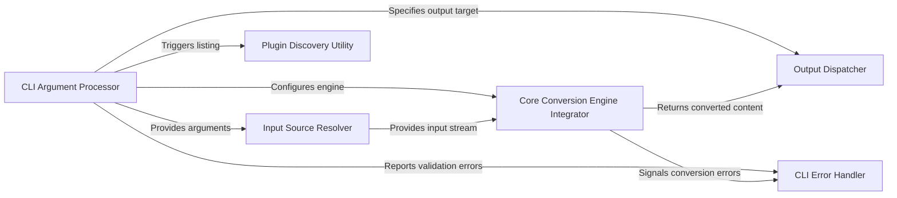

## Component Details

One paragraph explaining the functionality which is represented by this graph. What the main flow is and what is its purpose.

### CLI Argument Processor
This component is responsible for defining, parsing, and validating all command-line arguments provided by the user. It uses Python's argparse module to interpret user input, extract conversion parameters, and identify the input/output destinations.

**Related Classes/Methods**:

- <a href="https://github.com/microsoft/markitdown/blob/master/packages/markitdown/src/markitdown/__main__.py#L14-L114" target="_blank" rel="noopener noreferrer">`markitdown.__main__.parse_cli_arguments` (14:114)</a>

### Input Source Resolver
This component determines the actual source of the content to be converted (e.g., a local file path, standard input stream, or a URI). It also processes any provided hints (like file extension, MIME type, or character set) to create a StreamInfo object, which provides unified access to input stream properties.

**Related Classes/Methods**:

- <a href="https://github.com/microsoft/markitdown/blob/master/packages/markitdown/src/markitdown/__main__.py#L117-L156" target="_blank" rel="noopener noreferrer">`markitdown.__main__.resolve_input_hints` (117:156)</a>
- <a href="https://github.com/microsoft/markitdown/blob/master/packages/markitdown/src/markitdown/__main__.py#L189-L198" target="_blank" rel="noopener noreferrer">`markitdown.__main__.determine_input_source` (189:198)</a>
- <a href="https://github.com/microsoft/markitdown/blob/master/packages/markitdown/src/markitdown/_stream_info.py#L5-L31" target="_blank" rel="noopener noreferrer">`markitdown._stream_info.StreamInfo` (5:31)</a>

### Core Conversion Engine Integrator
This component acts as the bridge between the CLI and the MarkItDown core conversion logic. It instantiates the MarkItDown class with the appropriate configuration (e.g., enabling plugins, setting Document Intelligence endpoints) and invokes the primary conversion methods (convert or convert_stream) based on the resolved input source.

**Related Classes/Methods**:

- <a href="https://github.com/microsoft/markitdown/blob/master/packages/markitdown/src/markitdown/__main__.py#L175-L198" target="_blank" rel="noopener noreferrer">`markitdown.__main__.integrate_core_conversion` (175:198)</a>
- <a href="https://github.com/microsoft/markitdown/blob/master/packages/markitdown/src/markitdown/_markitdown.py#L92-L770" target="_blank" rel="noopener noreferrer">`markitdown._markitdown.MarkItDown` (92:770)</a>

### Output Dispatcher
This component is responsible for directing the final converted Markdown output to the correct destination. It either prints the content to standard output (console) or writes it to a specified output file, as determined by the command-line arguments.

**Related Classes/Methods**:

- <a href="https://github.com/microsoft/markitdown/blob/master/packages/markitdown/src/markitdown/__main__.py#L202-L213" target="_blank" rel="noopener noreferrer">`markitdown.__main__._handle_output` (202:213)</a>

### CLI Error Handler
This component manages the display of user-friendly error messages to the console and ensures a graceful exit from the application when critical issues (e.g., invalid arguments, missing dependencies, conversion failures) occur.

**Related Classes/Methods**:

- <a href="https://github.com/microsoft/markitdown/blob/master/packages/markitdown/src/markitdown/__main__.py#L216-L218" target="_blank" rel="noopener noreferrer">`markitdown.__main__._exit_with_error` (216:218)</a>
- <a href="https://github.com/microsoft/markitdown/blob/master/packages/markitdown/src/markitdown/_exceptions.py#L1-L1000" target="_blank" rel="noopener noreferrer">`markitdown._exceptions` (1:1000)</a>

### Plugin Discovery Utility
This component provides the functionality to list all installed third-party markitdown plugins. It queries the system's entry points to discover and display available extensions, enhancing the user's awareness of additional capabilities.

**Related Classes/Methods**:

- <a href="https://github.com/microsoft/markitdown/blob/master/packages/markitdown/src/markitdown/__main__.py#L158-L173" target="_blank" rel="noopener noreferrer">`markitdown.__main__.list_plugins` (158:173)</a>

### [FAQ](https://github.com/CodeBoarding/GeneratedOnBoardings/tree/main?tab=readme-ov-file#faq)