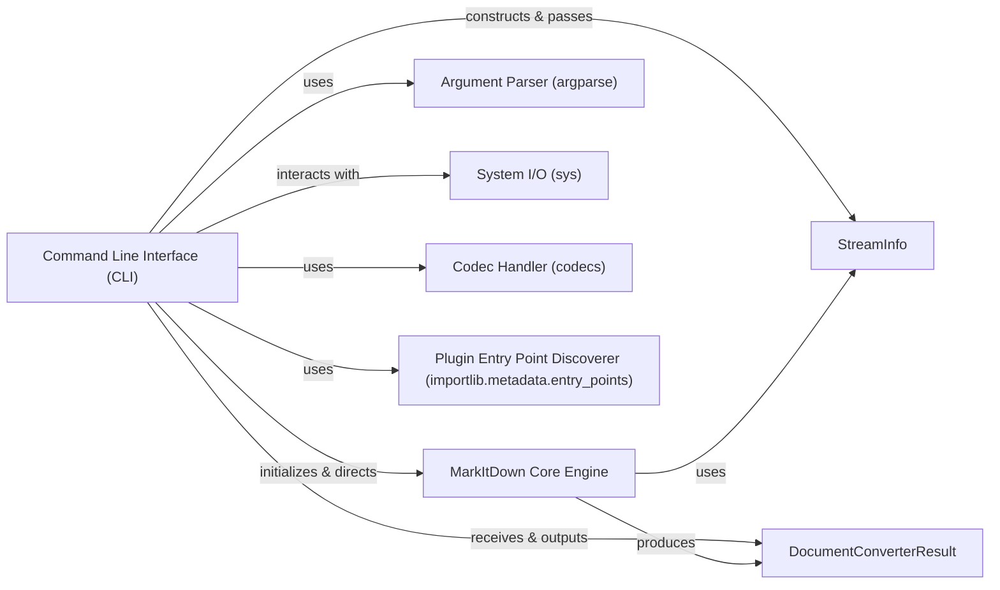

## Component Details

This analysis focuses on the `Command Line Interface (CLI)` component of the `markitdown` application, detailing its structure, flow, and interactions with other core components. The CLI serves as the primary user-facing interface, responsible for interpreting user commands and orchestrating the document conversion process.

### Command Line Interface (CLI)
The main entry point for the `markitdown` application. It parses command-line arguments, validates user input, initializes the `MarkItDown Core Engine` with specified parameters, directs the conversion of files or streams, and manages output to `stdout` or a designated file. It also handles error reporting and provides functionality to list installed plugins.

**Related Classes/Methods**:

- <a href="https://github.com/microsoft/markitdown/blob/master/packages/markitdown/src/markitdown/__main__.py#L12-L199" target="_blank" rel="noopener noreferrer">`markitdown.__main__:main` (12:199)</a>

### MarkItDown Core Engine
The central orchestrator for document conversion. It receives input and conversion parameters, then delegates the actual conversion to appropriate internal converter components. It encapsulates the core logic for handling various document types and applying conversion rules.

**Related Classes/Methods**:

- <a href="https://github.com/microsoft/markitdown/blob/master/packages/markitdown/src/markitdown/_markitdown.py#L92-L770" target="_blank" rel="noopener noreferrer">`markitdown._markitdown.MarkItDown` (92:770)</a>

### StreamInfo
A data structure used to encapsulate metadata about an input stream, such as its file extension, MIME type, and character set. This information is crucial for the `MarkItDown Core Engine` to correctly identify and process the input data, especially when reading from `stdin`.

**Related Classes/Methods**:

- <a href="https://github.com/microsoft/markitdown/blob/master/packages/markitdown/src/markitdown/_stream_info.py#L5-L31" target="_blank" rel="noopener noreferrer">`markitdown._stream_info.StreamInfo` (5:31)</a>

### DocumentConverterResult
A data structure that holds the outcome of a document conversion operation. Its primary content is the generated Markdown string, but it can also include other relevant metadata about the conversion process.

**Related Classes/Methods**:

- <a href="https://github.com/microsoft/markitdown/blob/master/packages/markitdown/src/markitdown/_base_converter.py#L4-L38" target="_blank" rel="noopener noreferrer">`markitdown._base_converter.DocumentConverterResult` (4:38)</a>

### Argument Parser (argparse)
A standard Python library component used by the CLI to define and parse command-line arguments. It handles the definition of options (e.g., `-o`, `--extension`), their types, and help messages, making the CLI user-friendly.

**Related Classes/Methods**:

- `argparse` (0:0)

### System I/O (sys)
A standard Python library component providing access to system-specific parameters and functions. In the context of the CLI, it is used for reading input from `sys.stdin.buffer`, writing output to `sys.stdout`, and exiting the application with a status code (`sys.exit`).

**Related Classes/Methods**:

- `sys` (0:0)

### Codec Handler (codecs)
A standard Python library component used by the CLI to handle various encoding and decoding schemes. Specifically, it's used to validate and normalize character set hints provided by the user, ensuring that the input stream can be correctly interpreted.

**Related Classes/Methods**:

- `codecs` (0:0)

### Plugin Entry Point Discoverer (importlib.metadata.entry_points)
A component used by the CLI to discover and list installed third-party plugins. It leverages Python's entry point mechanism to find packages registered as `markitdown.plugin`, providing users with information about available extensions.

**Related Classes/Methods**:

- `importlib.metadata.entry_points` (0:0)

### [FAQ](https://github.com/CodeBoarding/GeneratedOnBoardings/tree/main?tab=readme-ov-file#faq)