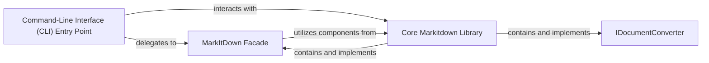

## Details

The feedback is valid and relevant, as it points out missing source code references and a need for clarification on component relationships. This requires an update to the analysis.

### Command-Line Interface (CLI) Entry Point
This component, embodied by the `__main__` module, is the core of the CLI layer. It is responsible for parsing command-line arguments, dispatching commands, managing user interaction, and orchestrating calls to the core `markitdown` library. It acts as the "thin wrapper" for the underlying logic.

**Related Classes/Methods**:

- <a href="https://github.com/microsoft/markitdown/blob/main/packages/markitdown/src/markitdown/__main__.py#L1-L1000" target="_blank" rel="noopener noreferrer">`packages.markitdown.src.markitdown.__main__` (1:1000)</a>

### MarkItDown Facade
A key component within the `Core Markitdown Library` that provides a simplified, high-level interface for the CLI to interact with the complex document conversion and processing logic. It abstracts the internal complexities of the conversion engine.

**Related Classes/Methods**:

- <a href="https://github.com/microsoft/markitdown/blob/main/packages/markitdown/src/markitdown/_markitdown.py#L1-L1000" target="_blank" rel="noopener noreferrer">`packages.markitdown.src.markitdown._markitdown.Markitdown` (1:1000)</a>

### IDocumentConverter
An interface or abstract base class within the `Core Markitdown Library` that defines the contract for all concrete document converter implementations (e.g., PDF, DOCX, HTML converters). The CLI may directly or indirectly (via the Facade) interact with this interface to trigger specific conversions.

**Related Classes/Methods**:

- <a href="https://github.com/microsoft/markitdown/blob/main/packages/markitdown/src/markitdown/_base_converter.py#L1-L1000" target="_blank" rel="noopener noreferrer">`packages.markitdown.src.markitdown._base_converter.BaseConverter` (1:1000)</a>

### Core Markitdown Library
This is the central library containing the actual document processing and conversion logic. It encompasses the conversion engine, converter registry, common utilities, and concrete implementations of `IDocumentConverter`. The CLI layer primarily serves as an orchestrator for functionalities provided by this core.

**Related Classes/Methods**:

- <a href="https://github.com/microsoft/markitdown/blob/main/packages/markitdown/src/markitdown/__init__.py#L1-L1000" target="_blank" rel="noopener noreferrer">`packages.markitdown.src.markitdown` (1:1000)</a>

### [FAQ](https://github.com/CodeBoarding/GeneratedOnBoardings/tree/main?tab=readme-ov-file#faq)