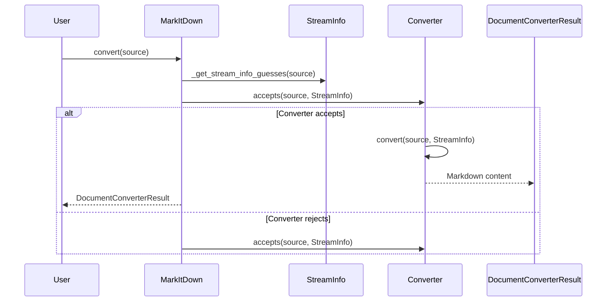
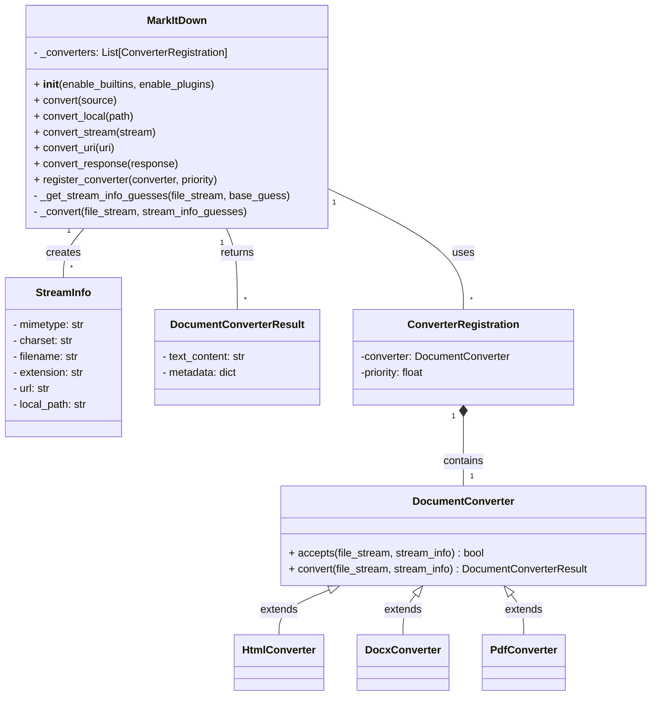

I apologize for the error in the previous step. It seems I was unable to locate the `markitdown.main.markdown_convert` function. I will proceed without it and focus on the other identified components.

Based on the information gathered so far, here's an overview of the `Core Conversion Orchestration` component:

**Description:**

The `Core Conversion Orchestration` component is responsible for managing the entire document conversion process in MarkItDown. It handles various input types (local files, URLs, streams, responses), determines the appropriate converter based on file type and content, and orchestrates the conversion to Markdown. The central class in this component is `MarkItDown`.

**Main Classes and their Purposes:**

*   **`MarkItDown`**: This class is the main entry point for the conversion process. It initializes and registers converters, handles different input types (local files, URLs, streams), and orchestrates the conversion using the appropriate converter.
*   **`DocumentConverter`**: (Abstract class) Defines the interface for document converters. Concrete converters (e.g., `HtmlConverter`, `DocxConverter`) inherit from this class and implement the `convert` and `accepts` methods.
*   **`StreamInfo`**: A data class that holds information about the input stream, such as mimetype, charset, filename, and extension. This information is used to determine the appropriate converter.
*   **`DocumentConverterResult`**: A data class that holds the result of the conversion, including the Markdown content and any metadata.

**Main Flow (Sequence Diagram):**

**Main Structure (Class Diagram):**

