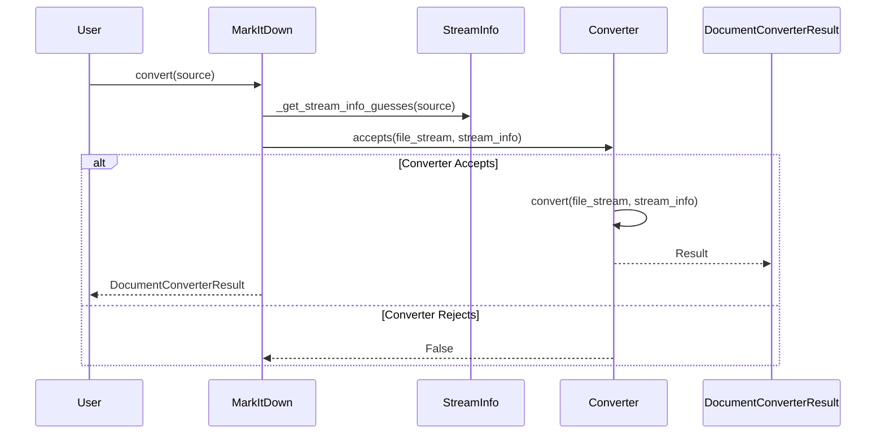
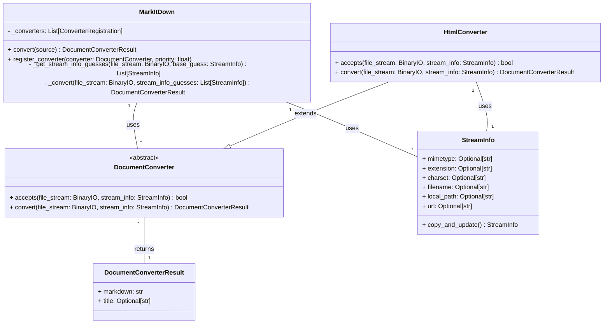

Based on the information gathered, here's an overview of the `markitdown` component:

**Description:**

The `markitdown` component is designed to convert various document formats and web resources into Markdown. It provides a flexible and extensible framework for document conversion, supporting local files, remote URLs, and data streams. The core of the component is the `MarkItDown` class, which orchestrates the conversion process by selecting appropriate converters based on file type and content. The component relies on `DocumentConverter` subclasses to handle the actual conversion of specific file formats. It also uses `StreamInfo` to store metadata about the input stream, which helps in selecting the right converter.

**Main Classes and Their Purposes:**

*   **`MarkItDown`**: The main class responsible for managing the conversion process. It handles converter registration, stream information detection, and orchestrates the conversion by delegating to appropriate `DocumentConverter` instances.
*   **`DocumentConverter`**: An abstract base class for all document converters. It defines the `accepts` and `convert` methods that subclasses must implement. The `accepts` method determines if a converter can handle a given input, while the `convert` method performs the actual conversion to Markdown.
*   **`StreamInfo`**: A data class that stores metadata about the input stream, such as MIME type, file extension, character set, filename, and URL. This information is used to select the appropriate converter and to provide context for the conversion process.
*   **`HtmlConverter`**: A concrete `DocumentConverter` subclass that converts HTML documents to Markdown. It uses `BeautifulSoup` for parsing HTML and `_CustomMarkdownify` (not detailed here) for Markdown conversion.

**Main Flow (Sequence Diagram):**

**Main Structure (Class Diagram):**

