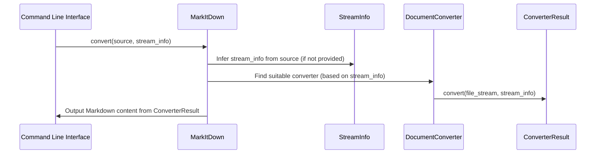
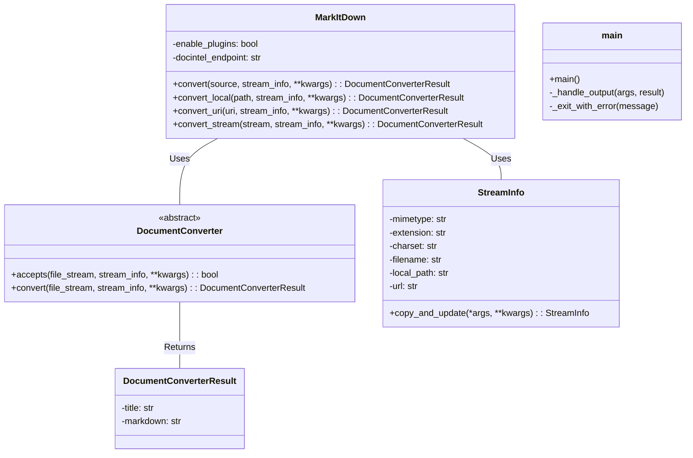

## Component Overview: Document Conversion

The `markitdown` library provides a tool for converting various document formats (e.g., PDF, DOCX, HTML) into Markdown. It offers a command-line interface and a Python API for performing these conversions.

**Main Classes and Their Purposes:**

*   **`MarkItDown`**: This class orchestrates the document conversion process. It handles different input types (local files, URLs, streams) and selects the appropriate converter based on file type or provided hints.
*   **`DocumentConverter`**: This is an abstract base class for all specific document converters (e.g., `PDFConverter`, `HTMLConverter`). Subclasses must implement the `accepts()` method to determine if they can handle a given document and the `convert()` method to perform the actual conversion.
*   **`StreamInfo`**: A data class that stores metadata about the input stream, such as MIME type, file extension, charset, filename, local path, and URL. This information is used to select the appropriate converter and provide context for the conversion process.
*   **`__main__.main`**: This function serves as the entry point for the command-line interface. It parses command-line arguments, initializes the `MarkItDown` class, performs the conversion, and handles the output.

**Main Flow (Sequence Diagram):**

**Component Structure (Class Diagram):**

