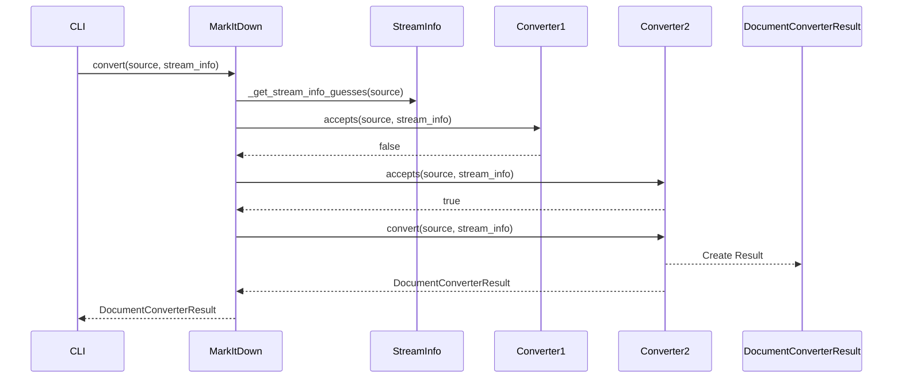
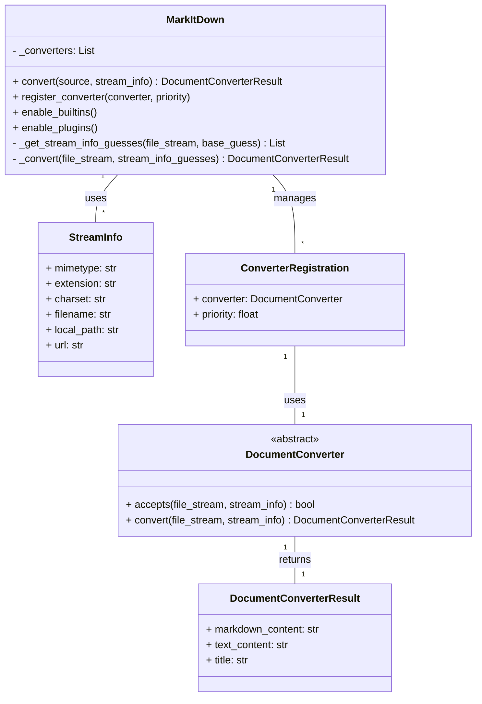

Okay, I have examined the source code of the core components. Here's a refined overview of the `Markitdown` component:

**Description:**

The `Markitdown` component is the core of the `markitdown` application. It's responsible for converting various document formats (local files, URLs, streams, etc.) into Markdown. It uses a chain of responsibility pattern with `DocumentConverter` instances to handle different file types. The component supports built-in converters and can be extended with plugins. It also handles stream type detection using `magika` and provides a CLI interface for users to interact with the conversion process.

**Main Classes and Their Purposes:**

*   **`MarkItDown`**: The main class that orchestrates the conversion process. It manages converter registration, stream type detection, and calls the appropriate converter.
    *   `convert()`: Accepts a source (path, URL, stream) and initiates the conversion process.
    *   `register_converter()`: Registers a `DocumentConverter` with a priority.
    *   `enable_builtins()`: Registers the built-in converters.
    *   `enable_plugins()`: Loads and registers converters from plugins.
*   **`DocumentConverter`**: An abstract base class for all document converters.
    *   `accepts()`: Determines if the converter can handle a given file stream and `StreamInfo`.
    *   `convert()`: Converts the file stream to a `DocumentConverterResult` object containing the Markdown content.
*   **`StreamInfo`**: A data class that holds information about the input stream, such as filename, mimetype, and charset. It's used to help determine the file type and how to convert it.
*   **`DocumentConverterResult`**: A data class that holds the result of a document conversion, including the Markdown content, text content, and title.
*   **`ConverterRegistration`**: A data class that associates a converter with a priority.
*   **`CLI`**: Handles command-line argument parsing and invokes the `MarkItDown` component. Located in `markitdown.cli`.
*   **`main`**: The entry point of the application. Located in `markitdown.__main__.main`. It parses command-line arguments, initializes the `MarkItDown` object, and performs the conversion.

**Visualization:**

I'll use a sequence diagram to illustrate the main flow of the conversion process and a class diagram to show the structure of the core classes.

**Sequence Diagram (Mermaid):**

**Class Diagram (Mermaid):**

