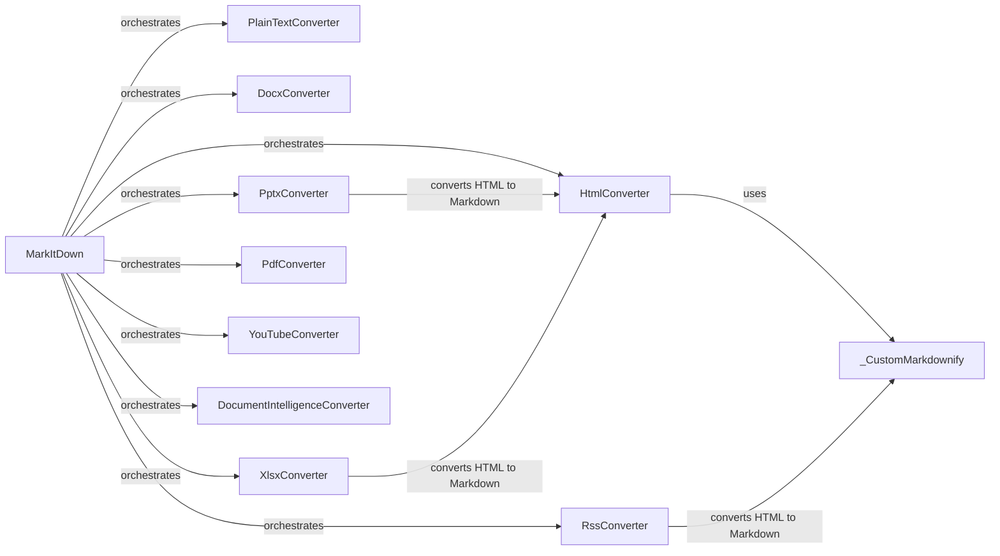

## Component Details

### MarkItDown
The main class responsible for converting various file formats to Markdown by orchestrating the registered converters.
- **Related Classes/Methods**: `repos.markitdown.packages.markitdown.src.markitdown._markitdown.MarkItDown`

### PlainTextConverter
Converter for plain text files, identifies text files based on MIME type, extension, or charset and converts them to Markdown.
- **Related Classes/Methods**: `repos.markitdown.packages.markitdown.src.markitdown.converters._plain_text_converter.PlainTextConverter`

### HtmlConverter
Converter for HTML files, uses BeautifulSoup to parse HTML, removes script and style elements, and converts the remaining content to Markdown using _CustomMarkdownify.
- **Related Classes/Methods**: `repos.markitdown.packages.markitdown.src.markitdown.converters._html_converter.HtmlConverter`

### DocxConverter
Converter for Microsoft Word (docx) files.
- **Related Classes/Methods**: `repos.markitdown.packages.markitdown.src.markitdown.converters._docx_converter.DocxConverter`

### PptxConverter
Converter for Microsoft PowerPoint (pptx) files.
- **Related Classes/Methods**: `repos.markitdown.packages.markitdown.src.markitdown.converters._pptx_converter.PptxConverter`

### XlsxConverter
Converter for Microsoft Excel (xlsx) files.
- **Related Classes/Methods**: `repos.markitdown.packages.markitdown.src.markitdown.converters._xlsx_converter.XlsxConverter`

### PdfConverter
Converter for PDF files.
- **Related Classes/Methods**: `repos.markitdown.packages.markitdown.src.markitdown.converters._pdf_converter.PdfConverter`

### YouTubeConverter
Converter for YouTube video transcripts.
- **Related Classes/Methods**: `repos.markitdown.packages.markitdown.src.markitdown.converters._youtube_converter.YouTubeConverter`

### RssConverter
Converter for RSS and Atom feeds.
- **Related Classes/Methods**: `repos.markitdown.packages.markitdown.src.markitdown.converters._rss_converter.RssConverter`

### DocumentIntelligenceConverter
Converter that uses Azure Document Intelligence to extract text from documents.
- **Related Classes/Methods**: `repos.markitdown.packages.markitdown.src.markitdown.converters._doc_intel_converter.DocumentIntelligenceConverter`

### _CustomMarkdownify
Custom Markdownify class for converting HTML to Markdown with specific rules, used by HtmlConverter and other converters that produce HTML as intermediate output.
- **Related Classes/Methods**: `repos.markitdown.packages.markitdown.src.markitdown.converters._markdownify._CustomMarkdownify`
