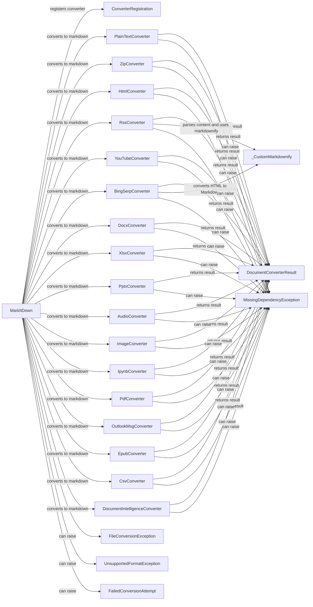

## Component Details

### MarkItDown
The main class responsible for converting various file formats to markdown. It orchestrates the conversion process by selecting the appropriate converter based on the file type and applying it to generate the markdown output.
- **Related Classes/Methods**: `repos.markitdown.packages.markitdown.src.markitdown._markitdown.MarkItDown`

### ConverterRegistration
Registers a converter for a specific file type, associating the file extension with the corresponding converter class. This allows the MarkItDown class to dynamically select the correct converter during the conversion process.
- **Related Classes/Methods**: `repos.markitdown.packages.markitdown.src.markitdown._markitdown.ConverterRegistration`

### PlainTextConverter
Converter for plain text files. It reads the content of the text file and returns it as a markdown string, performing minimal formatting.
- **Related Classes/Methods**: `repos.markitdown.packages.markitdown.src.markitdown.converters._plain_text_converter.PlainTextConverter`

### ZipConverter
Converter for zip files. It extracts the contents of the zip file and converts each file within it to markdown, aggregating the results into a single markdown document.
- **Related Classes/Methods**: `repos.markitdown.packages.markitdown.src.markitdown.converters._zip_converter.ZipConverter`

### HtmlConverter
Converter for HTML files. It parses the HTML content and converts it to markdown using a Markdownify library, preserving the structure and formatting of the original HTML.
- **Related Classes/Methods**: `repos.markitdown.packages.markitdown.src.markitdown.converters._html_converter.HtmlConverter`

### RssConverter
Converter for RSS feeds. It parses the RSS feed, extracts the content from each entry, and converts it to markdown, creating a summary of the feed's content.
- **Related Classes/Methods**: `repos.markitdown.packages.markitdown.src.markitdown.converters._rss_converter.RssConverter`

### YouTubeConverter
Converter for YouTube video transcripts. It retrieves the transcript of a YouTube video and converts it to markdown, providing a textual representation of the video's content.
- **Related Classes/Methods**: `repos.markitdown.packages.markitdown.src.markitdown.converters._youtube_converter.YouTubeConverter`

### BingSerpConverter
Converter for Bing search results pages. It extracts the search results from a Bing SERP and converts them to markdown, summarizing the search results in a readable format.
- **Related Classes/Methods**: `repos.markitdown.packages.markitdown.src.markitdown.converters._bing_serp_converter.BingSerpConverter`

### DocxConverter
Converter for DOCX files. It extracts the text and formatting from a DOCX file and converts it to markdown, preserving the document's structure and content.
- **Related Classes/Methods**: `repos.markitdown.packages.markitdown.src.markitdown.converters._docx_converter.DocxConverter`

### XlsxConverter
Converter for XLSX files. It extracts the data from the XLSX file and converts it to markdown tables, representing the spreadsheet data in a readable format.
- **Related Classes/Methods**: `repos.markitdown.packages.markitdown.src.markitdown.converters._xlsx_converter.XlsxConverter`

### PptxConverter
Converter for PPTX files. It extracts the text and images from the PPTX file and converts it to markdown, representing the presentation's content in a textual format.
- **Related Classes/Methods**: `repos.markitdown.packages.markitdown.src.markitdown.converters._pptx_converter.PptxConverter`

### AudioConverter
Converter for audio files. It transcribes the audio content and converts the transcription to markdown, providing a textual representation of the audio.
- **Related Classes/Methods**: `repos.markitdown.packages.markitdown.src.markitdown.converters._audio_converter.AudioConverter`

### ImageConverter
Converter for image files. It extracts text from images using OCR and converts the extracted text to markdown.
- **Related Classes/Methods**: `repos.markitdown.packages.markitdown.src.markitdown.converters._image_converter.ImageConverter`

### IpynbConverter
Converter for Jupyter Notebook files. It extracts the code and markdown cells from the notebook and combines them into a single markdown document, preserving the structure of the notebook.
- **Related Classes/Methods**: `repos.markitdown.packages.markitdown.src.markitdown.converters._ipynb_converter.IpynbConverter`

### PdfConverter
Converter for PDF files. It extracts the text from the PDF file and converts it to markdown, preserving the document's structure and content.
- **Related Classes/Methods**: `repos.markitdown.packages.markitdown.src.markitdown.converters._pdf_converter.PdfConverter`

### OutlookMsgConverter
Converter for Outlook message files. It extracts the text and attachments from the Outlook message and converts it to markdown, representing the email's content in a textual format.
- **Related Classes/Methods**: `repos.markitdown.packages.markitdown.src.markitdown.converters._outlook_msg_converter.OutlookMsgConverter`

### EpubConverter
Converter for EPUB files. It extracts the text and images from the EPUB file and converts it to markdown, preserving the book's structure and content.
- **Related Classes/Methods**: `repos.markitdown.packages.markitdown.src.markitdown.converters._epub_converter.EpubConverter`

### CsvConverter
Converter for CSV files. It extracts the data from the CSV file and converts it to markdown tables, representing the tabular data in a readable format.
- **Related Classes/Methods**: `repos.markitdown.packages.markitdown.src.markitdown.converters._csv_converter.CsvConverter`

### DocumentIntelligenceConverter
Converter using Document Intelligence. It uses an external Document Intelligence service to extract content and structure from documents, converting the extracted information to markdown.
- **Related Classes/Methods**: `repos.markitdown.packages.markitdown.src.markitdown.converters._doc_intel_converter.DocumentIntelligenceConverter`

### DocumentConverterResult
Represents the result of a document conversion, containing the markdown content and metadata. It encapsulates the output of the conversion process, providing a structured way to access the converted markdown and any associated information.
- **Related Classes/Methods**: `repos.markitdown.packages.markitdown.src.markitdown._base_converter.DocumentConverterResult`

### _CustomMarkdownify
Custom Markdownify class for converting HTML to Markdown with specific rules. It extends the standard Markdownify library to provide customized conversion rules, ensuring accurate and consistent markdown output.
- **Related Classes/Methods**: `repos.markitdown.packages.markitdown.src.markitdown.converters._markdownify._CustomMarkdownify`

### MissingDependencyException
Exception raised when a required dependency is missing. It indicates that a necessary library or module is not installed, preventing the converter from functioning correctly.
- **Related Classes/Methods**: `repos.markitdown.packages.markitdown.src.markitdown._exceptions.MissingDependencyException`

### FileConversionException
Exception raised when a file conversion fails. It indicates that an error occurred during the conversion process, preventing the file from being converted to markdown.
- **Related Classes/Methods**: `repos.markitdown.packages.markitdown.src.markitdown._exceptions.FileConversionException`

### UnsupportedFormatException
Exception raised when the file format is not supported. It indicates that the converter does not have the capability to convert the given file type to markdown.
- **Related Classes/Methods**: `repos.markitdown.packages.markitdown.src.markitdown._exceptions.UnsupportedFormatException`

### FailedConversionAttempt
Exception raised when a conversion attempt fails. It indicates that the conversion process encountered an error and was unable to produce a valid markdown output.
- **Related Classes/Methods**: `repos.markitdown.packages.markitdown.src.markitdown._exceptions.FailedConversionAttempt`
