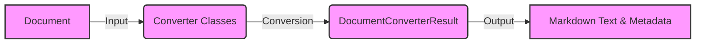

**Component: Document**
*Description*: Represents the input document to be converted. This can be a file or data stream of various formats (e.g., PDF, DOCX, HTML). It serves as the starting point for the conversion process.
*Functionality*: Provides the raw data that needs to be transformed into Markdown format.
*Interaction*: The Document component provides the input to the Converter Classes.
*Relevant source files*: N/A

**Component: Converter Classes**
*Description*: A set of classes responsible for converting different document types to a common format. Each converter class implements a `convert` method that takes a file path or input stream and returns a `DocumentConverterResult` object.
*Functionality*: Converts the input document into a `DocumentConverterResult` object.
*Interaction*: Receives the document from the Document component and calls the appropriate converter based on the document type. It then passes the `DocumentConverterResult` to the next component.
*Relevant source files*:
    *   `repos.markitdown.packages.markitdown.src.markitdown.converters._pptx_converter.PptxConverter`
    *   `repos.markitdown.packages.markitdown.src.markitdown.converters._csv_converter.CsvConverter`
    *   `repos.markitdown.packages.markitdown.src.markitdown.converters._bing_serp_converter.BingSerpConverter`
    *   `repos.markitdown.packages.markitdown.src.markitdown.converters._xlsx_converter.XlsxConverter`
    *   `repos.markitdown.packages.markitdown.src.markitdown.converters._xlsx_converter.XlsConverter`
    *   `repos.markitdown.packages.markitdown.src.markitdown.converters._youtube_converter.YouTubeConverter`
    *   `repos.markitdown.packages.markitdown.src.markitdown.converters._doc_intel_converter.DocumentIntelligenceConverter`
    *   `repos.markitdown.packages.markitdown.src.markitdown.converters._wikipedia_converter.WikipediaConverter`
    *   `repos.markitdown.packages.markitdown.src.markitdown.converters._rss_converter.RssConverter`
    *   `repos.markitdown.packages.markitdown.src.markitdown.converters._epub_converter.EpubConverter`
    *   `repos.markitdown.packages.markitdown.src.markitdown.converters._html_converter.HtmlConverter`
    *   `repos.markitdown.packages.markitdown.src.markitdown.converters._plain_text_converter.PlainTextConverter`
    *   `repos.markitdown.packages.markitdown.src.markitdown.converters._zip_converter.ZipConverter`
    *   `repos.markitdown.packages.markitdown.src.markitdown.converters._image_converter.ImageConverter`
    *   `repos.markitdown.packages.markitdown.src.markitdown.converters._docx_converter.DocxConverter`
    *   `repos.markitdown.packages.markitdown.src.markitdown.converters._outlook_msg_converter.OutlookMsgConverter`
    *   `repos.markitdown.packages.markitdown.src.markitdown.converters._pdf_converter.PdfConverter`
    *   `repos.markitdown.packages.markitdown.src.markitdown.converters._audio_converter.AudioConverter`
    *   `repos.markitdown.packages.markitdown.src.markitdown.converters._ipynb_converter.IpynbConverter`
    *   `repos.markitdown.packages.markitdown-sample-plugin.src.markitdown_sample_plugin._plugin.RtfConverter`

**Component: DocumentConverterResult**
*Description*: Represents the result of a document conversion, containing the converted markdown and any relevant metadata. It encapsulates the output of the conversion process, providing a standardized way to access the converted Markdown text and title.
*Functionality*: Holds the converted Markdown text and metadata.
*Interaction*: Receives the converted data from the Converter Classes and provides it to the Markdown Text & Metadata component.
*Relevant source files*:
    *   `repos.markitdown.packages.markitdown.src.markitdown._base_converter.DocumentConverterResult`

**Component: Markdown Text & Metadata**
*Description*: Represents the final output of the conversion process. This component contains the converted Markdown text and any relevant metadata extracted from the original document.
*Functionality*: Provides the final converted Markdown text and metadata.
*Interaction*: Receives the `DocumentConverterResult` from the DocumentConverterResult component and makes the converted data available for further processing or display.
*Relevant source files*: N/A