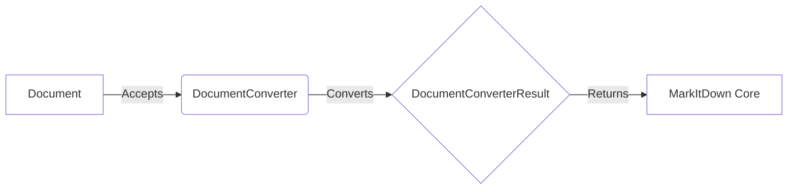

```markdown
## Conversion Result Overview

The `Conversion Result` represents the output of a successful conversion process within the MarkItDown Core. It encapsulates the converted Markdown content and any associated metadata, such as the document's title. This component serves as the final result returned by the MarkItDown Core after a successful conversion.

Here's a data flow diagram illustrating the role of `DocumentConverterResult` in the conversion process:



### Component Descriptions:

*   **Document:** Represents the input document to be converted. It sends the document to the `DocumentConverter` for processing.
    *   Relevant source files: N/A (Represents input data)

*   **DocumentConverter:** An abstract base class that defines the interface for converting documents to Markdown. It accepts a document and converts it into a `DocumentConverterResult`.
    *   Relevant source files: `repos.markitdown.packages.markitdown.src.markitdown._base_converter.DocumentConverter`

*   **DocumentConverterResult:** Represents the result of a document conversion, containing the converted Markdown text and an optional title. It returns the converted content to the `MarkItDown Core`.
    *   Relevant source files: `repos.markitdown.packages.markitdown.src.markitdown._base_converter.DocumentConverterResult`

*   **MarkItDown Core:** The central component that orchestrates the conversion process. It receives the `DocumentConverterResult` and uses it for further processing or output.
    *   Relevant source files: N/A (Represents the core application logic)
```