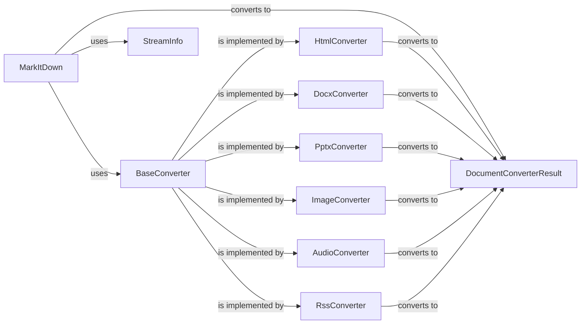

## Component Details

### MarkItDown
The main class responsible for converting documents to markdown format. It orchestrates the conversion process by selecting appropriate converters and handling different input types.
- **Related Classes/Methods**: `repos.markitdown.packages.markitdown.src.markitdown._markitdown.MarkItDown`, `repos.markitdown.packages.markitdown.src.markitdown._markitdown.MarkItDown.convert`, `repos.markitdown.packages.markitdown.src.markitdown._markitdown.MarkItDown.convert_uri`, `repos.markitdown.packages.markitdown.src.markitdown._markitdown.MarkItDown.convert_local`, `repos.markitdown.packages.markitdown.src.markitdown._markitdown.MarkItDown.convert_response`, `repos.markitdown.packages.markitdown.src.markitdown._markitdown.MarkItDown.convert_stream`, `repos.markitdown.packages.markitdown.src.markitdown._markitdown.MarkItDown._convert`, `repos.markitdown.packages.markitdown.src.markitdown._markitdown.MarkItDown.enable_builtins`, `repos.markitdown.packages.markitdown.src.markitdown._markitdown.MarkItDown.register_converter`, `repos.markitdown.packages.markitdown.src.markitdown._markitdown.MarkItDown.register_page_converter`

### BaseConverter
Abstract class for all converters. Defines the interface for accepting and converting documents.
- **Related Classes/Methods**: `repos.markitdown.packages.markitdown.src.markitdown._base_converter.BaseConverter`

### DocumentConverterResult
A data class that encapsulates the result of a document conversion, containing the converted markdown content and any extracted metadata.
- **Related Classes/Methods**: `repos.markitdown.packages.markitdown.src.markitdown._base_converter.DocumentConverterResult`

### HtmlConverter
Converts HTML content to markdown using Markdownify.
- **Related Classes/Methods**: `repos.markitdown.packages.markitdown.src.markitdown.converters._html_converter.HtmlConverter`, `repos.markitdown.packages.markitdown.src.markitdown.converters._html_converter.HtmlConverter.convert`, `repos.markitdown.packages.markitdown.src.markitdown.converters._html_converter.HtmlConverter.convert_string`

### DocxConverter
Converts DOCX files to markdown, leveraging pre-processing steps for math equations and using HtmlConverter for the main conversion.
- **Related Classes/Methods**: `repos.markitdown.packages.markitdown.src.markitdown.converters._docx_converter.DocxConverter`, `repos.markitdown.packages.markitdown.src.markitdown.converters._docx_converter.DocxConverter.convert`, `repos.markitdown.packages.markitdown.src.markitdown.converter_utils.docx.pre_process.pre_process_docx`

### PptxConverter
Converts PPTX files to markdown, handling images, tables, and charts.
- **Related Classes/Methods**: `repos.markitdown.packages.markitdown.src.markitdown.converters._pptx_converter.PptxConverter`, `repos.markitdown.packages.markitdown.src.markitdown.converters._pptx_converter.PptxConverter.convert`

### ImageConverter
Converts images to markdown, extracting metadata using exiftool and generating descriptions using an LLM.
- **Related Classes/Methods**: `repos.markitdown.packages.markitdown.src.markitdown.converters._image_converter.ImageConverter`, `repos.markitdown.packages.markitdown.src.markitdown.converters._image_converter.ImageConverter.convert`

### AudioConverter
Converts audio files to markdown, extracting metadata and transcribing the audio using a transcription service.
- **Related Classes/Methods**: `repos.markitdown.packages.markitdown.src.markitdown.converters._audio_converter.AudioConverter`, `repos.markitdown.packages.markitdown.src.markitdown.converters._audio_converter.AudioConverter.convert`, `repos.markitdown.packages.markitdown.src.markitdown.converters._transcribe_audio.transcribe_audio`

### RssConverter
Converts RSS feeds to markdown, parsing different feed types and extracting content.
- **Related Classes/Methods**: `repos.markitdown.packages.markitdown.src.markitdown.converters._rss_converter.RssConverter`, `repos.markitdown.packages.markitdown.src.markitdown.converters._rss_converter.RssConverter.convert`

### StreamInfo
A data class that holds information about the input stream, such as extension, filename, mimetype, and URL. Used for content negotiation.
- **Related Classes/Methods**: `markitdown._stream_info.StreamInfo`
