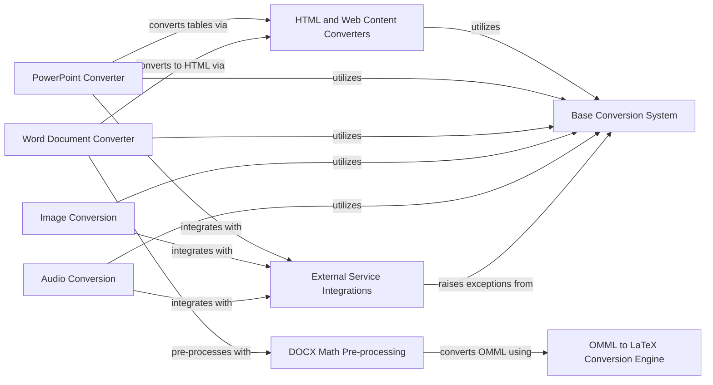

## Component Details

Provides a set of common helper functions and modules used across different document converters or by the core engine for specific, complex conversion sub-tasks, such as HTML to Markdown transformation, mathematical equation processing in DOCX, metadata extraction, audio transcription, and LLM-based captioning.

### Base Conversion System
Provides the foundational interfaces and data structures for all document conversions, including the abstract DocumentConverter class, the DocumentConverterResult for standardized output, StreamInfo for input metadata, and MissingDependencyException for handling optional dependencies required by specific converters.

**Related Classes/Methods**:

- <a href="https://github.com/microsoft/markitdown/blob/master/packages/markitdown/src/markitdown/_base_converter.py#L42-L105" target="_blank" rel="noopener noreferrer">`markitdown.packages.markitdown.src.markitdown._base_converter.DocumentConverter` (42:105)</a>
- <a href="https://github.com/microsoft/markitdown/blob/master/packages/markitdown/src/markitdown/_base_converter.py#L5-L39" target="_blank" rel="noopener noreferrer">`markitdown.packages.markitdown.src.markitdown._base_converter.DocumentConverterResult` (5:39)</a>
- <a href="https://github.com/microsoft/markitdown/blob/master/packages/markitdown/src/markitdown/_stream_info.py#L6-L32" target="_blank" rel="noopener noreferrer">`markitdown.packages.markitdown.src.markitdown._stream_info.StreamInfo` (6:32)</a>
- <a href="https://github.com/microsoft/markitdown/blob/master/packages/markitdown/src/markitdown/_exceptions.py#L19-L31" target="_blank" rel="noopener noreferrer">`markitdown.packages.markitdown.src.markitdown._exceptions.MissingDependencyException` (19:31)</a>

### HTML and Web Content Converters
A collection of converters specialized in processing HTML and web-based content, leveraging _CustomMarkdownify to transform HTML into Markdown. This component includes converters for general HTML files, Bing search results, Wikipedia pages, and RSS feeds, all relying on robust HTML parsing and Markdown conversion capabilities.

**Related Classes/Methods**:

- <a href="https://github.com/microsoft/markitdown/blob/master/packages/markitdown/src/markitdown/converters/_html_converter.py#L20-L90" target="_blank" rel="noopener noreferrer">`markitdown.packages.markitdown.src.markitdown.converters._html_converter.HtmlConverter` (20:90)</a>
- <a href="https://github.com/microsoft/markitdown/blob/master/packages/markitdown/src/markitdown/converters/_markdownify.py#L8-L111" target="_blank" rel="noopener noreferrer">`markitdown.packages.markitdown.src.markitdown.converters._markdownify._CustomMarkdownify` (8:111)</a>
- <a href="https://github.com/microsoft/markitdown/blob/master/packages/markitdown/src/markitdown/converters/_markdownify.py#L110-L111" target="_blank" rel="noopener noreferrer">`markitdown.packages.markitdown.src.markitdown.converters._markdownify._CustomMarkdownify.convert_soup` (110:111)</a>
- <a href="https://github.com/microsoft/markitdown/blob/master/packages/markitdown/src/markitdown/converters/_bing_serp_converter.py#L23-L120" target="_blank" rel="noopener noreferrer">`markitdown.packages.markitdown.src.markitdown.converters._bing_serp_converter.BingSerpConverter` (23:120)</a>
- <a href="https://github.com/microsoft/markitdown/blob/master/packages/markitdown/src/markitdown/converters/_wikipedia_converter.py#L20-L87" target="_blank" rel="noopener noreferrer">`markitdown.packages.markitdown.src.markitdown.converters._wikipedia_converter.WikipediaConverter` (20:87)</a>
- <a href="https://github.com/microsoft/markitdown/blob/master/packages/markitdown/src/markitdown/converters/_rss_converter.py#L29-L192" target="_blank" rel="noopener noreferrer">`markitdown.packages.markitdown.src.markitdown.converters._rss_converter.RssConverter` (29:192)</a>

### PowerPoint Converter
Handles the conversion of PowerPoint (PPTX) presentations into Markdown. This converter extracts textual content, tables, images, and charts from slides, and can optionally integrate with external services for generating LLM-based descriptions for images.

**Related Classes/Methods**:

- <a href="https://github.com/microsoft/markitdown/blob/master/packages/markitdown/src/markitdown/converters/_pptx_converter.py#L34-L252" target="_blank" rel="noopener noreferrer">`markitdown.packages.markitdown.src.markitdown.converters._pptx_converter.PptxConverter` (34:252)</a>

### Word Document Converter
Converts Word (DOCX) documents to Markdown. This component utilizes an internal HTML converter for the main document content and incorporates a specialized pre-processing step to handle and convert mathematical equations embedded within the DOCX file.

**Related Classes/Methods**:

- <a href="https://github.com/microsoft/markitdown/blob/master/packages/markitdown/src/markitdown/converters/_docx_converter.py#L28-L80" target="_blank" rel="noopener noreferrer">`markitdown.packages.markitdown.src.markitdown.converters._docx_converter.DocxConverter` (28:80)</a>

### DOCX Math Pre-processing
A utility component responsible for pre-processing DOCX files, specifically focusing on converting Office Math Markup Language (OMML) equations embedded within the document to LaTeX format. This step ensures that mathematical expressions are correctly represented before the document is converted to HTML.

**Related Classes/Methods**:

- <a href="https://github.com/microsoft/markitdown/blob/master/packages/markitdown/src/markitdown/converter_utils/docx/pre_process.py#L118-L156" target="_blank" rel="noopener noreferrer">`markitdown.packages.markitdown.src.markitdown.converter_utils.docx.pre_process.pre_process_docx` (118:156)</a>
- <a href="https://github.com/microsoft/markitdown/blob/master/packages/markitdown/src/markitdown/converter_utils/docx/pre_process.py#L33-L49" target="_blank" rel="noopener noreferrer">`markitdown.packages.markitdown.src.markitdown.converter_utils.docx.pre_process._convert_omath_to_latex` (33:49)</a>
- <a href="https://github.com/microsoft/markitdown/blob/master/packages/markitdown/src/markitdown/converter_utils/docx/pre_process.py#L52-L71" target="_blank" rel="noopener noreferrer">`markitdown.packages.markitdown.src.markitdown.converter_utils.docx.pre_process._get_omath_tag_replacement` (52:71)</a>
- <a href="https://github.com/microsoft/markitdown/blob/master/packages/markitdown/src/markitdown/converter_utils/docx/pre_process.py#L74-L96" target="_blank" rel="noopener noreferrer">`markitdown.packages.markitdown.src.markitdown.converter_utils.docx.pre_process._replace_equations` (74:96)</a>
- <a href="https://github.com/microsoft/markitdown/blob/master/packages/markitdown/src/markitdown/converter_utils/docx/pre_process.py#L99-L115" target="_blank" rel="noopener noreferrer">`markitdown.packages.markitdown.src.markitdown.converter_utils.docx.pre_process._pre_process_math` (99:115)</a>

### OMML to LaTeX Conversion Engine
Provides the core logic for converting Office Math Markup Language (OMML) XML structures into their corresponding LaTeX representations. It defines methods for processing various mathematical tags and ensures proper escaping of LaTeX special characters, forming the backbone of math conversion in DOCX files.

**Related Classes/Methods**:

- <a href="https://github.com/microsoft/markitdown/blob/master/packages/markitdown/src/markitdown/converter_utils/docx/math/omml.py#L170-L400" target="_blank" rel="noopener noreferrer">`markitdown.packages.markitdown.src.markitdown.converter_utils.docx.math.omml.oMath2Latex` (170:400)</a>
- <a href="https://github.com/microsoft/markitdown/blob/master/packages/markitdown/src/markitdown/converter_utils/docx/math/omml.py#L75-L124" target="_blank" rel="noopener noreferrer">`markitdown.packages.markitdown.src.markitdown.converter_utils.docx.math.omml.Tag2Method` (75:124)</a>
- <a href="https://github.com/microsoft/markitdown/blob/master/packages/markitdown/src/markitdown/converter_utils/docx/math/omml.py#L127-L167" target="_blank" rel="noopener noreferrer">`markitdown.packages.markitdown.src.markitdown.converter_utils.docx.math.omml.Pr` (127:167)</a>
- <a href="https://github.com/microsoft/markitdown/blob/master/packages/markitdown/src/markitdown/converter_utils/docx/math/omml.py#L43-L46" target="_blank" rel="noopener noreferrer">`markitdown.packages.markitdown.src.markitdown.converter_utils.docx.math.omml.load` (43:46)</a>
- <a href="https://github.com/microsoft/markitdown/blob/master/packages/markitdown/src/markitdown/converter_utils/docx/math/omml.py#L49-L52" target="_blank" rel="noopener noreferrer">`markitdown.packages.markitdown.src.markitdown.converter_utils.docx.math.omml.load_string` (49:52)</a>
- <a href="https://github.com/microsoft/markitdown/blob/master/packages/markitdown/src/markitdown/converter_utils/docx/math/omml.py#L68-L72" target="_blank" rel="noopener noreferrer">`markitdown.packages.markitdown.src.markitdown.converter_utils.docx.math.omml.get_val` (68:72)</a>
- <a href="https://github.com/microsoft/markitdown/blob/master/packages/markitdown/src/markitdown/converter_utils/docx/math/omml.py#L55-L65" target="_blank" rel="noopener noreferrer">`markitdown.packages.markitdown.src.markitdown.converter_utils.docx.math.omml.escape_latex` (55:65)</a>

### Image Conversion
Converts image files to Markdown by extracting available metadata using an external Exiftool utility. Additionally, it can generate descriptive captions for images by interacting with a multimodal Large Language Model (LLM), enhancing the textual representation of visual content.

**Related Classes/Methods**:

- <a href="https://github.com/microsoft/markitdown/blob/master/packages/markitdown/src/markitdown/converters/_image_converter.py#L16-L138" target="_blank" rel="noopener noreferrer">`markitdown.packages.markitdown.src.markitdown.converters._image_converter.ImageConverter` (16:138)</a>

### Audio Conversion
Converts audio files to Markdown by extracting metadata using an external Exiftool utility. It also includes functionality to transcribe spoken content from audio files into text using a speech recognition service, providing a textual representation of the audio.

**Related Classes/Methods**:

- <a href="https://github.com/microsoft/markitdown/blob/master/packages/markitdown/src/markitdown/converters/_audio_converter.py#L23-L101" target="_blank" rel="noopener noreferrer">`markitdown.packages.markitdown.src.markitdown.converters._audio_converter.AudioConverter` (23:101)</a>

### External Service Integrations
Encapsulates functions that interact with external tools or services to enhance document conversion. This includes exiftool_metadata for extracting file metadata, transcribe_audio for converting speech to text, and llm_caption for generating image descriptions using large language models.

**Related Classes/Methods**:

- <a href="https://github.com/microsoft/markitdown/blob/master/packages/markitdown/src/markitdown/converters/_exiftool.py#L7-L30" target="_blank" rel="noopener noreferrer">`markitdown.packages.markitdown.src.markitdown.converters._exiftool.exiftool_metadata` (7:30)</a>
- <a href="https://github.com/microsoft/markitdown/blob/master/packages/markitdown/src/markitdown/converters/_transcribe_audio.py#L23-L49" target="_blank" rel="noopener noreferrer">`markitdown.packages.markitdown.src.markitdown.converters._transcribe_audio.transcribe_audio` (23:49)</a>
- <a href="https://github.com/microsoft/markitdown/blob/master/packages/markitdown/src/markitdown/converters/_llm_caption.py#L7-L50" target="_blank" rel="noopener noreferrer">`markitdown.packages.markitdown.src.markitdown.converters._llm_caption.llm_caption` (7:50)</a>

### [FAQ](https://github.com/CodeBoarding/GeneratedOnBoardings/tree/main?tab=readme-ov-file#faq)