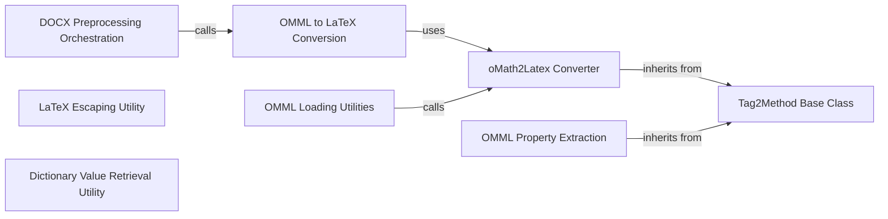

## Component Details

### DOCX Preprocessing Orchestration
This component orchestrates the preprocessing of DOCX files. It involves unzipping the DOCX, transforming the XML content (specifically converting OMML to LaTeX), and rezipping the modified content back into a DOCX file. It serves as the entry point for DOCX-specific conversion utilities.
- **Related Classes/Methods**: `markitdown.converter_utils.docx.pre_process`

### OMML to LaTeX Conversion
This component focuses on converting Office Math Markup Language (OMML) elements within DOCX files to LaTeX format. It identifies 'oMath' and 'oMathPara' tags in the XML content and replaces them with their LaTeX equivalents, enabling mathematical equations to be accurately represented in the converted output. It uses the `oMath2Latex` converter.
- **Related Classes/Methods**: `markitdown.converter_utils.docx.pre_process`

### oMath2Latex Converter
The `oMath2Latex` class is the core component responsible for the actual conversion of OMML elements to LaTeX code. It takes an OMML XML element as input and uses the `Tag2Method` class to recursively process the XML structure and generate the corresponding LaTeX representation. This class encapsulates the conversion logic.
- **Related Classes/Methods**: `markitdown.converter_utils.docx.math.omml`

### Tag2Method Base Class
The `Tag2Method` class serves as a base class for handling different OMML tags during the conversion process. It provides a structured approach for processing the children of an XML element and calling the appropriate conversion method for each tag. It promotes code reuse and maintainability by defining a common interface for tag-specific conversion logic.
- **Related Classes/Methods**: `markitdown.converter_utils.docx.math.omml`

### OMML Property Extraction
The `Pr` class is responsible for extracting common properties from OMML elements, such as character values, positions, and types. These properties are stored and used during the conversion process to ensure accurate LaTeX representation of the mathematical equations. It simplifies access to relevant attributes within OMML elements.
- **Related Classes/Methods**: `markitdown.converter_utils.docx.math.omml`

### OMML Loading Utilities
These utilities provide functions for loading OMML content from either a stream or a string. The `load` and `load_string` functions parse the OMML content and yield `oMath2Latex` objects, making it easier to integrate the conversion process into different workflows. They act as entry points for processing OMML data.
- **Related Classes/Methods**: `markitdown.converter_utils.docx.math.omml`

### LaTeX Escaping Utility
The `escape_latex` function is a utility that escapes special characters in a string to ensure they are properly rendered in LaTeX. This is crucial for preventing errors and ensuring the correct display of mathematical equations in the converted output. It handles characters that have special meaning in LaTeX.
- **Related Classes/Methods**: `markitdown.converter_utils.docx.math.omml`

### Dictionary Value Retrieval Utility
The `get_val` function provides a safe way to retrieve values from a dictionary, returning a default value if the key is not found. This utility helps prevent errors when accessing dictionary values and simplifies code by providing a concise way to handle missing keys.
- **Related Classes/Methods**: `markitdown.converter_utils.docx.math.omml`
