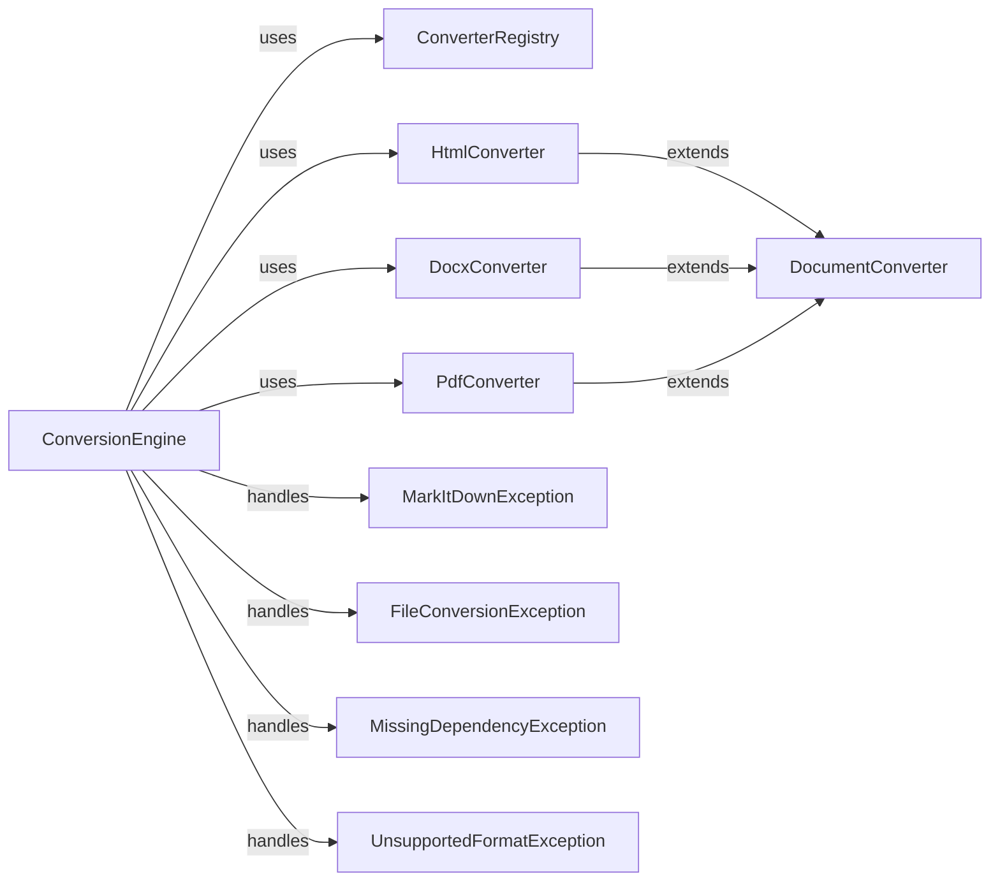

## Component Details

Analysis of markitdown conversion subsystem

### ConversionEngine
The main orchestrator. Receives the input file, determines the appropriate converter using the ConverterRegistry, executes the conversion, and handles exceptions using a try-except block.

**Related Classes/Methods**:

- <a href="https://github.com/microsoft/markitdown/blob/master/packages/markitdown/src/markitdown/_markitdown.py#L0-L0" target="_blank" rel="noopener noreferrer">`markitdown._markitdown.ConversionEngine` (0:0)</a>

### ConverterRegistry
A registry managing and providing access to available converters. Likely uses a dictionary or similar data structure to map file types (mimetypes or extensions) to converter instances.

**Related Classes/Methods**:

- <a href="https://github.com/microsoft/markitdown/blob/master/packages/markitdown/src/markitdown/_markitdown.py#L0-L0" target="_blank" rel="noopener noreferrer">`markitdown._markitdown.ConverterRegistry` (0:0)</a>

### DocumentConverter
Defines the interface for all concrete converters. Likely includes methods like `accepts()` to check if a converter can handle a specific file type and `convert()` to perform the actual conversion.

**Related Classes/Methods**:

- <a href="https://github.com/microsoft/markitdown/blob/master/packages/markitdown/src/markitdown/_base_converter.py#L41-L104" target="_blank" rel="noopener noreferrer">`markitdown._base_converter.DocumentConverter` (41:104)</a>

### HtmlConverter
Implement the DocumentConverter interface for specific file types (HTML, DOCX, PDF). Each converter contains the logic to parse and convert its respective file type to Markdown.

**Related Classes/Methods**:

- `markitdown.converters.HtmlConverter` (0:0)

### DocxConverter
Implement the DocumentConverter interface for specific file types (HTML, DOCX, PDF). Each converter contains the logic to parse and convert its respective file type to Markdown.

**Related Classes/Methods**:

- `markitdown.converters.DocxConverter` (0:0)

### PdfConverter
Implement the DocumentConverter interface for specific file types (HTML, DOCX, PDF). Each converter contains the logic to parse and convert its respective file type to Markdown.

**Related Classes/Methods**:

- `markitdown.converters.PdfConverter` (0:0)

### MarkItDownException
Base class for all custom exceptions.

**Related Classes/Methods**:

- <a href="https://github.com/microsoft/markitdown/blob/master/packages/markitdown/src/markitdown/_exceptions.py#L10-L15" target="_blank" rel="noopener noreferrer">`markitdown._exceptions.MarkItDownException` (10:15)</a>

### FileConversionException
Specific exception types for different error scenarios (conversion failure, missing dependencies, unsupported format).

**Related Classes/Methods**:

- <a href="https://github.com/microsoft/markitdown/blob/master/packages/markitdown/src/markitdown/_exceptions.py#L51-L75" target="_blank" rel="noopener noreferrer">`markitdown._exceptions.FileConversionException` (51:75)</a>

### MissingDependencyException
Specific exception types for different error scenarios (conversion failure, missing dependencies, unsupported format).

**Related Classes/Methods**:

- <a href="https://github.com/microsoft/markitdown/blob/master/packages/markitdown/src/markitdown/_exceptions.py#L18-L30" target="_blank" rel="noopener noreferrer">`markitdown._exceptions.MissingDependencyException` (18:30)</a>

### UnsupportedFormatException
Specific exception types for different error scenarios (conversion failure, missing dependencies, unsupported format).

**Related Classes/Methods**:

- <a href="https://github.com/microsoft/markitdown/blob/master/packages/markitdown/src/markitdown/_exceptions.py#L33-L38" target="_blank" rel="noopener noreferrer">`markitdown._exceptions.UnsupportedFormatException` (33:38)</a>

### [FAQ](https://github.com/CodeBoarding/GeneratedOnBoardings/tree/main?tab=readme-ov-file#faq)