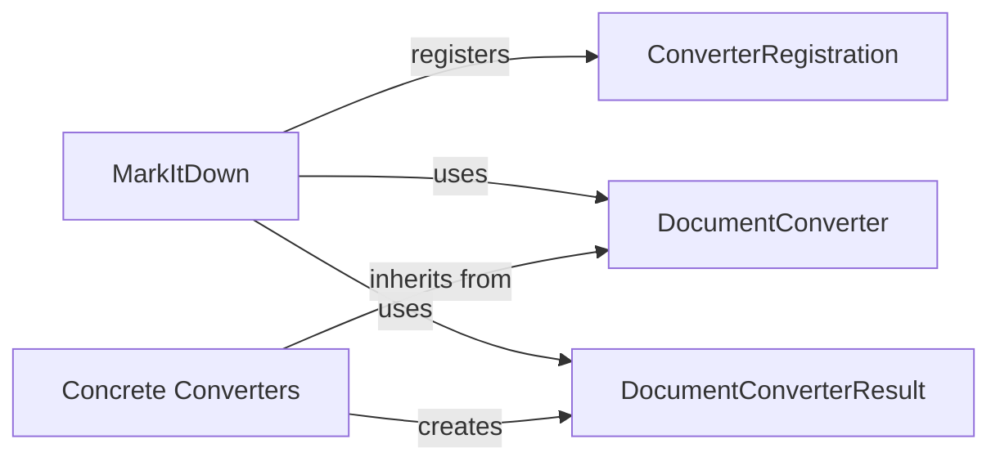

## Component Details

### MarkItDown
The main class responsible for managing the conversion process. It initializes and registers available converters and provides the main interface for converting documents from various sources (local files, URLs, streams, etc.) to markdown.
- **Related Classes/Methods**: `repos.markitdown.packages.markitdown.src.markitdown._markitdown.MarkItDown`

### ConverterRegistration
A class that encapsulates the registration of a converter, associating it with the MarkItDown instance. It likely stores information about the converter and its supported file types.
- **Related Classes/Methods**: `repos.markitdown.packages.markitdown.src.markitdown._markitdown.ConverterRegistration`

### DocumentConverter
An abstract base class for all specific converters. It defines the interface that all converters must implement, ensuring a common standard for conversion. Subclasses implement the actual conversion logic for specific file types. It contains the `accepts` and `convert` methods.
- **Related Classes/Methods**: `repos.markitdown.packages.markitdown.src.markitdown._base_converter.DocumentConverter`

### DocumentConverterResult
A data structure representing the result of a document conversion, containing the converted markdown text and an optional title. It provides a standardized way to return conversion results from different converters.
- **Related Classes/Methods**: `repos.markitdown.packages.markitdown.src.markitdown._base_converter.DocumentConverterResult`

### Concrete Converters
A collection of concrete converter implementations for various file types (e.g., PlainTextConverter, ZipConverter, HtmlConverter). Each converter inherits from DocumentConverter and provides specific logic for converting its respective file type to markdown.
- **Related Classes/Methods**: `repos.markitdown.packages.markitdown.src.markitdown.converters._plain_text_converter.PlainTextConverter`, `repos.markitdown.packages.markitdown.src.markitdown.converters._zip_converter.ZipConverter`, `repos.markitdown.packages.markitdown.src.markitdown.converters._html_converter.HtmlConverter`, `repos.markitdown.packages.markitdown.src.markitdown.converters._rss_converter.RssConverter`, `repos.markitdown.packages.markitdown.src.markitdown.converters._wikipedia_converter.WikipediaConverter`, `repos.markitdown.packages.markitdown.src.markitdown.converters._youtube_converter.YouTubeConverter`, `repos.markitdown.packages.markitdown.src.markitdown.converters._bing_serp_converter.BingSerpConverter`, `repos.markitdown.packages.markitdown.src.markitdown.converters._docx_converter.DocxConverter`, `repos.markitdown.packages.markitdown.src.markitdown.converters._xlsx_converter.XlsxConverter`, `repos.markitdown.packages.markitdown.src.markitdown.converters._xlsx_converter.XlsConverter`, `repos.markitdown.packages.markitdown.src.markitdown.converters._pptx_converter.PptxConverter`, `repos.markitdown.packages.markitdown.src.markitdown.converters._audio_converter.AudioConverter`, `repos.markitdown.packages.markitdown.src.markitdown.converters._image_converter.ImageConverter`, `repos.markitdown.packages.markitdown.src.markitdown.converters._ipynb_converter.IpynbConverter`, `repos.markitdown.packages.markitdown.src.markitdown.converters._pdf_converter.PdfConverter`, `repos.markitdown.packages.markitdown.src.markitdown.converters._outlook_msg_converter.OutlookMsgConverter`, `repos.markitdown.packages.markitdown.src.markitdown.converters._epub_converter.EpubConverter`, `repos.markitdown.packages.markitdown.src.markitdown.converters._csv_converter.CsvConverter`, `repos.markitdown.packages.markitdown.src.markitdown.converters._doc_intel_converter.DocumentIntelligenceConverter`
