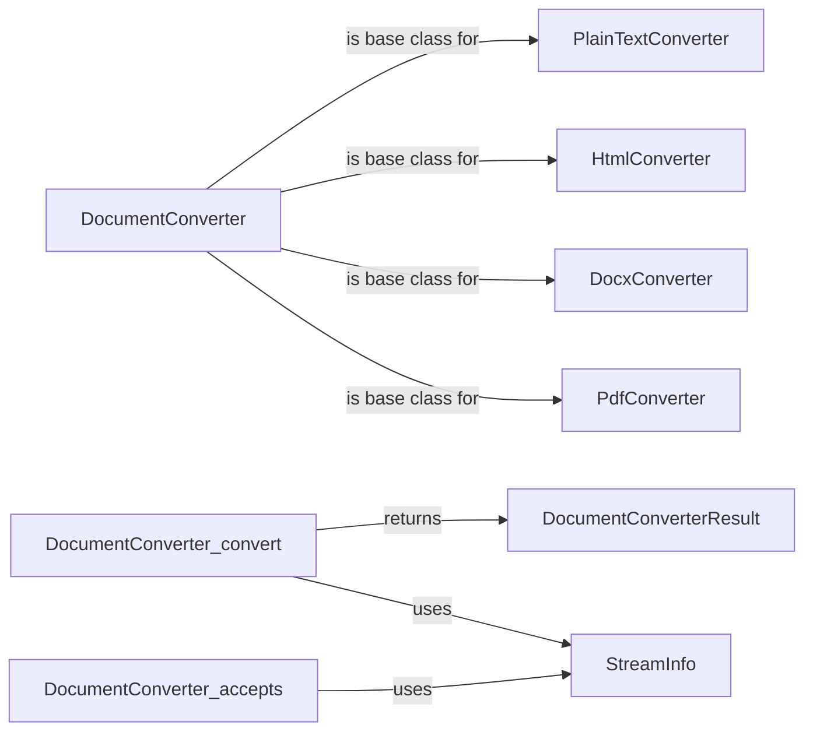

## Component Details

### DocumentConverter
Abstract base class for all document converters. It defines the interface for accepting and converting documents to Markdown format. Subclasses must implement the `accepts` and `convert` methods to handle specific document types. This class serves as a blueprint for creating new converters and ensures a consistent API across all supported formats.
- **Related Classes/Methods**: `markitdown._base_converter`

### DocumentConverterResult
Represents the result of a document conversion process. It encapsulates the converted Markdown text and an optional title for the document. This data class provides a structured way to return the output of the conversion, making it easier to manage and utilize the converted content.
- **Related Classes/Methods**: `markitdown._base_converter`

### StreamInfo
A data class that contains metadata about the input stream, such as mimetype, extension, charset, and URL. It is used by the `accepts` method to determine if the converter can handle the document. This information is crucial for identifying the document type and applying the appropriate conversion logic.
- **Related Classes/Methods**: `markitdown._stream_info`

### PlainTextConverter
A concrete implementation of the `DocumentConverter` for handling plain text files. It inherits the base class's interface and provides specific logic for converting plain text content into Markdown format. This converter is responsible for ensuring that plain text documents are properly formatted when converted.
- **Related Classes/Methods**: `markitdown._base_converter`

### HtmlConverter
A concrete implementation of the `DocumentConverter` designed to convert HTML documents into Markdown format. It inherits the base class's interface and implements the `accepts` and `convert` methods to handle HTML-specific conversion logic. This converter is responsible for parsing HTML content and transforming it into a Markdown representation.
- **Related Classes/Methods**: `markitdown._base_converter`

### DocxConverter
A concrete implementation of the `DocumentConverter` for handling Microsoft Word (docx) files. It inherits the base class's interface and provides specific logic for extracting text and formatting information from docx files and converting it into Markdown format. This converter is responsible for accurately representing Word documents in Markdown.
- **Related Classes/Methods**: `markitdown._base_converter`

### PdfConverter
A concrete implementation of the `DocumentConverter` for handling PDF files. It inherits the base class's interface and provides specific logic for extracting text and formatting information from PDF files and converting it into Markdown format. This converter is responsible for accurately representing PDF documents in Markdown.
- **Related Classes/Methods**: `markitdown._base_converter`
