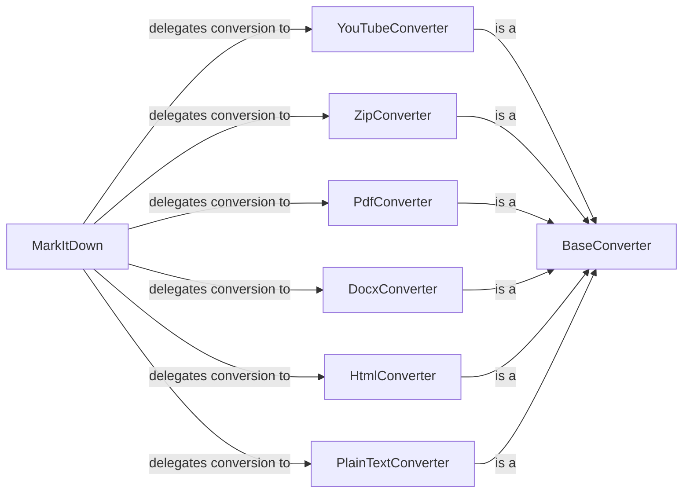

## Component Details

The MarkItDown system provides a flexible way to convert various document types into Markdown format. The core functionality revolves around the `MarkItDown` class, which acts as a central hub for managing and utilizing different converter components. Each converter component is responsible for handling a specific document type, such as PDF, DOCX, or HTML. The `BaseConverter` class defines a common interface for all converters, ensuring consistency and extensibility. When a document needs to be converted, `MarkItDown` selects the appropriate converter based on the file type and delegates the conversion process to it. The selected converter then extracts the content from the document and formats it into Markdown, which is returned as the final output.

### MarkItDown
The central class responsible for orchestrating the conversion of various input types into Markdown. It manages converter registration and selection.
- **Related Classes/Methods**: `markitdown.packages.markitdown.src.markitdown._markitdown.MarkItDown`

### BaseConverter
An abstract base class that defines the interface for all document converters. It specifies the methods that all converters must implement.
- **Related Classes/Methods**: `markitdown.packages.markitdown.src.markitdown._base_converter`

### YouTubeConverter
Converter specifically for YouTube URLs, extracting relevant information and formatting it into Markdown.
- **Related Classes/Methods**: `markitdown.packages.markitdown.src.markitdown.converters._youtube_converter.YouTubeConverter`

### ZipConverter
Converter for ZIP archives, extracting and converting the contents into Markdown.
- **Related Classes/Methods**: `markitdown.packages.markitdown.src.markitdown.converters._zip_converter.ZipConverter`

### PdfConverter
Converter for PDF files, extracting text and formatting it into Markdown.
- **Related Classes/Methods**: `markitdown.packages.markitdown.src.markitdown.converters._pdf_converter.PdfConverter`

### DocxConverter
Converter for DOCX files, extracting text and formatting it into Markdown.
- **Related Classes/Methods**: `markitdown.packages.markitdown.src.markitdown.converters._docx_converter.DocxConverter`

### HtmlConverter
Converter for HTML files, extracting content and formatting it into Markdown.
- **Related Classes/Methods**: `markitdown.packages.markitdown.src.markitdown.converters._html_converter.HtmlConverter`

### PlainTextConverter
Converter for plain text files, simply formatting the text into Markdown.
- **Related Classes/Methods**: `markitdown.packages.markitdown.src.markitdown.converters._plain_text_converter.PlainTextConverter`
