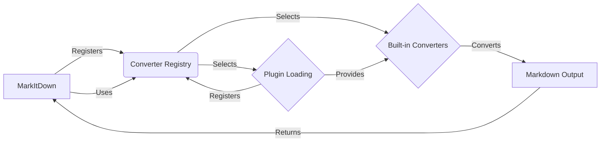

## Converter Registry Overview

The Converter Registry is a crucial part of the `MarkItDown` component, responsible for managing and selecting the appropriate converter for a given input document. It allows for dynamic extension of supported file types through plugins and prioritizes converters based on their suitability.

Here's a data flow diagram illustrating the interaction of the Converter Registry with other components:

### Component Descriptions:

*   **MarkItDown:** The main class that initiates the conversion process. It uses the Converter Registry to find the appropriate converter for the input document and orchestrates the conversion. **Relevant source file:** `repos.markitdown.packages.markitdown.src.markitdown._markitdown.MarkItDown`

*   **Converter Registry:** Maintains a list of available converters (both built-in and plugins) and their priorities. It selects the most suitable converter based on the input document type. **Relevant source file:** `repos.markitdown.packages.markitdown.src.markitdown._markitdown.MarkItDown.register_converter`

*   **Built-in Converters:** A set of pre-defined converters for common file types. These converters are registered with the Converter Registry upon initialization. **Relevant source files:** `repos.markitdown.packages.markitdown.src.markitdown.converters._plain_text_converter.PlainTextConverter`, `repos.markitdown.packages.markitdown.src.markitdown.converters._zip_converter.ZipConverter`, `repos.markitdown.packages.markitdown.src.markitdown.converters._html_converter.HtmlConverter`, `repos.markitdown.packages.markitdown.src.markitdown.converters._rss_converter.RssConverter`, `repos.markitdown.packages.markitdown.src.markitdown.converters._wikipedia_converter.WikipediaConverter`, `repos.markitdown.packages.markitdown.src.markitdown.converters._youtube_converter.YouTubeConverter`, `repos.markitdown.packages.markitdown.src.markitdown.converters._bing_serp_converter.BingSerpConverter`, `repos.markitdown.packages.markitdown.src.markitdown.converters._docx_converter.DocxConverter`, `repos.markitdown.packages.markitdown.src.markitdown.converters._xlsx_converter.XlsxConverter`, `repos.markitdown.packages.markitdown.src.markitdown.converters._xlsx_converter.XlsConverter`, `repos.markitdown.packages.markitdown.src.markitdown.converters._pptx_converter.PptxConverter`, `repos.markitdown.packages.markitdown.src.markitdown.converters._audio_converter.AudioConverter`, `repos.markitdown.packages.markitdown.src.markitdown.converters._image_converter.ImageConverter`, `repos.markitdown.packages.markitdown.src.markitdown.converters._ipynb_converter.IpynbConverter`, `repos.markitdown.packages.markitdown.src.markitdown.converters._pdf_converter.PdfConverter`, `repos.markitdown.packages.markitdown.src.markitdown.converters._outlook_msg_converter.OutlookMsgConverter`, `repos.markitdown.packages.markitdown.src.markitdown.converters._epub_converter.EpubConverter`, `repos.markitdown.packages.markitdown.src.markitdown.converters._csv_converter.CsvConverter`, `repos.markitdown.packages.markitdown.src.markitdown.converters._doc_intel_converter.DocumentIntelligenceConverter`

*   **Plugin Loading:** Dynamically loads external plugins, which can provide additional converters. These converters are then registered with the Converter Registry, extending the system's capabilities. **Relevant source file:** `repos.markitdown.packages.markitdown.src.markitdown._markitdown._load_plugins`

*   **Markdown Output:** The final output of the conversion process, which is a markdown representation of the input document. This output is returned to the `MarkItDown` component.
