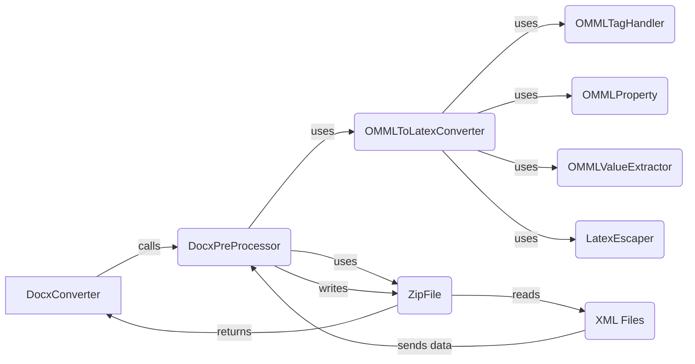

```markdown
## Converter Utilities Component Overview

The `Converter Utilities` component provides essential utility functions and classes that support the document conversion process, particularly for DOCX files. It includes functionalities for preprocessing DOCX files, handling mathematical equations, and ensuring proper formatting during conversion.

### Data Flow Diagram



### Component Descriptions

*   **DocxConverter**
    *   *Description*: Orchestrates the conversion of .docx files to other formats.
    *   *Functionality*: It calls the `DocxPreProcessor` to handle format-specific issues before the main conversion.
    *   *Related Files*: `repos.markitdown.packages.markitdown.src.markitdown.converters._docx_converter.DocxConverter`

*   **DocxPreProcessor**
    *   *Description*: Pre-processes the docx file to handle math equations and other format-specific issues before the main conversion.
    *   *Functionality*: Reads XML files from the DOCX archive, uses `OMMLToLatexConverter` to convert math equations, and writes the processed content back into the archive.
    *   *Related Files*: `repos.markitdown.packages.markitdown.src.markitdown.converter_utils.docx.pre_process`

*   **OMMLToLatexConverter**
    *   *Description*: Converts Office Math Markup Language (OMML) to LaTeX format.
    *   *Functionality*: Parses OMML elements and generates corresponding LaTeX code. It uses `OMMLTagHandler`, `OMMLProperty`, `OMMLValueExtractor`, and `LatexEscaper` to handle specific aspects of the conversion.
    *   *Related Files*: `repos.markitdown.packages.markitdown.src.markitdown.converter_utils.docx.math.omml.oMath2Latex`

*   **OMMLTagHandler**
    *   *Description*: Handles the processing of individual OMML tags during the conversion to LaTeX.
    *   *Functionality*: Provides a base class for specific tag handling logic.
    *   *Related Files*: `repos.markitdown.packages.markitdown.src.markitdown.converter_utils.docx.math.omml.Tag2Method`

*   **OMMLProperty**
    *   *Description*: Represents properties of OMML elements, providing a structured way to access and manipulate these properties.
    *   *Functionality*: Provides a structured way to access and manipulate these properties.
    *   *Related Files*: `repos.markitdown.packages.markitdown.src.markitdown.converter_utils.docx.math.omml.Pr`

*   **OMMLValueExtractor**
    *   *Description*: Extracts the value of an OMML element.
    *   *Functionality*: Simplifies the process of retrieving values from OMML elements.
    *   *Related Files*: `repos.markitdown.packages.markitdown.src.markitdown.converter_utils.docx.math.omml.get_val`

*   **LatexEscaper**
    *   *Description*: Escapes special characters for LaTeX to ensure correct rendering of the converted content.
    *   *Functionality*: Ensures that special characters in the generated LaTeX code are properly escaped.
    *   *Related Files*: `repos.markitdown.packages.markitdown.src.markitdown.converter_utils.docx.math.omml.escape_latex`

*   **ZipFile**
    *   *Description*: Reads and writes DOCX files as zip archives.
    *   *Functionality*: Used by `DocxPreProcessor` to access and modify the XML files within the DOCX archive.
    *   *Related Files*: `zipfile` (standard Python library)

*   **XML Files**
    *   *Description*: XML files within the DOCX archive that contain the document content.
    *   *Functionality*: These files are read by `DocxPreProcessor` and processed to convert OMML equations to LaTeX.
    *   *Related Files*: e.g., `word/document.xml`
```