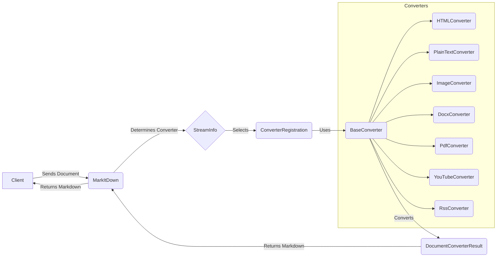

## Converter Subsystem Overview

This document provides an overview of the `Converter` subsystem within the `MarkItDown` project. The core responsibility of this subsystem is to convert various file formats and content types into Markdown. The `MarkItDown` class orchestrates the conversion process by selecting the appropriate converter based on the input stream's characteristics.

### Data Flow Diagram

### Component Descriptions

*   **Client:** Initiates the conversion process by sending a document to `MarkItDown`.

*   **MarkItDown:** The central component that receives the document, determines the appropriate converter based on the file type or content, and returns the converted Markdown.
    *   **Purpose:** Orchestrates the conversion process.
    *   **Interactions:** Receives documents from the client, uses `StreamInfo` to determine the converter, and returns the converted Markdown to the client.
    *   **Relevant Source Files:** `repos.markitdown.packages.markitdown.src.markitdown._markitdown.MarkItDown`

*   **StreamInfo:** Provides metadata about the input stream, such as mimetype, extension, filename, and URL. This information is used to select the appropriate converter.
    *   **Purpose:** Encapsulates metadata about the input stream.
    *   **Interactions:** Used by `MarkItDown` to determine the appropriate converter.
    *   **Relevant Source Files:** `repos.markitdown.packages.markitdown.src.markitdown._stream_info.StreamInfo`

*   **ConverterRegistration:** Represents the registration of a converter with a specific priority. It's used internally by MarkItDown to manage the available converters.
    *   **Purpose:** Manages the registration of converters.
    *   **Interactions:** Used by `MarkItDown` to store and retrieve converters.
    *   **Relevant Source Files:** `repos.markitdown.packages.markitdown.src.markitdown._markitdown.ConverterRegistration`

*   **BaseConverter:** Abstract base class for all converters. Defines the interface for converting files to markdown, including methods for accepting a file and converting it.
    *   **Purpose:** Defines the interface for all converters.
    *   **Interactions:** Inherited by specific converters (e.g., `HTMLConverter`, `PlainTextConverter`).
    *   **Relevant Source Files:** `repos.markitdown.packages.markitdown.src.markitdown._base_converter.BaseConverter`

*   **HTMLConverter:** Converter for HTML files. It uses `markdownify` to convert HTML content to markdown.
    *   **Purpose:** Converts HTML files to Markdown.
    *   **Interactions:** Inherits from `BaseConverter`, uses `Markdownify`.
    *   **Relevant Source Files:** `repos.markitdown.packages.markitdown.src.markitdown.converters._html_converter.HtmlConverter`

*   **PlainTextConverter:** Converter for plain text files.
    *   **Purpose:** Converts plain text files to Markdown.
    *   **Interactions:** Inherits from `BaseConverter`.
    *   **Relevant Source Files:** `repos.markitdown.packages.markitdown.src.markitdown.converters._plain_text_converter.PlainTextConverter`

*   **ImageConverter:** Converter for image files. Extracts metadata and generates a description using a language model.
    *   **Purpose:** Converts image files to Markdown.
    *   **Interactions:** Inherits from `BaseConverter`.
    *   **Relevant Source Files:** `repos.markitdown.packages.markitdown.src.markitdown.converters._image_converter.ImageConverter`

*   **DocxConverter:** Converter for Microsoft Word (docx) files. Converts docx content to HTML and then to markdown.
    *   **Purpose:** Converts docx files to Markdown.
    *   **Interactions:** Inherits from `BaseConverter`.
    *   **Relevant Source Files:** `repos.markitdown.packages.markitdown.src.markitdown.converters._docx_converter.DocxConverter`

*   **PdfConverter:** Converter for PDF files.
    *   **Purpose:** Converts PDF files to Markdown.
    *   **Interactions:** Inherits from `BaseConverter`.
    *   **Relevant Source Files:** `repos.markitdown.packages.markitdown.src.markitdown.converters._pdf_converter.PdfConverter`

*   **YouTubeConverter:** Converter for YouTube video transcripts.
    *   **Purpose:** Converts YouTube video transcripts to Markdown.
    *   **Interactions:** Inherits from `BaseConverter`.
    *   **Relevant Source Files:** `repos.markitdown.packages.markitdown.src.markitdown.converters._youtube_converter.YouTubeConverter`

*   **RssConverter:** Converter for RSS and Atom feeds. Extracts content from feed entries and converts it to markdown.
    *   **Purpose:** Converts RSS and Atom feeds to Markdown.
    *   **Interactions:** Inherits from `BaseConverter`.
    *   **Relevant Source Files:** `repos.markitdown.packages.markitdown.src.markitdown.converters._rss_converter.RssConverter`

*   **DocumentConverterResult:** Represents the result of a document conversion, containing the markdown content and optional title.
    *   **Purpose:** Encapsulates the result of the conversion.
    *   **Interactions:** Returned by converters.
    *   **Relevant Source Files:** `repos.markitdown.packages.markitdown.src.markitdown._base_converter.DocumentConverterResult`
