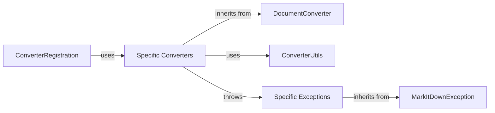

## Component Details

markitdown subsystem component overview

### DocumentConverter
Abstract base class defining the interface for all specific document converters. Handles common conversion logic (likely including error handling and potentially some basic pre/post-processing steps). All other converters inherit from this.

**Related Classes/Methods**:

- <a href="https://github.com/microsoft/markitdown/blob/master/packages/markitdown/src/markitdown/_base_converter.py#L41-L104" target="_blank" rel="noopener noreferrer">`markitdown._base_converter.DocumentConverter` (41:104)</a>

### Specific Converters
A collection of concrete converter classes, each responsible for converting a specific file format (DOCX, PDF, HTML, etc.) to Markdown. These classes implement the DocumentConverter interface.

**Related Classes/Methods**:

- <a href="https://github.com/microsoft/markitdown/blob/master/packages/markitdown/src/markitdown/converters/_docx_converter.py#L27-L79" target="_blank" rel="noopener noreferrer">`markitdown.converters._docx_converter.DocxConverter` (27:79)</a>
- <a href="https://github.com/microsoft/markitdown/blob/master/packages/markitdown/src/markitdown/converters/_pdf_converter.py#L30-L76" target="_blank" rel="noopener noreferrer">`markitdown.converters._pdf_converter.PdfConverter` (30:76)</a>

### ConverterRegistration
Manages the registration and lookup of converters based on file type. This component is crucial for selecting the appropriate converter at runtime.

**Related Classes/Methods**:

- <a href="https://github.com/microsoft/markitdown/blob/master/packages/markitdown/src/markitdown/_markitdown.py#L85-L89" target="_blank" rel="noopener noreferrer">`markitdown._markitdown.ConverterRegistration` (85:89)</a>

### ConverterUtils
Contains reusable utility functions used by multiple converters to perform common tasks (e.g., file I/O, data manipulation, string processing). Reduces code duplication and improves maintainability.

**Related Classes/Methods**: _None_

### MarkItDownException
Base exception class for all custom exceptions within the markitdown subsystem. Provides a consistent way to handle errors.

**Related Classes/Methods**:

- <a href="https://github.com/microsoft/markitdown/blob/master/packages/markitdown/src/markitdown/_exceptions.py#L10-L15" target="_blank" rel="noopener noreferrer">`markitdown._exceptions.MarkItDownException` (10:15)</a>

### Specific Exceptions
Subclasses of MarkItDownException, representing specific error conditions (e.g., unsupported file format, conversion failure).

**Related Classes/Methods**:

- <a href="https://github.com/microsoft/markitdown/blob/master/packages/markitdown/src/markitdown/_exceptions.py#L33-L38" target="_blank" rel="noopener noreferrer">`markitdown._exceptions.UnsupportedFormatException` (33:38)</a>
- <a href="https://github.com/microsoft/markitdown/blob/master/packages/markitdown/src/markitdown/_exceptions.py#L51-L75" target="_blank" rel="noopener noreferrer">`markitdown._exceptions.FileConversionException` (51:75)</a>

### [FAQ](https://github.com/CodeBoarding/GeneratedOnBoardings/tree/main?tab=readme-ov-file#faq)