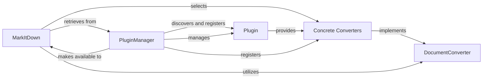

## Details

The project's core functionality revolves around document conversion, orchestrated by the `MarkItDown` facade. This facade leverages a set of `Concrete Converters`, each specialized in transforming specific document formats. The system's extensibility is facilitated by `Plugins`, which introduce new conversion capabilities, managed and made available by the `PluginManager`. The `DocumentConverter` component establishes a common interface for all conversion operations, ensuring a standardized approach across diverse document types.

### DocumentConverter
Defines the foundational structure and standardized interface (`accepts`, `convert`) that all specific document converters must adhere to. It serves as the abstract base for all conversion logic, ensuring uniformity across different conversion types.

**Related Classes/Methods**:

- <a href="https://github.com/microsoft/markitdown/blob/main/packages/markitdown/src/markitdown/_base_converter.py#L42-L105" target="_blank" rel="noopener noreferrer">`markitdown._base_converter.BaseConverter`:42-105</a>

### Concrete Converters
Specific implementations of the `DocumentConverter` interface. Each concrete converter handles the transformation of a particular input format (e.g., Markdown, HTML, PDF via Azure Document Intelligence) into a standardized output. These are the actual workers performing the document transformations. This component represents a conceptual grouping of various converter implementations found within the `markitdown.converters` package, such as `_html_converter.py`, `_pdf_converter.py`, etc.

**Related Classes/Methods**:

- <a href="https://github.com/microsoft/markitdown/blob/main/packages/markitdown/src/markitdown/converters/_html_converter.py#L20-L90" target="_blank" rel="noopener noreferrer">`markitdown.converters._html_converter.HTMLConverter`:20-90</a>

### MarkItDown
The primary facade and orchestrator of the MarkItDown library. It provides the high-level API for users, intelligently selects the appropriate `Concrete Converter` based on the input document's characteristics, and manages the overall conversion workflow.

**Related Classes/Methods**:

- <a href="https://github.com/microsoft/markitdown/blob/main/packages/markitdown/src/markitdown/_markitdown.py#L93-L771" target="_blank" rel="noopener noreferrer">`markitdown._markitdown.MarkItDown`:93-771</a>

### Plugin
An extensible unit within the MarkItDown system that can introduce new functionalities, primarily by providing new `Concrete Converters`. It encapsulates specific conversion capabilities, integrations (e.g., with Azure Document Intelligence), or custom logic.

**Related Classes/Methods**:

### PluginManager
Responsible for discovering, loading, and registering `Plugin` instances and their associated `Concrete Converters`. It acts as the central registry for all available conversion capabilities, making them accessible to the `MarkItDown` facade.

**Related Classes/Methods**:

### [FAQ](https://github.com/CodeBoarding/GeneratedOnBoardings/tree/main?tab=readme-ov-file#faq)