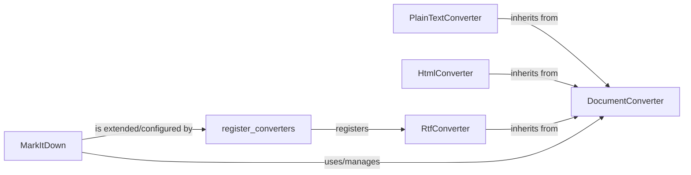

## Details

One paragraph explaining the functionality which is represented by this graph. What the main flow is and what is its purpose.

### DocumentConverter
This abstract base class defines the standard interface and contract (`Converter Pattern`) for all document conversion operations within the framework. It ensures that all concrete converters adhere to a consistent method signature for transformation.

**Related Classes/Methods**:

- <a href="https://github.com/microsoft/markitdown/blob/main/packages/markitdown/src/markitdown/_base_converter.py" target="_blank" rel="noopener noreferrer">`markitdown._base_converter.DocumentConverter`</a>

### PlainTextConverter
A concrete implementation of the `DocumentConverter` interface, responsible for transforming documents into plain text format. It represents one of the built-in conversion capabilities.

**Related Classes/Methods**:

- <a href="https://github.com/microsoft/markitdown/blob/main/packages/markitdown/src/markitdown/converters/_plain_text_converter.py" target="_blank" rel="noopener noreferrer">`markitdown.converters._plain_text_converter.PlainTextConverter`</a>

### HtmlConverter
Another concrete implementation of `DocumentConverter`, specifically designed to convert documents into HTML format. This is also a built-in converter.

**Related Classes/Methods**:

- <a href="https://github.com/microsoft/markitdown/blob/main/packages/markitdown/src/markitdown/converters/_html_converter.py" target="_blank" rel="noopener noreferrer">`markitdown.converters._html_converter.HtmlConverter`</a>

### RtfConverter
A sample concrete converter provided by an external plugin. It demonstrates the extensibility of the framework, allowing third-party developers to add new conversion types by implementing the `DocumentConverter` interface.

**Related Classes/Methods**:

- <a href="https://github.com/microsoft/markitdown/blob/main/packages/markitdown-sample-plugin/src/markitdown_sample_plugin/_plugin.py" target="_blank" rel="noopener noreferrer">`markitdown_sample_plugin._plugin.RtfConverter`</a>

### MarkItDown
This class serves as the main entry point and orchestrator (`Facade Pattern`) for the document conversion process. It manages and utilizes various `DocumentConverter` implementations, providing a simplified interface for clients to perform conversions without needing to interact directly with individual converters.

**Related Classes/Methods**:

- <a href="https://github.com/microsoft/markitdown/blob/main/packages/markitdown/src/markitdown/_markitdown.py" target="_blank" rel="noopener noreferrer">`markitdown._markitdown.MarkItDown`</a>

### register_converters
A function (part of the `Plugin System`) that illustrates how external plugins can register their custom `DocumentConverter` implementations with the `MarkItDown` framework. This mechanism allows the framework to dynamically discover and incorporate new conversion capabilities.

**Related Classes/Methods**:

- <a href="https://github.com/microsoft/markitdown/blob/main/packages/markitdown-sample-plugin/src/markitdown_sample_plugin/_plugin.py" target="_blank" rel="noopener noreferrer">`markitdown_sample_plugin._plugin.register_converters`</a>

### [FAQ](https://github.com/CodeBoarding/GeneratedOnBoardings/tree/main?tab=readme-ov-file#faq)