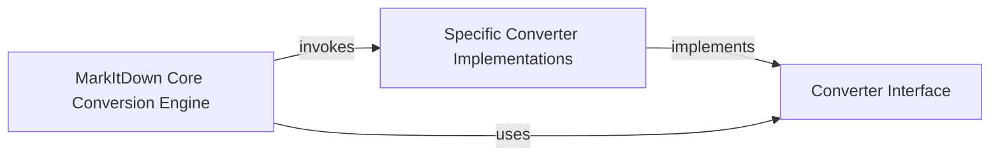

## Details

One paragraph explaining the functionality which is represented by this graph. What the main flow is and what is its purpose.

### Converter Interface [[Expand]](./Converter_Interface.md)
Defines the standardized contract (accepts, convert) that all specific document converters must adhere to. This interface is crucial for enabling the Strategy pattern, allowing the Core Conversion Engine to dynamically select and execute the correct converter. It serves as the foundational abstraction for the plugin architecture.

**Related Classes/Methods**:

- `markitdown._base_converter._BaseConverter` (1:1)
- `markitdown._base_converter._BaseConverter:accepts` (1:1)
- `markitdown._base_converter._BaseConverter:convert` (1:1)
- `markitdown._base_converter._BaseConverter:__init__` (1:1)
- `markitdown._base_converter._BaseConverter:text_content` (1:1)
- `markitdown._base_converter._BaseConverter:__str__` (1:1)

### MarkItDown Core Conversion Engine
This engine acts as the client of the Converter Interface, using it to discover, select, and execute the appropriate Specific Converter Implementations. It orchestrates the overall document conversion process by leveraging the defined interface.

**Related Classes/Methods**:

- `markitdown._markitdown` (1:1)

### Specific Converter Implementations
These are the concrete strategies that implement the Converter Interface, providing the actual conversion logic for different document types (e.g., PDF, DOCX, XLSX). Each implementation encapsulates the unique logic and dependencies required for its specific format.

**Related Classes/Methods**:

- `markitdown.converters._docx_converter` (1:1)
- `markitdown.converters._pdf_converter` (1:1)
- `markitdown.converters._xlsx_converter` (1:1)

### [FAQ](https://github.com/CodeBoarding/GeneratedOnBoardings/tree/main?tab=readme-ov-file#faq)