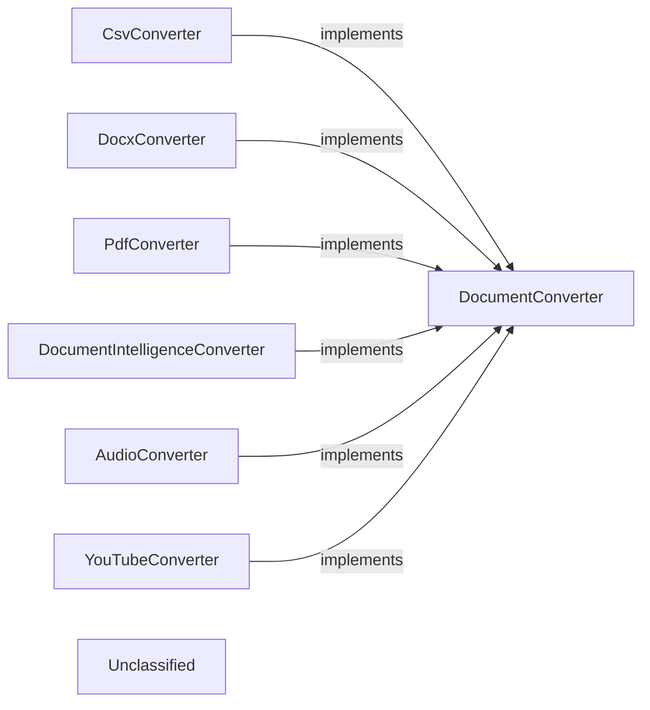

## Details

The `markitdown` project's conversion subsystem provides a flexible and extensible architecture for converting various document types into Markdown. It is centered around the `DocumentConverter` abstract base class, which defines a consistent interface for conversion operations. Specialized concrete converters like `CsvConverter`, `DocxConverter`, `PdfConverter`, `DocumentIntelligenceConverter`, `AudioConverter`, and `YouTubeConverter` implement this interface, each handling specific file formats or integrating with external services to parse input streams and produce a unified Markdown output. This modular design facilitates the easy addition of new document conversion capabilities.

### DocumentConverter
Defines the contract for all document conversion operations, ensuring a consistent `accepts` and `convert` method.

**Related Classes/Methods**:

- <a href="https://github.com/microsoft/markitdown/blob/mainpackages/markitdown/src/markitdown/_base_converter.py#L42-L105" target="_blank" rel="noopener noreferrer">`markitdown._base_converter.DocumentConverter`:42-105</a>

### CsvConverter
Converts CSV data into Markdown tables.

**Related Classes/Methods**:

- <a href="https://github.com/microsoft/markitdown/blob/mainpackages/markitdown/src/markitdown/converters/_csv_converter.py#L15-L77" target="_blank" rel="noopener noreferrer">`markitdown.converters._csv_converter.CsvConverter`:15-77</a>

### DocxConverter
Transforms Microsoft Word (DOCX) files into Markdown.

**Related Classes/Methods**:

- <a href="https://github.com/microsoft/markitdown/blob/mainpackages/markitdown/src/markitdown/converters/_docx_converter.py#L38-L90" target="_blank" rel="noopener noreferrer">`markitdown.converters._docx_converter.DocxConverter`:38-90</a>

### PdfConverter
Extracts text from PDF documents and renders it as Markdown.

**Related Classes/Methods**:

- <a href="https://github.com/microsoft/markitdown/blob/mainpackages/markitdown/src/markitdown/converters/_pdf_converter.py#L31-L77" target="_blank" rel="noopener noreferrer">`markitdown.converters._pdf_converter.PdfConverter`:31-77</a>

### DocumentIntelligenceConverter
Utilizes Azure Document Intelligence for advanced document parsing and OCR, converting the results to Markdown.

**Related Classes/Methods**:

- <a href="https://github.com/microsoft/markitdown/blob/mainpackages/markitdown/src/markitdown/converters/_doc_intel_converter.py#L130-L254" target="_blank" rel="noopener noreferrer">`markitdown.converters._doc_intel_converter.DocumentIntelligenceConverter`:130-254</a>

### AudioConverter
Transcribes audio files and extracts metadata, converting the output to Markdown.

**Related Classes/Methods**:

- <a href="https://github.com/microsoft/markitdown/blob/mainpackages/markitdown/src/markitdown/converters/_audio_converter.py#L23-L101" target="_blank" rel="noopener noreferrer">`markitdown.converters._audio_converter.AudioConverter`:23-101</a>

### YouTubeConverter
Fetches YouTube video metadata and transcripts, formatting them into Markdown.

**Related Classes/Methods**:

- <a href="https://github.com/microsoft/markitdown/blob/mainpackages/markitdown/src/markitdown/converters/_youtube_converter.py#L37-L238" target="_blank" rel="noopener noreferrer">`markitdown.converters._youtube_converter.YouTubeConverter`:37-238</a>

### Unclassified
Component for all unclassified files and utility functions (Utility functions/External Libraries/Dependencies)

**Related Classes/Methods**: _None_

### [FAQ](https://github.com/CodeBoarding/GeneratedOnBoardings/tree/main?tab=readme-ov-file#faq)