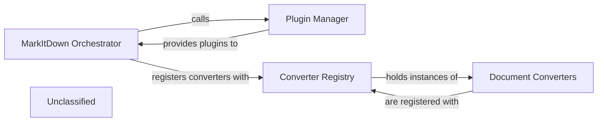

## Details

The Converter & Plugin Management subsystem is responsible for the dynamic extension of the markitdown system through plugins and the organized management of various document conversion strategies. It encompasses the core orchestration logic for setting up the conversion environment, the dedicated mechanisms for plugin discovery and loading, and the centralized registry for all available document conversion components. This subsystem ensures the system's adaptability to new formats and functionalities without requiring core code modifications.

### MarkItDown Orchestrator
The central control component that initializes the conversion environment. Within this subsystem, its key responsibilities include orchestrating the enabling of plugins and the registration of document converters, acting as the primary integrator for extensible functionalities.

**Related Classes/Methods**:

- <a href="https://github.com/microsoft/markitdown/blob/main/packages/markitdown/src/markitdown/_markitdown.py#L225-L243" target="_blank" rel="noopener noreferrer">`MarkItDown.enable_plugins`:225-243</a>
- <a href="https://github.com/microsoft/markitdown/blob/main/packages/markitdown/src/markitdown/_markitdown.py#L634-L664" target="_blank" rel="noopener noreferrer">`MarkItDown.register_converter`:634-664</a>

### Plugin Manager
Dedicated to discovering, loading, and enabling external plugin packages. It provides the core mechanism for extending the system's functionality by allowing plugins to dynamically register custom converters or introduce other processing steps.

**Related Classes/Methods**:

- <a href="https://github.com/microsoft/markitdown/blob/main/packages/markitdown/src/markitdown/_markitdown.py#L65-L82" target="_blank" rel="noopener noreferrer">`_load_plugins`:65-82</a>

### Converter Registry
Manages a centralized collection of all available DocumentConverter instances. It facilitates the dynamic lookup and selection of the appropriate converter based on the characteristics of the input document, ensuring efficient and flexible conversion capabilities.

**Related Classes/Methods**:

- <a href="https://github.com/microsoft/markitdown/blob/main/packages/markitdown/src/markitdown/_markitdown.py#L85-L90" target="_blank" rel="noopener noreferrer">`ConverterRegistration`:85-90</a>

### Document Converters
Comprises an abstract base class (DocumentConverter) and its concrete implementations. Each concrete converter is responsible for the specific logic of transforming a particular document format (e.g., CSV, PPTX, PDF via Azure) into Markdown, acting as the actual workers of the conversion pipeline.

**Related Classes/Methods**:

- <a href="https://github.com/microsoft/markitdown/blob/main/packages/markitdown/src/markitdown/_base_converter.py#L42-L105" target="_blank" rel="noopener noreferrer">`DocumentConverter`:42-105</a>

### Unclassified
Component for all unclassified files and utility functions (Utility functions/External Libraries/Dependencies)

**Related Classes/Methods**: _None_

### [FAQ](https://github.com/CodeBoarding/GeneratedOnBoardings/tree/main?tab=readme-ov-file#faq)