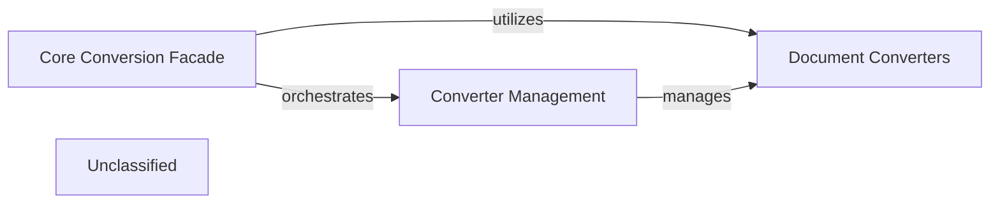

## Details

The `markitdown` conversion subsystem is built around a pluggable architecture, centralizing document conversion capabilities. The `Converter Management` component, embodied by the `_markitdown` class, dynamically discovers, registers, and manages various `Document Converters`. These converters are specialized plugins responsible for transforming specific document formats. The `Core Conversion Facade`, primarily exposed through the `convert` method of the `_markitdown` class, offers a simplified interface for clients to initiate conversions. This facade abstracts the underlying complexity of converter selection and orchestration, relying on `Converter Management` to identify the appropriate `Document Converters` for a given task. This design promotes extensibility, allowing new document formats to be supported by simply adding new `Document Converters` to the system.

### Converter Management
This component is responsible for the dynamic discovery, loading, registration, and lifecycle management of document converters. It maintains a centralized registry of all available conversion capabilities, ensuring the system's extensibility.

**Related Classes/Methods**:

- <a href="https://github.com/microsoft/markitdown/blob/main/packages/markitdown/src/markitdown/_markitdown.py#L85-L90" target="_blank" rel="noopener noreferrer">`markitdown._markitdown.ConverterRegistration`:85-90</a>
- <a href="https://github.com/microsoft/markitdown/blob/main/packages/markitdown/src/markitdown/_markitdown.py#L634-L664" target="_blank" rel="noopener noreferrer">`markitdown._markitdown.register_converter`:634-664</a>
- <a href="https://github.com/microsoft/markitdown/blob/main/packages/markitdown/src/markitdown/_markitdown.py#L225-L243" target="_blank" rel="noopener noreferrer">`markitdown._markitdown.enable_plugins`:225-243</a>
- <a href="https://github.com/microsoft/markitdown/blob/main/packages/markitdown/src/markitdown/_markitdown.py#L65-L82" target="_blank" rel="noopener noreferrer">`markitdown._markitdown._load_plugins`:65-82</a>
- <a href="https://github.com/microsoft/markitdown/blob/main/packages/markitdown/src/markitdown/_markitdown.py#L133-L223" target="_blank" rel="noopener noreferrer">`markitdown._markitdown.enable_builtins`:133-223</a>

### Document Converters [[Expand]](./Document_Converters.md)
These are the concrete implementations responsible for converting specific document formats (e.g., PDF, DOCX, XLSX) into a standardized output. They are the actual plugins that Converter Management discovers and registers.

**Related Classes/Methods**:

- <a href="https://github.com/microsoft/markitdown/blob/main/packages/markitdown/src/markitdown/converters/pdf.py#L1-L100" target="_blank" rel="noopener noreferrer">`markitdown.converters.PdfConverter`:1-100</a>

### Core Conversion Facade
This component provides a simplified, high-level interface for clients to initiate document conversions. It abstracts the complexity of selecting the appropriate Document Converter by querying the Converter Management component and then orchestrating the conversion process.

**Related Classes/Methods**:

- <a href="https://github.com/microsoft/markitdown/blob/main/packages/markitdown/src/markitdown/_markitdown.py#L245-L300" target="_blank" rel="noopener noreferrer">`markitdown._markitdown._markitdown.convert`:245-300</a>

### Unclassified
Component for all unclassified files and utility functions (Utility functions/External Libraries/Dependencies)

**Related Classes/Methods**: _None_

### [FAQ](https://github.com/CodeBoarding/GeneratedOnBoardings/tree/main?tab=readme-ov-file#faq)