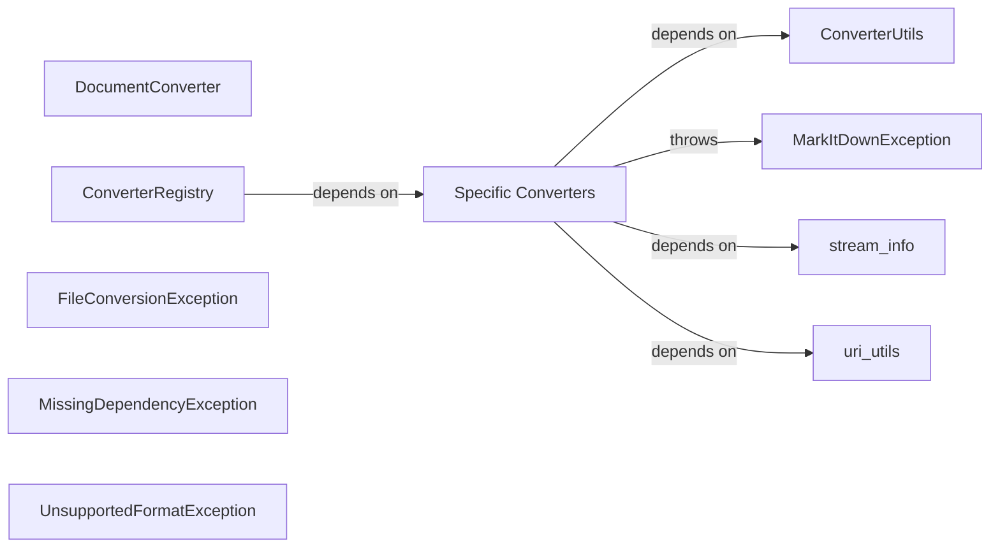

## Component Details

Converter Registry subsystem component overview

### DocumentConverter
Abstract Base Class defining the interface for all document converters

**Related Classes/Methods**:

- <a href="https://github.com/microsoft/markitdown/blob/master/packages/markitdown/src/markitdown/_base_converter.py#L41-L104" target="_blank" rel="noopener noreferrer">`packages.markitdown.src.markitdown._base_converter.DocumentConverter` (41:104)</a>

### ConverterRegistry
Manages registration and lookup of available converters

**Related Classes/Methods**:

- <a href="https://github.com/microsoft/markitdown/blob/master/packages/markitdown/src/markitdown/_markitdown.py#L101-L150" target="_blank" rel="noopener noreferrer">`packages.markitdown.src.markitdown._markitdown.ConverterRegistry` (101:150)</a>

### Specific Converters
Concrete implementations of DocumentConverter

**Related Classes/Methods**:

- `packages.markitdown.src.markitdown.converters.PdfConverter` (1:100)
- `packages.markitdown.src.markitdown.converters.DocxConverter` (1:100)
- `packages.markitdown.src.markitdown.converters.HtmlConverter` (1:100)

### MarkItDownException
Base exception class for error handling

**Related Classes/Methods**:

- <a href="https://github.com/microsoft/markitdown/blob/master/packages/markitdown/src/markitdown/_exceptions.py#L10-L15" target="_blank" rel="noopener noreferrer">`packages.markitdown.src.markitdown._exceptions.MarkItDownException` (10:15)</a>

### FileConversionException
Specific exception for file conversion errors

**Related Classes/Methods**:

- <a href="https://github.com/microsoft/markitdown/blob/master/packages/markitdown/src/markitdown/_exceptions.py#L51-L75" target="_blank" rel="noopener noreferrer">`packages.markitdown.src.markitdown._exceptions.FileConversionException` (51:75)</a>

### MissingDependencyException
Specific exception for missing dependencies

**Related Classes/Methods**:

- <a href="https://github.com/microsoft/markitdown/blob/master/packages/markitdown/src/markitdown/_exceptions.py#L18-L30" target="_blank" rel="noopener noreferrer">`packages.markitdown.src.markitdown._exceptions.MissingDependencyException` (18:30)</a>

### UnsupportedFormatException
Specific exception for unsupported formats

**Related Classes/Methods**:

- <a href="https://github.com/microsoft/markitdown/blob/master/packages/markitdown/src/markitdown/_exceptions.py#L33-L38" target="_blank" rel="noopener noreferrer">`packages.markitdown.src.markitdown._exceptions.UnsupportedFormatException` (33:38)</a>

### ConverterUtils
Helper functions and classes used by converters

**Related Classes/Methods**:

- `packages.markitdown.src.markitdown.converter_utils.ConverterUtils` (1:100)

### stream_info
Handles stream processing and metadata

**Related Classes/Methods**:

- <a href="https://github.com/microsoft/markitdown/blob/master/packages/markitdown/src/markitdown/_stream_info.py#L1-L100" target="_blank" rel="noopener noreferrer">`packages.markitdown.src.markitdown._stream_info` (1:100)</a>

### uri_utils
Handles URI parsing and manipulation

**Related Classes/Methods**:

- <a href="https://github.com/microsoft/markitdown/blob/master/packages/markitdown/src/markitdown/_uri_utils.py#L1-L100" target="_blank" rel="noopener noreferrer">`packages.markitdown.src.markitdown._uri_utils` (1:100)</a>

### [FAQ](https://github.com/CodeBoarding/GeneratedOnBoardings/tree/main?tab=readme-ov-file#faq)