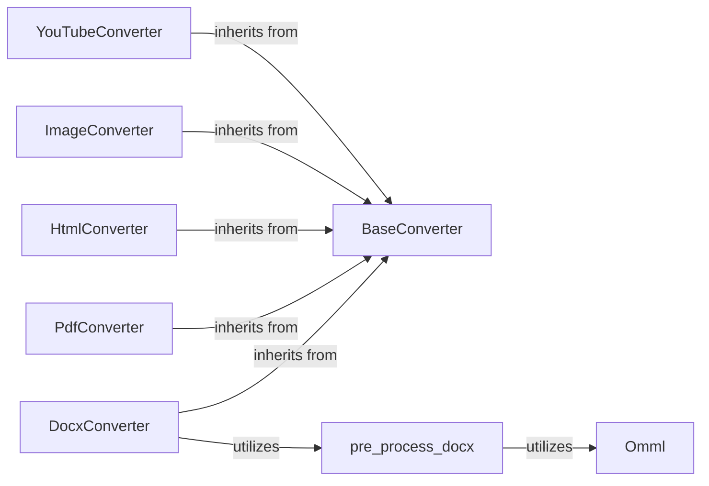

## Details

The `markitdown` Converter System is designed around a flexible and extensible architecture, primarily leveraging the Strategy pattern. At its core, the `BaseConverter` defines a standardized contract for content transformation, ensuring all specialized converters adhere to a consistent interface. This abstract base class is then extended by concrete implementations like `DocxConverter`, `PdfConverter`, `HtmlConverter`, `ImageConverter`, and `YouTubeConverter`, each tailored to handle specific input formats. This modular design allows for easy addition of new content types without altering existing converter logic. For complex document types like DOCX, the system incorporates dedicated pre-processing utilities such as `pre_process_docx` and `Omml`, which handle intricate elements like mathematical equations, ensuring accurate and comprehensive conversion to Markdown. This layered approach ensures robust and adaptable content transformation capabilities.

### BaseConverter
Defines the standard interface (`accepts`, `convert`) that all specific content converters must implement. It serves as the abstract base class, ensuring a consistent contract for content transformation across the system. This component is fundamental to the Converter and Strategy patterns employed.

**Related Classes/Methods**:

- <a href="https://github.com/microsoft/markitdown/blob/main/packages/markitdown/src/markitdown/_base_converter.py" target="_blank" rel="noopener noreferrer">`markitdown._base_converter.BaseConverter`</a>
- <a href="https://github.com/microsoft/markitdown/blob/main/packages/markitdown/src/markitdown/_base_converter.py" target="_blank" rel="noopener noreferrer">`markitdown._base_converter.BaseConverter:accepts`</a>
- <a href="https://github.com/microsoft/markitdown/blob/main/packages/markitdown/src/markitdown/_base_converter.py" target="_blank" rel="noopener noreferrer">`markitdown._base_converter.BaseConverter:convert`</a>

### DocxConverter
A concrete implementation of the `BaseConverter` interface, specialized in transforming Microsoft Word (DOCX) documents into Markdown. It handles the parsing, extraction, and formatting of content from DOCX files, including integration with pre-processing utilities for complex elements.

**Related Classes/Methods**:

- <a href="https://github.com/microsoft/markitdown/blob/main/packages/markitdown/src/markitdown/converters/_docx_converter.py" target="_blank" rel="noopener noreferrer">`markitdown.converters._docx_converter.DocxConverter`</a>

### PdfConverter
A concrete implementation of the `BaseConverter` interface, designed to transform Portable Document Format (PDF) files into Markdown. It focuses on accurately extracting text and layout information from PDFs and converting them into a readable Markdown format.

**Related Classes/Methods**:

- <a href="https://github.com/microsoft/markitdown/blob/main/packages/markitdown/src/markitdown/converters/_pdf_converter.py" target="_blank" rel="noopener noreferrer">`markitdown.converters._pdf_converter.PdfConverter`</a>

### HtmlConverter
A concrete implementation of the `BaseConverter` interface, responsible for transforming HTML content (e.g., web pages, HTML snippets) into Markdown. It parses HTML structures and converts them into their corresponding Markdown syntax.

**Related Classes/Methods**:

- <a href="https://github.com/microsoft/markitdown/blob/main/packages/markitdown/src/markitdown/converters/_html_converter.py" target="_blank" rel="noopener noreferrer">`markitdown.converters._html_converter.HtmlConverter`</a>

### ImageConverter
A concrete implementation of the `BaseConverter` interface, handling the transformation of various image formats into Markdown. This typically involves generating Markdown image syntax, potentially embedding images or linking to them.

**Related Classes/Methods**:

- <a href="https://github.com/microsoft/markitdown/blob/main/packages/markitdown/src/markitdown/converters/_image_converter.py" target="_blank" rel="noopener noreferrer">`markitdown.converters._image_converter.ImageConverter`</a>

### YouTubeConverter
A concrete implementation of the `BaseConverter` interface, specialized in transforming YouTube video information (primarily URLs) into Markdown. It might embed video links or extract relevant metadata for Markdown representation.

**Related Classes/Methods**:

- <a href="https://github.com/microsoft/markitdown/blob/main/packages/markitdown/src/markitdown/converters/_youtube_converter.py" target="_blank" rel="noopener noreferrer">`markitdown.converters._youtube_converter.YouTubeConverter`</a>

### pre_process_docx
A utility module or function within the `Converter System` that orchestrates initial pre-processing steps specifically for DOCX documents. Its role is to prepare the DOCX content for the main conversion, such as handling complex structures like mathematical equations.

**Related Classes/Methods**:

- <a href="https://github.com/microsoft/markitdown/blob/main/packages/markitdown/src/markitdown/converter_utils/docx/pre_process.py" target="_blank" rel="noopener noreferrer">`markitdown.converter_utils.docx.pre_process.pre_process_docx`</a>

### Omml
A specialized utility class or module focused on identifying, parsing, and transforming Office Math Markup Language (OMML) elements found within DOCX documents. It converts OMML into a Markdown-compatible format, such as LaTeX, ensuring mathematical equations are correctly rendered.

**Related Classes/Methods**:

- <a href="https://github.com/microsoft/markitdown/blob/main/packages/markitdown/src/markitdown/converter_utils/docx/math/omml.py" target="_blank" rel="noopener noreferrer">`markitdown.converter_utils.docx.math.omml.Omml`</a>

### [FAQ](https://github.com/CodeBoarding/GeneratedOnBoardings/tree/main?tab=readme-ov-file#faq)