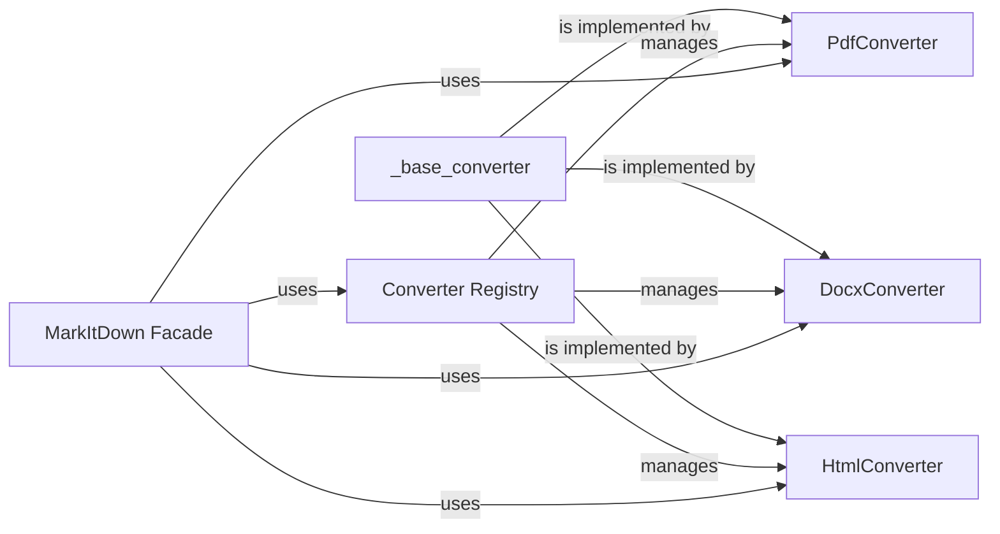

## Details

The `Converter System` is structured around the "Strategy Pattern," where `_base_converter` defines the strategy interface, and `PdfConverter`, `DocxConverter`, and `HtmlConverter` are concrete strategies. The `Converter Registry` acts as a factory or manager for these strategies, allowing the `MarkItDown Facade` to dynamically select and execute the correct conversion strategy based on the input document type. This modular design ensures extensibility, allowing new converters to be added without modifying existing code, aligning with the "Extensible Framework" and "Plugin Architecture" patterns.

### _base_converter
Defines the common API and contract for all document conversion operations, ensuring a consistent interface for concrete converters. This component is fundamental as it establishes the "Strategy" pattern for conversion.

**Related Classes/Methods**:

- `markitdown._base_converter` (1:1)

### PdfConverter
A concrete converter responsible for transforming PDF documents into Markdown format, adhering to the `_base_converter` interface.

**Related Classes/Methods**:

- `markitdown.converters.PdfConverter` (1:1)

### DocxConverter
A concrete converter responsible for transforming DOCX documents into Markdown format, adhering to the `_base_converter` interface.

**Related Classes/Methods**:

- `markitdown.converters.DocxConverter` (1:1)

### HtmlConverter
A concrete converter responsible for transforming HTML documents into Markdown format, adhering to the `_base_converter` interface.

**Related Classes/Methods**:

- `markitdown.converters.HtmlConverter` (1:1)

### Converter Registry
Manages and provides instances of concrete converters based on the input document type, acting as a central lookup for available conversion strategies. This component supports the "Plugin Architecture" by allowing dynamic registration and retrieval of converters.

**Related Classes/Methods**:

- `markitdown.converters` (1:1)

### MarkItDown Facade
Serves as the primary entry point for the conversion process, interacting with the `Converter Registry` to dynamically select and utilize the appropriate concrete converter for a given document. This component embodies the "Facade Pattern," simplifying the conversion subsystem's interface.

**Related Classes/Methods**:

- `markitdown` (1:1)

### [FAQ](https://github.com/CodeBoarding/GeneratedOnBoardings/tree/main?tab=readme-ov-file#faq)