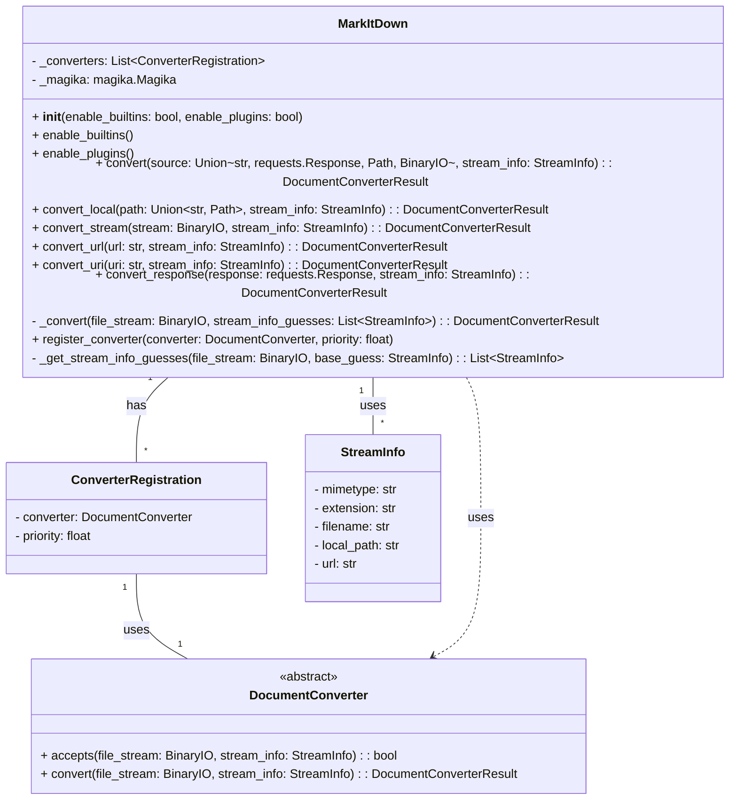

Based on the provided information, here's an overview of the `MarkItDown` component:

**Description:**

The `MarkItDown` component is the core of the `markitdown` library. It's responsible for converting various file formats and web resources into Markdown. It orchestrates the process by:

1.  **Accepting various input types:** It can handle local files, URLs, streams, and `requests.Response` objects.
2.  **Identifying the file type:** It uses `magika` to guess the file type based on the content and falls back to extension-based guesses.
3.  **Selecting the appropriate converter:** It maintains a registry of `DocumentConverter` instances and selects the best one based on the identified file type and priority.
4.  **Converting the content:** It calls the `convert` method of the selected `DocumentConverter` to perform the actual conversion.
5.  **Normalizing the output:** It normalizes the Markdown output by removing trailing whitespace and extra newlines.
6.  **Handling errors:** It gracefully handles conversion errors and exceptions.
7.  **Plugin Support:** It supports dynamically loading converters from plugins.

**Main Classes and Their Purposes:**

*   **`MarkItDown`:** The main class that orchestrates the conversion process. It handles input, file type detection, converter selection, and output normalization.
*   **`ConverterRegistration`:** A data class that associates a `DocumentConverter` with a priority.
*   **`StreamInfo`:** A data class that stores information about the input stream, such as MIME type, file extension, and URL.
*   **`DocumentConverter`:** An abstract base class for converters. It defines the `accepts` and `convert` methods that concrete converters must implement.
*   **Concrete Converters (e.g., `HtmlConverter`, `DocxConverter`, `PdfConverter`):** Implement the `DocumentConverter` interface for specific file formats. They perform the actual conversion logic.

**Visualization:**

I will use a class diagram to represent the structure of the `MarkItDown` component.

