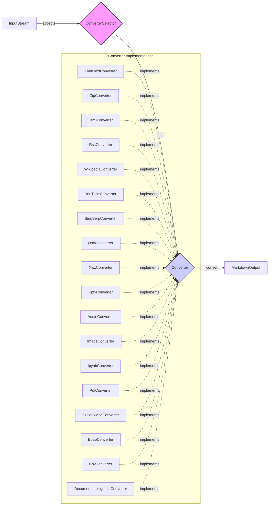

### Component Descriptions:

*   **InputStream:** Represents the input data stream to be converted. It provides data to the `ConverterSelector`. **Relevant source files:** N/A (abstract input)
*   **ConverterSelector:** This component selects the appropriate converter based on the input stream's content type and other characteristics. It iterates through available converters, calling their `accepts` method until a suitable converter is found. **Relevant source files:** `repos.markitdown.packages.markitdown.src.markitdown._markitdown.MarkItDown`
*   **Converter:** An abstract component that defines the interface for converting a specific file type or data source to markdown. Concrete converter implementations inherit from this component. **Relevant source files:** `repos.markitdown.packages.markitdown.src.markitdown.converters`
*   **MarkdownOutput:** Represents the final markdown output generated by the converter. This output can then be used for further processing or display. **Relevant source files:** N/A (abstract output)
*   **Converter Implementations:** These are concrete implementations of the `Converter` component, each responsible for converting a specific file type or data source to markdown. Examples include `PlainTextConverter`, `ZipConverter`, `HtmlConverter`, etc. Each converter implements the `accepts` method to determine if it can handle the input stream, and the `convert` method to perform the conversion. **Relevant source files:**
    *   `repos.markitdown.packages.markitdown.src.markitdown.converters._plain_text_converter.PlainTextConverter`
    *   `repos.markitdown.packages.markitdown.src.markitdown.converters._zip_converter.ZipConverter`
    *   `repos.markitdown.packages.markitdown.src.markitdown.converters._html_converter.HtmlConverter`
    *   `repos.markitdown.packages.markitdown.src.markitdown.converters._rss_converter.RssConverter`
    *   `repos.markitdown.packages.markitdown.src.markitdown.converters._wikipedia_converter.WikipediaConverter`
    *   `repos.markitdown.packages.markitdown.src.markitdown.converters._youtube_converter.YouTubeConverter`
    *   `repos.markitdown.packages.markitdown.src.markitdown.converters._bing_serp_converter.BingSerpConverter`
    *   `repos.markitdown.packages.markitdown.src.markitdown.converters._docx_converter.DocxConverter`
    *   `repos.markitdown.packages.markitdown.src.markitdown.converters._xlsx_converter.XlsxConverter`
    *   `repos.markitdown.packages.markitdown.src.markitdown.converters._pptx_converter.PptxConverter`
    *   `repos.markitdown.packages.markitdown.src.markitdown.converters._audio_converter.AudioConverter`
    *   `repos.markitdown.packages.markitdown.src.markitdown.converters._image_converter.ImageConverter`
    *   `repos.markitdown.packages.markitdown.src.markitdown.converters._ipynb_converter.IpynbConverter`
    *   `repos.markitdown.packages.markitdown.src.markitdown.converters._pdf_converter.PdfConverter`
    *   `repos.markitdown.packages.markitdown.src.markitdown.converters._outlook_msg_converter.OutlookMsgConverter`
    *   `repos.markitdown.packages.markitdown.src.markitdown.converters._epub_converter.EpubConverter`
    *   `repos.markitdown.packages.markitdown.src.markitdown.converters._csv_converter.CsvConverter`
    *   `repos.markitdown.packages.markitdown.src.markitdown.converters._doc_intel_converter.DocumentIntelligenceConverter`
