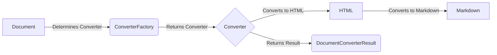

## Converters Component Overview

This component is responsible for converting various document types (DOCX, XLSX, PPTX, EPUB, PDF, etc.) into Markdown format. The conversion process typically involves converting the document to HTML first, and then using a Markdownify library to convert the HTML to Markdown.

### Component Descriptions:

*   **Document:** Represents the input document of various types (e.g., DOCX, XLSX, PPTX, EPUB, PDF). It determines which converter to use based on the file type.

*   **ConverterFactory:** This component determines the appropriate converter based on the document type. It acts as a central point for selecting the right converter for a given document.

*   **Converter:** This is an abstract component. Concrete implementations handle the conversion of specific document types to HTML. Each converter implements a `convert` method.

*   **HTML:** Represents the HTML output generated by the converter. This is an intermediate format used to convert to Markdown.

*   **Markdown:** Represents the final Markdown output generated from the HTML. This is the desired output format.

*   **DocumentConverterResult:** Represents the result of the document conversion, containing the markdown content and metadata.

### List of relevant source files:

*   `markitdown._base_converter.DocumentConverter`
*   `markitdown._base_converter.DocumentConverterResult`
*   `markitdown.converters._html_converter.HtmlConverter`
*   `markitdown.converters._docx_converter.DocxConverter`
*   `markitdown.converters._xlsx_converter.XlsxConverter`
*   `markitdown.converters._xlsx_converter.XlsConverter`
*   `markitdown.converters._pptx_converter.PptxConverter`
*   `markitdown.converters._epub_converter.EpubConverter`
*   `markitdown.converters._pdf_converter.PdfConverter`
*   `markitdown.converters._plain_text_converter.PlainTextConverter`
*   `markitdown.converters._image_converter.ImageConverter`
*   `markitdown.converters._audio_converter.AudioConverter`
*   `markitdown.converters._rss_converter.RssConverter`
*   `markitdown.converters._youtube_converter.YouTubeConverter`
*   `markitdown.converters._bing_serp_converter.BingSerpConverter`
*   `markitdown.converters._ipynb_converter.IpynbConverter`
*   `markitdown.converters._outlook_msg_converter.OutlookMsgConverter`
*   `markitdown.converters._csv_converter.CsvConverter`
*   `markitdown.converters._zip_converter.ZipConverter`
*   `markitdown.converters._doc_intel_converter.DocumentIntelligenceConverter`
