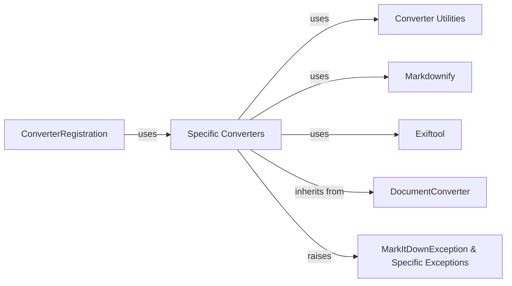

## Component Details

One paragraph explaining the functionality which is represented by this graph. What the main flow is and what is its purpose.

### DocumentConverter
Abstract base class defining the interface for all specific file converters. Handles core conversion logic common to all types.

**Related Classes/Methods**:

- <a href="https://github.com/microsoft/markitdown/blob/master/packages/markitdown/src/markitdown/_base_converter.py#L1-L100" target="_blank" rel="noopener noreferrer">`markitdown._base_converter.py` (1:100)</a>

### Specific Converters
A collection of concrete classes (e.g., `DocxConverter`, `PdfConverter`, `HtmlConverter`) each implementing the `DocumentConverter` interface for a specific file type.

**Related Classes/Methods**:

- `markitdown.converters.*.py` (1:100)

### ConverterRegistration
A registry or mapping that associates file extensions or MIME types with their corresponding converter classes.

**Related Classes/Methods**:

- <a href="https://github.com/microsoft/markitdown/blob/master/packages/markitdown/src/markitdown/_markitdown.py#L1-L100" target="_blank" rel="noopener noreferrer">`markitdown._markitdown.py` (1:100)</a>

### Converter Utilities
Helper functions and classes used by multiple converters to perform common tasks (e.g., text cleaning, Markdown formatting helpers).

**Related Classes/Methods**:

- `markitdown.converter_utils.py` (1:100)

### Markdownify
A component responsible for the final Markdown formatting and generation. May handle tasks like syntax highlighting, image embedding, etc.

**Related Classes/Methods**:

- <a href="https://github.com/microsoft/markitdown/blob/master/packages/markitdown/src/markitdown/converters/_markdownify.py#L1-L100" target="_blank" rel="noopener noreferrer">`markitdown.converters._markdownify.py` (1:100)</a>

### Exiftool
If used, this component handles metadata extraction (e.g., EXIF data from images). It's not core to all conversions, so it's optional.

**Related Classes/Methods**:

- <a href="https://github.com/microsoft/markitdown/blob/master/packages/markitdown/src/markitdown/converters/_exiftool.py#L1-L100" target="_blank" rel="noopener noreferrer">`markitdown.converters._exiftool.py` (1:100)</a>

### MarkItDownException & Specific Exceptions
Base exception class and its subclasses for handling errors during conversion.

**Related Classes/Methods**:

- <a href="https://github.com/microsoft/markitdown/blob/master/packages/markitdown/src/markitdown/_exceptions.py#L1-L100" target="_blank" rel="noopener noreferrer">`markitdown._exceptions.py` (1:100)</a>

### [FAQ](https://github.com/CodeBoarding/GeneratedOnBoardings/tree/main?tab=readme-ov-file#faq)