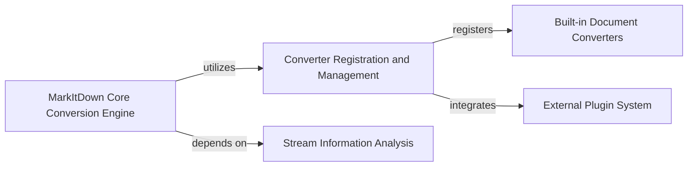

## Component Details

This graph illustrates the architecture of the MarkItDown document conversion system. The central `MarkItDown Core Conversion Engine` orchestrates the conversion process, handling various input types and dispatching tasks to specialized converters. It relies on `Converter Registration and Management` to manage available converters and `Stream Information Analysis` to determine input characteristics. The system supports both `Built-in Document Converters` and `External Plugin System` for extensibility.

### MarkItDown Core Conversion Engine
The central orchestrator for document conversion, managing various input types (files, streams, URIs), dispatching tasks to specialized converters, and handling the overall conversion flow. It utilizes stream information analysis and interacts with registered converters.

**Related Classes/Methods**:

- <a href="https://github.com/microsoft/markitdown/blob/master/packages/markitdown/src/markitdown/_markitdown.py#L93-L771" target="_blank" rel="noopener noreferrer">`packages.markitdown.src.markitdown._markitdown.MarkItDown` (93:771)</a>
- <a href="https://github.com/microsoft/markitdown/blob/master/packages/markitdown/src/markitdown/_markitdown.py#L243-L291" target="_blank" rel="noopener noreferrer">`packages.markitdown.src.markitdown._markitdown.MarkItDown:convert` (243:291)</a>
- <a href="https://github.com/microsoft/markitdown/blob/master/packages/markitdown/src/markitdown/_markitdown.py#L293-L328" target="_blank" rel="noopener noreferrer">`packages.markitdown.src.markitdown._markitdown.MarkItDown:convert_local` (293:328)</a>
- <a href="https://github.com/microsoft/markitdown/blob/master/packages/markitdown/src/markitdown/_markitdown.py#L330-L375" target="_blank" rel="noopener noreferrer">`packages.markitdown.src.markitdown._markitdown.MarkItDown:convert_stream` (330:375)</a>
- <a href="https://github.com/microsoft/markitdown/blob/master/packages/markitdown/src/markitdown/_markitdown.py#L377-L394" target="_blank" rel="noopener noreferrer">`packages.markitdown.src.markitdown._markitdown.MarkItDown:convert_url` (377:394)</a>
- <a href="https://github.com/microsoft/markitdown/blob/master/packages/markitdown/src/markitdown/_markitdown.py#L396-L455" target="_blank" rel="noopener noreferrer">`packages.markitdown.src.markitdown._markitdown.MarkItDown:convert_uri` (396:455)</a>
- <a href="https://github.com/microsoft/markitdown/blob/master/packages/markitdown/src/markitdown/_markitdown.py#L457-L527" target="_blank" rel="noopener noreferrer">`packages.markitdown.src.markitdown._markitdown.MarkItDown:convert_response` (457:527)</a>
- <a href="https://github.com/microsoft/markitdown/blob/master/packages/markitdown/src/markitdown/_markitdown.py#L529-L619" target="_blank" rel="noopener noreferrer">`packages.markitdown.src.markitdown._markitdown.MarkItDown._convert` (529:619)</a>

### Converter Registration and Management
Responsible for initializing, enabling, and managing `DocumentConverter` instances. It handles the registration of both built-in and plugin-provided converters, making them available for the conversion process.

**Related Classes/Methods**:

- <a href="https://github.com/microsoft/markitdown/blob/master/packages/markitdown/src/markitdown/_markitdown.py#L97-L130" target="_blank" rel="noopener noreferrer">`packages.markitdown.src.markitdown._markitdown.MarkItDown:__init__` (97:130)</a>
- <a href="https://github.com/microsoft/markitdown/blob/master/packages/markitdown/src/markitdown/_markitdown.py#L132-L221" target="_blank" rel="noopener noreferrer">`packages.markitdown.src.markitdown._markitdown.MarkItDown:enable_builtins` (132:221)</a>
- <a href="https://github.com/microsoft/markitdown/blob/master/packages/markitdown/src/markitdown/_markitdown.py#L223-L241" target="_blank" rel="noopener noreferrer">`packages.markitdown.src.markitdown._markitdown.MarkItDown:enable_plugins` (223:241)</a>
- <a href="https://github.com/microsoft/markitdown/blob/master/packages/markitdown/src/markitdown/_markitdown.py#L621-L627" target="_blank" rel="noopener noreferrer">`packages.markitdown.src.markitdown._markitdown.MarkItDown:register_page_converter` (621:627)</a>
- <a href="https://github.com/microsoft/markitdown/blob/master/packages/markitdown/src/markitdown/_markitdown.py#L629-L659" target="_blank" rel="noopener noreferrer">`packages.markitdown.src.markitdown._markitdown.MarkItDown:register_converter` (629:659)</a>
- <a href="https://github.com/microsoft/markitdown/blob/master/packages/markitdown/src/markitdown/_markitdown.py#L86-L90" target="_blank" rel="noopener noreferrer">`packages.markitdown.src.markitdown._markitdown.ConverterRegistration` (86:90)</a>

### Stream Information Analysis
Focuses on analyzing input streams to determine characteristics like MIME type, file extension, and character encoding, crucial for selecting the correct document converter.

**Related Classes/Methods**:

- <a href="https://github.com/microsoft/markitdown/blob/master/packages/markitdown/src/markitdown/_markitdown.py#L661-L760" target="_blank" rel="noopener noreferrer">`packages.markitdown.src.markitdown._markitdown.MarkItDown:_get_stream_info_guesses` (661:760)</a>
- <a href="https://github.com/microsoft/markitdown/blob/master/packages/markitdown/src/markitdown/_markitdown.py#L762-L771" target="_blank" rel="noopener noreferrer">`packages.markitdown.src.markitdown._markitdown.MarkItDown:_normalize_charset` (762:771)</a>
- <a href="https://github.com/microsoft/markitdown/blob/master/packages/markitdown/src/markitdown/_stream_info.py#L6-L32" target="_blank" rel="noopener noreferrer">`packages.markitdown.src.markitdown._stream_info.StreamInfo` (6:32)</a>

### Built-in Document Converters
A collection of pre-defined `DocumentConverter` implementations for various file formats and web content types, providing core conversion functionality.

**Related Classes/Methods**:

- <a href="https://github.com/microsoft/markitdown/blob/master/packages/markitdown/src/markitdown/_base_converter.py#L42-L105" target="_blank" rel="noopener noreferrer">`packages.markitdown.src.markitdown._base_converter.DocumentConverter` (42:105)</a>
- <a href="https://github.com/microsoft/markitdown/blob/master/packages/markitdown/src/markitdown/_base_converter.py#L5-L39" target="_blank" rel="noopener noreferrer">`packages.markitdown.src.markitdown._base_converter.DocumentConverterResult` (5:39)</a>
- `packages.markitdown.src.markitdown.converters.PlainTextConverter` (full file reference)
- `packages.markitdown.src.markitdown.converters.HtmlConverter` (full file reference)
- `packages.markitdown.src.markitdown.converters.RssConverter` (full file reference)
- `packages.markitdown.src.markitdown.converters.WikipediaConverter` (full file reference)
- `packages.markitdown.src.markitdown.converters.YouTubeConverter` (full file reference)
- `packages.markitdown.src.markitdown.converters.IpynbConverter` (full file reference)
- `packages.markitdown.src.markitdown.converters.BingSerpConverter` (full file reference)
- `packages.markitdown.src.markitdown.converters.PdfConverter` (full file reference)
- `packages.markitdown.src.markitdown.converters.DocxConverter` (full file reference)
- `packages.markitdown.src.markitdown.converters.XlsxConverter` (full file reference)
- `packages.markitdown.src.markitdown.converters.XlsConverter` (full file reference)
- `packages.markitdown.src.markitdown.converters.PptxConverter` (full file reference)
- `packages.markitdown.src.markitdown.converters.ImageConverter` (full file reference)
- `packages.markitdown.src.markitdown.converters.AudioConverter` (full file reference)
- `packages.markitdown.src.markitdown.converters.OutlookMsgConverter` (full file reference)
- `packages.markitdown.src.markitdown.converters.ZipConverter` (full file reference)
- `packages.markitdown.src.markitdown.converters.EpubConverter` (full file reference)
- `packages.markitdown.src.markitdown.converters.DocumentIntelligenceConverter` (full file reference)
- `packages.markitdown.src.markitdown.converters.CsvConverter` (full file reference)

### External Plugin System
Provides a mechanism for extending MarkItDown's capabilities by allowing external plugins to register custom `DocumentConverter` implementations.

**Related Classes/Methods**:

- <a href="https://github.com/microsoft/markitdown/blob/master/packages/markitdown/src/markitdown/_markitdown.py#L65-L82" target="_blank" rel="noopener noreferrer">`packages.markitdown.src.markitdown._markitdown._load_plugins` (65:82)</a>
- <a href="https://github.com/microsoft/markitdown/blob/master/packages/markitdown/src/markitdown/_markitdown.py#L223-L241" target="_blank" rel="noopener noreferrer">`packages.markitdown.src.markitdown._markitdown.MarkItDown:enable_plugins` (223:241)</a>

### [FAQ](https://github.com/CodeBoarding/GeneratedOnBoardings/tree/main?tab=readme-ov-file#faq)